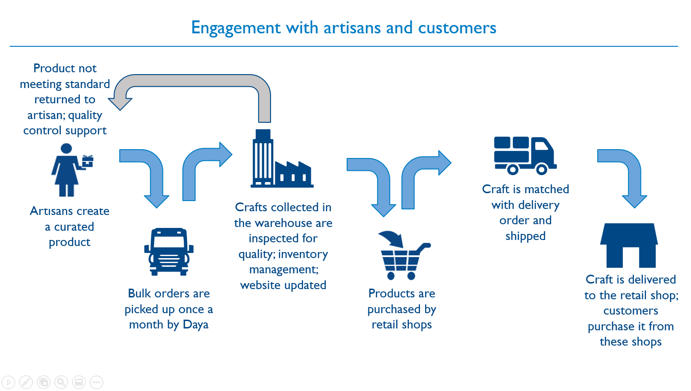
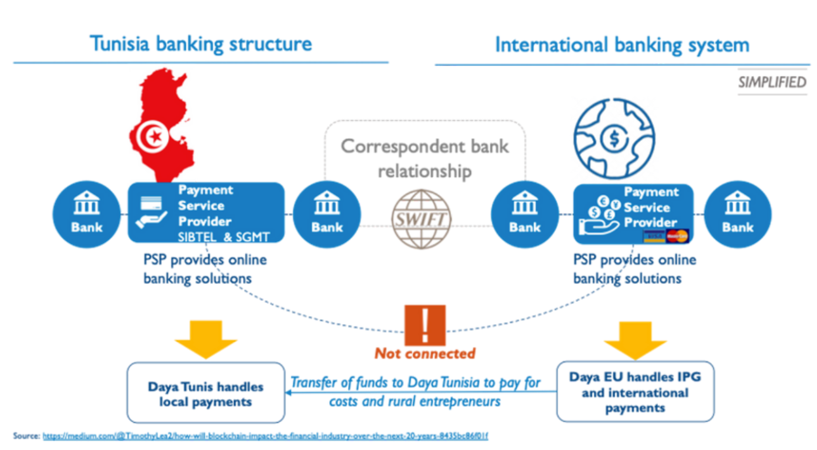
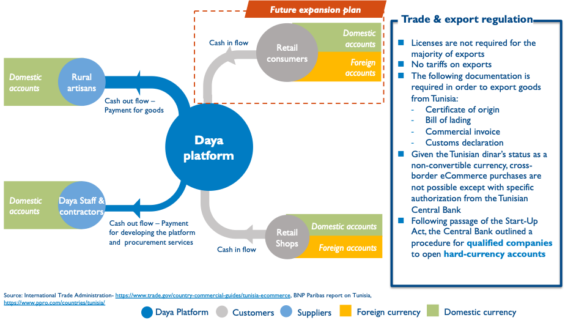
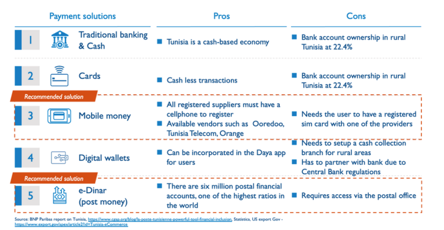
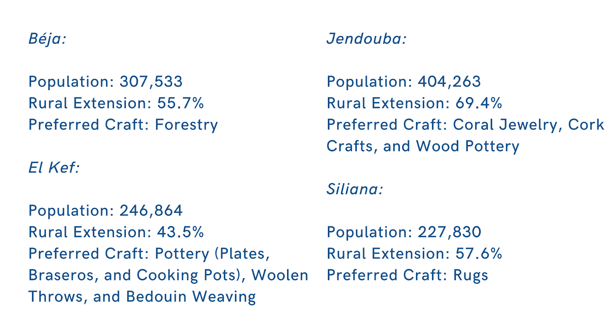

# Payment System Options for Daya Users: Mobile or Postal Money?

Daya users, which are in their totality female rural artisans in Tunisia, have two ways to receive payments from the sales of their products, either through mobile money or post money. We are designing a program to understand which one is the most beneficial for the users. The results not only will have implications for future strategies for the platform Daya, but it will also provide evidence of the effectiveness of digital money in empowering female entrepreneurs.

## Introduction

In Tunisia, women make up 49.9% of the population yet account for only 13% of the total entrepreneurs ([Drine & Grach, 2012](https://link.springer.com/article/10.1057/ejdr.2011.13)). One-quarter of those are in the craft sector [Laffineur et al., 2018](https://www.researchgate.net/publication/325718036_Insights_from_Female_Entrepreneurs_in_MENA_Countries_Barriers_and_Success_Factors), which accounts for 3.9% of the country’s GDP [EU Neighbours, 2014](https://www.europarl.europa.eu/factsheets/en/sheet/170/the-european-neighbourhood-policy).

Although the Tunisian government’s 2018 Start Up Act has tried to address the diminishing national entrepreneurial activity over the years, from 9.4% in 2009 to 4.8% in 2012 [Belkacem & Mansouri, 2010](https://idl-bnc-idrc.dspacedirect.org/handle/10625/48784) by simplifying legal frameworks, focused funding, and entrepreneurial hubs, men are still 2 to 3 times more likely than women to start a business ([Maayoufi et al., 2020](http://journal.ke.hu/index.php/stm/article/view/3274)). This is because the nation’s entrepreneurial ecosystem, while not legally barring women from state provided resources ([Maayoufi, 2020](https://www.eeda.sk/dok/publikacie/ostatne/2020-europska-veda-12.pdf#page=42)), does not specifically facilitate their access to compensate for the existing gender gaps.

As such, the Daya platform presents itself as a much-needed wholesale intermediate marketplace, with the objective of solving the challenges entrepreneurs face in terms of accessing information, markets and financial services ([OECD, 2020](https://www.oecd.org/countries/tunisia/changing-laws-and-breaking-barriers-for-women-s-economic-empowerment-in-egypt-jordan-morocco-and-tunisia-ac780735-en.htm)). Specifically, the platform introduces craft artisans - an industry with untapped potential for female entrepreneurs ([Laffineur et al., 2018](https://www.researchgate.net/publication/325718036_Insights_from_Female_Entrepreneurs_in_MENA_Countries_Barriers_and_Success_Factors)) - to international business opportunities, whilst expanding their sales and export capacities, so that they can focus on what they are experts on, craftsmanship.

### *How Daya Works*

Daya currently only operates with Tunisia’s greatest trading partner, the EU, which accounts for 48.3% of Tunisia’s imports and receives over 70% of Tunisia’s exports. The EU Free trade agreement ([Grumiller et al., 2018](https://www.econstor.eu/handle/10419/268174)) provides an opportunity to access markets for female rural artisans, yet most do not understand how to tap this opportunity on their own. Furthermore, although there are no legal barriers to exporting goods from Tunisia, its banking system is not integrated with the international banking system. These two challenges perpetuate the mismatch between large established exporters and smaller artisans that lack knowledge of how to navigate this complex environment. As such, Daya is designed to support its users, Tunisian female rural artisans, to navigate this system. First by connecting them to the wider EU market and second by ensuring secure payments and transfers to the artisans.

### *The Tunisan Banking System and Daya’s Payment Solutions*

Tunisia has its local payment service providers, SIBTEL and SGMT, under the supervision of Tunisia’s Central Bank. Moreover, there is no access to international online payment solutions such as Visa and Mastercard within the country. To overcome these issues, Daya has set up a foreign legal entity parallel to its local legal entity to provide easy online solutions for foreign customers overseas:

Once the funds arrive in Tunisia,  it is the local legal entity handling the payments to the users. However, transferring funds within the country through traditional banking systems is extremely difficult. The banking penetration rate is low in Tunisia, averaging 34.6% in 2020, and 22.4% in rural areas ([Statista, 2021](https://www.statista.com/statistics/1270250/share-of-tunisians-owning-a-mobile-phone-by-area/#:~:text=On%20average%2C%20around%2093%20percent,the%20share%20exceeded%2096%20percent.)) where the bank branches are scarce. Daya navigates this issue through the following transfer system:

And through the following payment solutions:

After careful consideration of the existing challenges, two payment solutions are offered by Daya to best support its users:

- Mobile money: used to pay rural female artisans by only requiring a cellphone (smart-phone penetration is approximately at 85%, [Statistica, 2021](https://www.statista.com/statistics/1270250/share-of-tunisians-owning-a-mobile-phone-by-area/#:~:text=On%20average%2C%20around%2093%20percent,the%20share%20exceeded%2096%20percent.)). Mobile money users can cash out and collect their balance either at kiosks or retail shops. However it still is not the most popular method in the country to receive payments, specifically for rural artisans as their digital literacy lags behind ([Aid to Artisans, Tunisian Project](http://ata.creativelearning.org/building-export-capacity-in-tunisia-cap-x/)).

- E-Dinar (Post Money): Tunisia has six million postal financial accounts ([Hyunh, 2014](https://www.cgap.org/blog/la-poste-tunisienne-powerful-tool-for-financial-inclusion#:~:text=La%20Poste%20is%20a%20powerful,the%20country%20%E2%80%93%201%2C050%20post%20offices.)), where account holders can collect cash directly at the post offices. However, even if Tunisia holds one of the highest ratios of postal banking accounts in the world, accessing a physical postal office can be challenging for some users.

For Daya to truly empower female rural artisans, it requires understanding which payment system is the most effective. Hence the need to design an intervention measuring which alternative could represent a better solution to the economic participation of rural female artisan entrepreneurs.

## Intervention

Daya, as an intermediary platform, gives access to both mobile payment and post (e-dinar) options to rural female entrepreneurs, which are affected the most by this challenge. If mobile money can be an ideal solution for artisans, the lack of digital literacy can be a barrier, while post money may be difficult to access in certain areas. Our intervention aims to measure which option (A) Mobile money or (B) e-Dinar (Post money) has a higher impact on the economic empowerment of rural female artisan entrepreneurs.

### *Theory of Change*

Our intervention will address the need for a payment system that does not rely on physical distances to be effective. This revolves around the root issue of uneven access to Places-Of-Payment (POS) stations across the country. The high degree of connectivity among mobile phone users allows us to focus on the activity part of the intervention, meaning creating enough e-Dinar or Mobile money users. This is trackable through the digital data collection of the Daya platform activities, such as how many cards are used at a time, for what transactions, if they are used consistently throughout time, and if they provide a functional service ([Arango-Arango & Suárez-Ariza, 2020](https://www.ingentaconnect.com/content/hsp/jpss/2020/00000014/00000004/art00008)).
Upon the evaluation of these immediate outputs, the main objective remains the profitability of the female rural artisans' businesses activities.  Metrics such as withdrawal patterns ([Zekri, 2013](https://www-proquest-com.proxygt-law.wrlc.org/docview/1503664068?pq-origsite=gscholar&fromopenview=true)) might reveal whether or not our intervention has worked. And failure can be represented by the lack of withdrawals.

Other MENA countries share similar characteristics to Tunisia – namely Egypt, Jordan, and Morocco. In general, their female entrepreneurs are facing the same set of challenges as Tunisia: gender pay gap is considerable, female participation in the workforce is low, and societal prejudice is still deeply entrenched. These factors have resulted in an underdeveloped setting for female-owned businesses including a general aversion to expanding existing companies ([Drine & Grach, 2010](https://link.springer.com/article/10.1057/ejdr.2011.13)). Just like in Tunisia, the other three countries are beginning to increase workplace protection for female business owners. For example, all four countries have recently ratified the Equal Remuneration Convention and the Discrimination (Employment and Occupation) Convention, which provides an institutional basis for the protection of gender equal rights ([OECD, 2018](https://www.oecd.org/development/the-mediterranean-middle-east-and-north-africa-2018-9789264304161-en.htm)). Moreover, the countries in question have all initiated national projects in similar fashion to Tunisia’s National Programme for Women’s Entrepreneurship to boost entrepreneurship and to allow better access to financing, aimed at encouraging more females to join the workforce and to create their own businesses ([OECD, 2018](https://www.oecd.org/development/the-mediterranean-middle-east-and-north-africa-2018-9789264304161-en.htm)). While these measures are still insufficient to fully address the issue of workplace gender equality, they are still receptive to improvements, and would only benefit from the added utility of digital payments.

## *Data Collection*

While our data collection process will follow a Minimal Data Collection criteria where only relevant and necessary information will be requested, some Personally Identifiable Information (PII) - information that allows to identify a single surveyed individual ([DIME, World Bank](https://dimewiki.worldbank.org/Personally_Identifiable_Information_(PII))) - will still be maintained to guarantee a degree of unicity per respondent. Such information includes names of survey respondents, date of birth and geospatial data. The preserved PII will enable us not only to understand what approach (mobile money or e-post transactions) works better in terms of overall benefits for the entrepreneurs’ business, but also to identify improvements in Daya users’ economic empowerment.

Following standards set by the [Bill and Melinda Gates Foundation](https://www.gatesfoundation.org/equal-is-greater/our-approach/), we define women’s economic empowerment (WEE) (in this intervention females) as “the transformative process that helps women and girls move from limited power, voice, and choice at home and in the economy to having the skills, resources, and opportunities needed to compete equitably in markets as well as the agency to control and benefit from economic gains.” Our team will include questions that can enable us to measure the following domains within the women’s economic empowerment framework:

1. *Access* to resources such as capital, digital technologies, markets, and business training
2. *Agency*, such as control of resources and authority to make strategic decisions in households, businesses, or communities
3. *Achievements*, such as economic advancement, education and skill attainment, and the adoption and use of technology

In this regard, we will measure the following indicators:

#### ***Access***
- Access to credit/ borrowing services
- Savings patterns
- Digital Literacy

#### ***Agency***
- Hours worked per day
- Hours dedicated to household tasks
- Hours dedicated to leisure activities
- Control over income and expenditures
- Mobile SIM ownership

#### ***Achievements***
- Access to business capital
- Access to new markets
- Number of sales
- Business revenue
- Business profits
- Number of employees
- Number of customers
- Business Practices knowledge

The PII collected by our team will be protected by storing it into an encrypted folder, and encoded to ensure that the data remains private and safe from third-party actors. The SurveyCTO form used to survey participants will be encrypted to ensure the privacy of the information shared by the respondents. In addition, we will request explicit consent from our program’s participants before posting any public data.

## Measurement

### Design
The project will be based on a Randomized Control Trial design, analyzing Daya users from four separate Tunisian regions: Beja, Jendouba, El Kef and Siliana.

These regions were selected due to the established presence of the cooperative ACEA (Action Collaborative pour les Exportations Artisanal), as the organization had already built a relationship of trust with artisanal groups within the selected regions. Our aim is to partner up with ACEA to ensure participation. Moreover, to prevent issues of non-compliance, small sample sizes and ethical issues due to study design, apart from recruiting existing users, a non-users will have to be contacted. The cooperative will aid the organizers in referring current Daya users to the experiment, while informatory pamphlets will be distributed through the postal service to incentivize participation to the program through Daya subscription benefits.

Consenting users (between 900 and 1200 participants) will be clustered by district (39 total) and village identification, divided into groups of around 125 neighboring participants, with a maximum of two groups per region. Limiting the groups to two per region will facilitate obtaining a reasonably balanced sample, with weights first based on the [2014 Population and Housing Census](https://ghdx.healthdata.org/record/tunisia-population-and-housing-census-2014). This will allow first, to navigate possible connectivity issues of the users, and second, to understand the differences in digital literacy of Daya’s users.

Once the sample has been built, the data collected, and weighed for population characteristics, we will use a difference in difference regression to compare a treatment and control group’s difference in business growth between the four regions. The treatment group will utilize the Daya platform with only the mobile money option activated, while the control group will have access to the same Daya services as the control group, but with only the e-Dinar option enabled. Business outcomes for the control group and the treatment group will then be tested, and each region’s assumed differences will be compared to the other three, in order to verify if any variations in product selection, rural distribution percentage, and/or closeness to postal services contributed to the effectiveness or failure of the program.

### Program Procedure

New users will receive instructions to both download Daya and utilize its services, while existing users will just be prompted to sign the consent form, upon which both will be directed to answer the initial baseline survey. Consenting participants who are not able to access Daya in any capacity will be deemed ineligible for the study.

This survey will ask questions regarding the following topics:

1. *Basic Demographics*: to account for personal characteristics, including age, business experience, marriage status, number of kids in the household, number of known rival and collaborating businesses, etc.

2. *Business Growth*: in order to understand what is the current status of the users’ entrepreneurial venture, the participants will be asked to fill in basic financial measures such as number of sales, average costs, losses, profits etc. The questions will be simplified as to not overwhelm entrepreneurs with little economic knowledge (i.e. What was your most recent sale? How many products do you sell in a week? How much additional income have you earned from your business?

3. *Current Needs*: in order to understand what are the most pressing needs that afflict users. The questions will try to avoid household or societal problems which might be dangerous to answer, even in confidentiality. These will be mostly related to measures of business development (i.e. How long do your products take to reach your customers? What is the maximum range of delivery for your business? Have you ever lost money on a failed sale transaction?)

4. *Business Knowledge and Plans*: in order to understand what are the goals and objectives of the participating entrepreneurs. This might include a non-graded section on business topics, which will test basic economic knowledge and assess the individual’s level of business experience. Of the questions addressing plans and objectives, some might include “Do you expect to move your business to neighboring districts/villages?” How many years do you expect to keep making artisanal products?” “Would you be willing to hire contracted workers to run the production side of your business?” “How much product diversification would be willing to embark on, if any at all?”

The survey should not take longer than 30 minutes to complete, should only address the past 6 months of artisanal services, and it should contain language version alternatives for individuals which may be more versed in Arabic or French. Incomplete information coming from existing users’ surveys will be completed through existing data collected within the platform.

 For every transaction, a small likert and open-ended series of feedback questions will be prompted to obtain continuous customer satisfaction data from the artisans. These 1-minute surveys will be delivered through the app, which will automatically store the information within an encrypted database. After 6 months, a final endline survey containing all the same questions from the baseline survey, except for the demographics, will be delivered to all participating users, with the same accommodations granted during the previous surveys. The data collected by the various transaction mini- surveys will be gathered as a supplement to the endline data, and to verify the veracity of the users’ claims at the end of the program (i.e. if a user’s business growth was influenced by any other venture outside of Daya). On the other end, financial and sales data will be collected through the Daya platform as it is already available.

### Complications
Our timeline includes approximately two months to complete the research design process, such as choosing the sample size, meeting ethical requirements, preparing the consent process and data management. The most complicated part will be obtaining accurate housing data to assign each user to the appropriate district cluster, and gathering enough rural data to justify weighing for communication access. In fact, it would also be necessary to define what standards of urban separation define rurality, and how much restriction of access to mainline cash transaction sources would either define businesses as “rural” or disqualify females from control testing.

Following this, at least 1 month should be reserved to training staff, and familiarizing them with the Daya platform in order to provide the best possible services at program start. This would include piloting the questionnaire, memorizing steps for answering the mini-surveys, establishing contact with the district assigned ACEA member and perhaps even meeting with some artisanal women to understand the best way to approach them. Through the latter half of this period, notices of participation will be sent out to the female rural artisans, and consent forms will have to be processed for randomized selection. It is paramount that this process should be executed missing any awareness of the users’ location, business size or predicted outcome, as to not incur in selection bias. Limiting our sample size to 1000 does not preclude from the difficulty of hiring enough staff for easy tracking of artisanal transactions, as it is not assured that the 500 control women will be utilizing the same postal offices within the selected districts. This limitation can be addressed by indicating a small number of postal offices that provide the cash distribution services, but this could also create geographical bias without necessarily reducing the need for high staff counts for data collection.

Workers will then also need to be hired for the data cleaning and processing which will follow the three months of collection, which will further burden the budget available to us in the execution of this RCT. Considering that data analysis might take at minimum another month of work, it is likely that we will need to employ research assistants and survey processing agents for at least a year.
