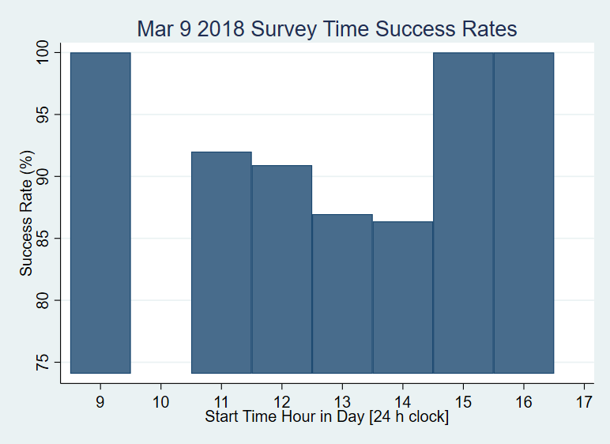

# Week 12 - High Frequency Checks (HFC's) Group Assignment 
Serenity Fan, Alexa Coon, Saloni Bhatia 

## Check 1: Survey Timing Check 

We want to characterize the most effective times during the day when enumerators obtain responses. If the check is repeated on a daily basis over a period of at least a month, patterns of responsiveness amongst the target population can be ascertained. To this end, we show results from the checks below, binning the survey start time into 1-hour intervals from 9:00-9:59 am, 10:00-10:59 am, ..., up to 5:00-5:59 pm. We define survey success, the dependent variable, as occurences in which: 
* a) The enumerator found the household 
* b) Member of household was present 
* c) Consent to perform survey obtained 

We acknowledge that this assumes that surveys that were started were also completed during this enumerator visit. 

  
  
  
  
  
  
  
  
  
  
  

Based on the graphs, we do not see an obvious pattern in most successful times during which to conduct surveys. This could be because we only have data for ~2 work-weeks (11 days) in this dataset, which is a small sample. If continued for a few more weeks, however, patterns may emerge, which could used to inform the field manager of when to best schedule enumerator shifts. 

## Check 2: Respondent Recall Check 

Our group had considered choosing to focus our HFC on verifying the accuracy of information provided by surveyed individuals. During our midline survey we anticipate asking questions about individual's commute times to work. We will test respondent recall by asking the following: 

1. How long their commute had been at the time of the baseline survey? --> Continuous variable
2. If they have changed jobs between the baseline and the midline survey? --> Indicator variable: Yes or No
3. How long their commute time is currently? --> Continuous variable 

To check the validity of the answers provided by participants we will put in a check regarding these questions. If the respondent has said no to Q2, then their answers for Q1 and Q3 should be equal (assuming they have not moved household). If their answers to Q1 and Q3 are not equal, then the survey should be flagged for incorrect information or further verification. If the respondent has the same job, theoretically their commute time should be the same and any deviation from that would indicate false or innaccurate information. (This does assume that the worker is returning to the same location for work each day but we are willing to make this assumption for the purpose of this check.) 

