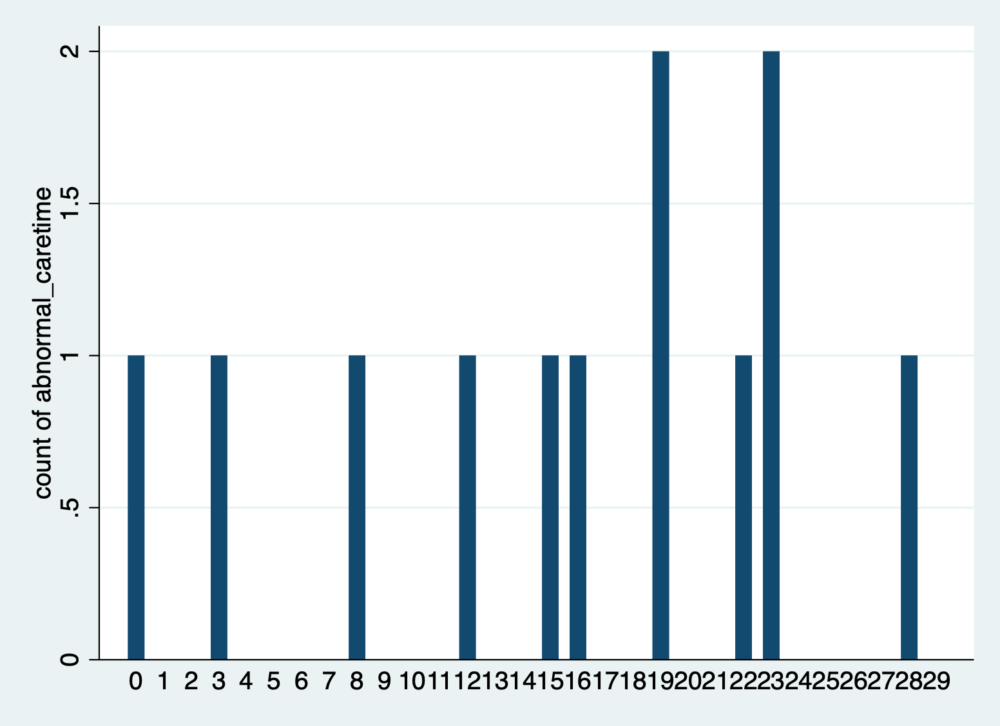
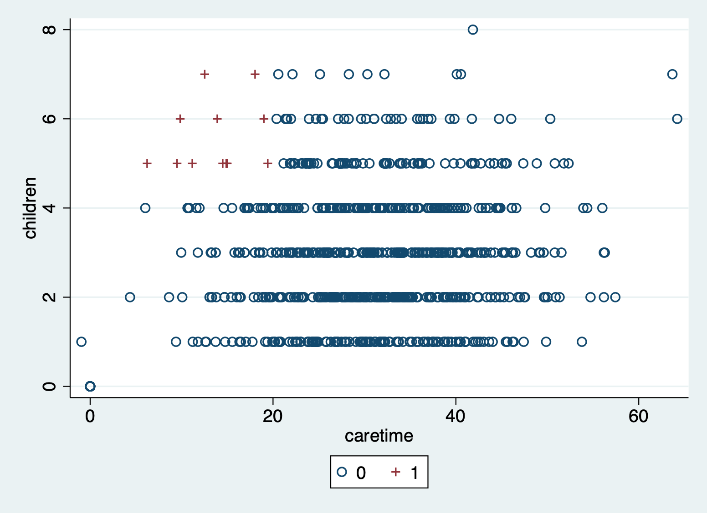

# Group #6 
# Project: Are women entrepreneurs time constrained from spend time in their business because of childcare? 

**BeverlyAnn Hippolyte, Diana Rivas Garcia, Young-Ju Nam**

An error we expect in the survey output is the wrong number of children entered. Bogota has an average of about 2 children per family(we are estimating a 2 child standard deviation) therefore we expect that the families having over 5 children to be very few and a potential error. However, some families might actually be that large and reviewing all of them with more than 5 children might not be efficient. Therefore, considering that more children result in more childcare time, we assume that there will be higher probability of error if a survey records a high amount of children but a low amount of care time. This way we can also check the potential error of recording the wrong care time if the families do have over 5 children.  

## Below is the sample output: 

The graph below shows the amount of errors by the enumerator ID.

Below shows the data that could be errors by differentiating them as red crosses.

