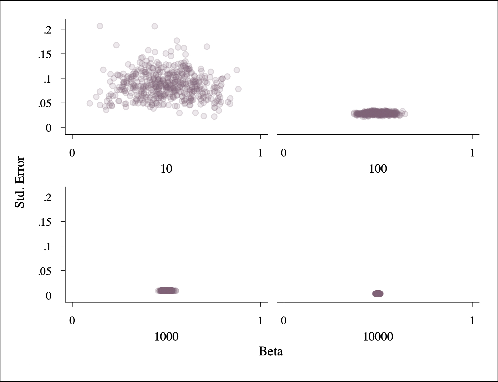
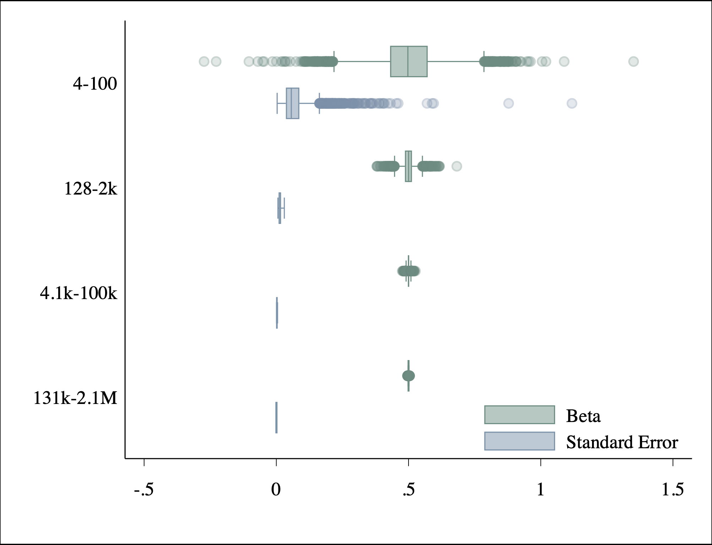
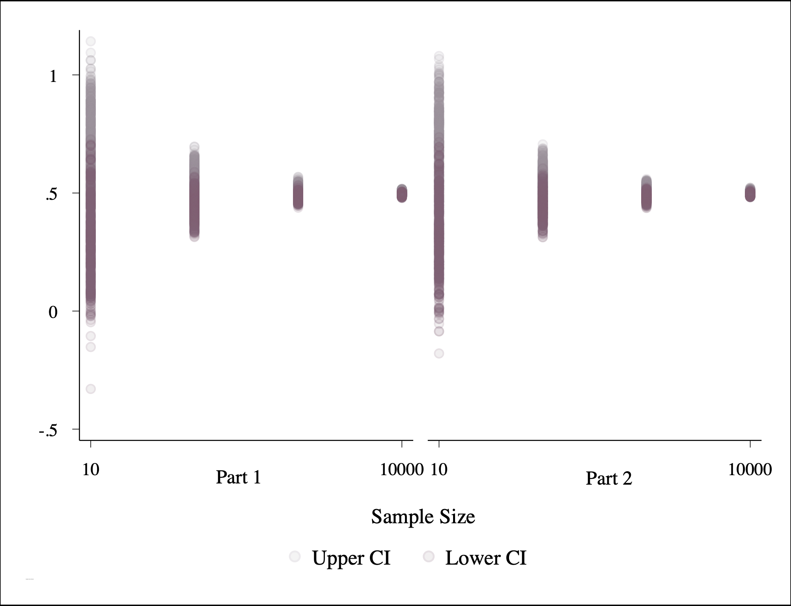
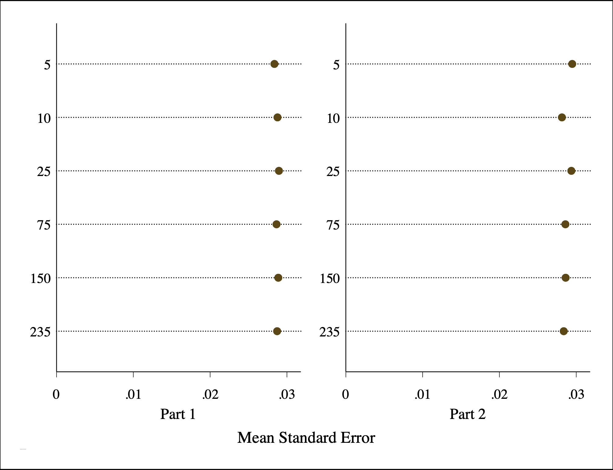

# Week 8 Assignment

Part 1: Finite Sample

Drawing from an dataset with a finite population of $N$ = 10,000, I compile regression statistics at increasing sample sizes for the following model: $ŷ$ =  $\beta$*0* +  $\beta$*1* $x$*1*  + $\epsilon$.

Results:
* Beta coefficients at every sample size hover around *$\bar{x}$* ≈ 0.50. 
* Plotting coefficients against standard errors  reveals considerably more variance at smaller samples sizes. 
* Standard errors and *p*-values converge toward 0 as sample size increases.
* Likewise, betas and the upper and lower bounds of the confidence intervals converge toward 0.50.
 

 

<b>Figure 1. Betas vs. Standard Errors by Sample Size.</b>

*Sample reps = 500*
 

<b>Table 1. Part 1 Regression Statistics.</b>
  
| N     | Beta   | Std. Err. | P-value | CI Upper  | CI Lower |
|-------|--------|-----------|---------|-----------|----------|
| 10    | 0.4994 | 0.0860    | 0.0062  | 0.6978    | 0.3010   |
| 100   | 0.5009 | 0.0288    | 0.0000  | 0.5580    | 0.4438   |
| 1000  | 0.5003 | 0.0091    | 0.0000  | 0.5182    | 0.4824   |
| 10000 | 0.4994 | 0.0029    | 0.0000  | 0.5051    | 0.4938   |
| Total | 0.5000 | 0.0317    | 0.0015  | 0.5698    | 0.4302   |

 

 

Part 2: Infinite Sample

I simulate a data generating process for a sample with $n$ number of observations, where $N$ ≠ 10,000, but instead is undefinied. As such, I can simulate samples where $n$ > 10,000.

* Betas and standards errors converge toward 0.50 and 0, respectively as sample size increases.
* Confidence intervals between Part 1 and Part 2 slightly differ at $n$ = powers of 10 since observations are randomly drawn a finite number of times (reps = 500) from different populations.
* Comparing the average of the standard errors in Part 1 and Part 2 at different rep sizes indicates that results converge as the number of reps increases (although differences are negligible past a sufficient number of reps, approximately between 25 < reps < 75.
 
___
 

<b>Figure 2. Betas and Standard Errors by Sample Size.</b>

 

<b>Table 2. Part 2 Regression Statistics.</b>

| N         | Beta     | Std. Err. | P-value  | CI Lower | CI Upper |
|-----------|----------|-----------|----------|----------|----------|
| 4-100     | .5010025 | .0725892  | .0206612 | .2973341 | .704671  |
| 128-2k    | .4998106 | .0134454  | 0        | .4733313 | .5262899 |
| 4.1k-100k | .5000354 | .0023543  | 0        | .4954204 | .5046505 |
| 131k-2.1M | .5000136 | .0004216  | 0        | .4991872 | .5008401 |
| Total     | .5002389 | .0233772  | .0055626 | .4378612 | .5626165 |

 

<b>Figure 3. Confidence Intervals by Sample Size.</b>
<i>Finite (Part 1) vs. Infinite (Part 2).</i>

 
*Note: Lighter color = upper bound*

 

<b>Table 3. Comparing Samples at Powers of 10.</b>

| N     | Beta   |          | Std. Err. |          | CI Lower |          | CI Upper |          |
|-------|--------|----------|-----------|----------|----------|----------|----------|----------|
|       | Finite | Infinite | Finite    | Infinite | Finite   | Infinite | Finite   | Infinite |
| 10    | 0.4994 | 0.5058   | 0.0860    | 0.0834   | 0.3010   | 0.3135   | 0.6978   | 0.6981   |
| 100   | 0.5009 | 0.4992   | 0.0288    | 0.0285   | 0.4438   | 0.4425   | 0.5580   | 0.5558   |
| 1000  | 0.5003 | 0.4990   | 0.0091    | 0.0091   | 0.4824   | 0.4811   | 0.5182   | 0.5170   |
| 10000 | 0.4994 | 0.5000   | 0.0029    | 0.0029   | 0.4938   | 0.4943   | 0.5051   | 0.5056   |
| Total | 0.5000 | 0.5010   | 0.0317    | 0.0310   | 0.4302   | 0.4329   | 0.5698   | 0.5691   |
 

<b>Figure 4. Standard Errors at Decreasing Rep Sizes ($n$ = 100).</b>
<i>Finite (Part 1) vs. Infinite (Part 2).</i>

 
