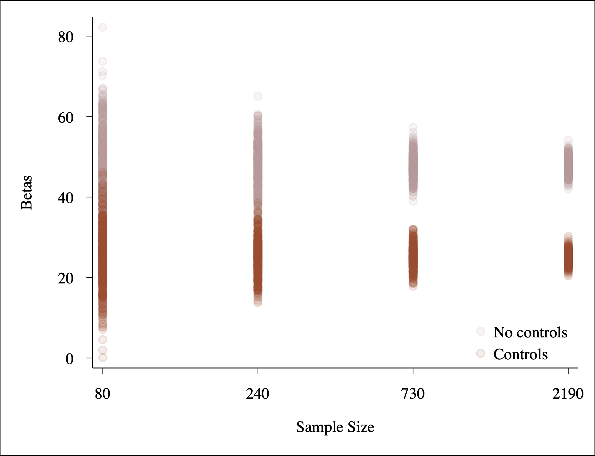
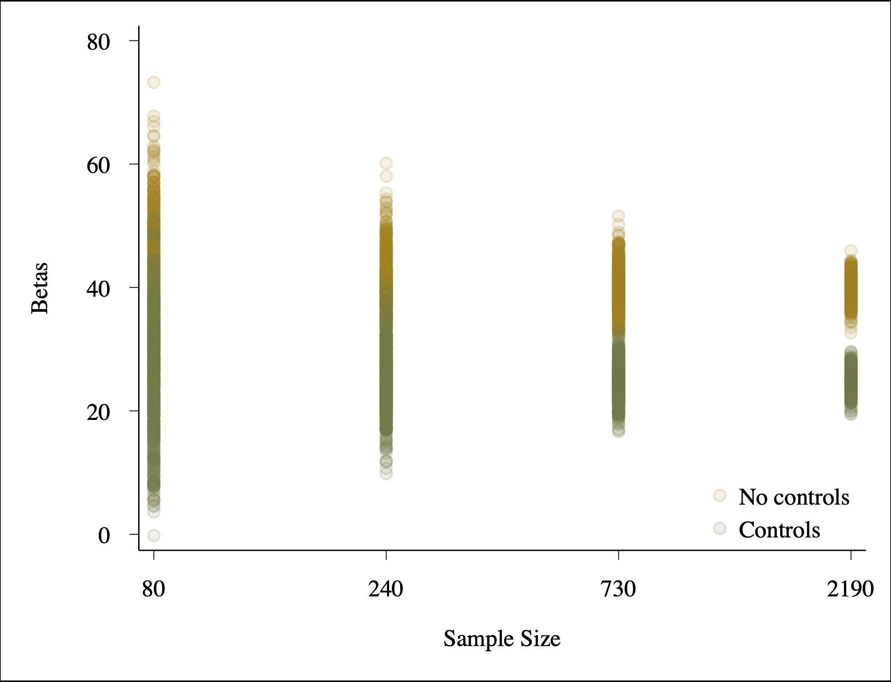

# Week 9 Assignment

Part 1: Three Parameters

I create a dataset to demonstrate how the below controls may bias or de-bias the estimated effect of receiving a credit builder loan on students credit score. Final results displayed in Table 2 and Table 4 indicate the estimated change in credit score for students in the treatment group compared to students in the control group. Despite considerable variance in $\beta$*treatment*&nbsp; at lower sample sizes, means of $\beta$*treatment*&nbsp; did not notably differ by sample size. 

* The variance in $\beta$*treatment*&nbsp; decreases as N gets larger.
* Exluding school effects constitutes omitted variable bias. As does excluding controls for age, female, and credit limit, which exert a positive, negative, and negative bias, repsectfully.
* Excluding parents' credit score does not bias results, as it is unrelated to treatment.
* Incliding the mediator ($x$ = *treatment on treated*) biases results by absorbing the treatment effects.

 

<b>Table 1. Variables and Intended Effects.</b>

| Variable                      | Description          | Effect on           |
|-------------------------------|----------------------|-------------------|
| $ŷ$                           | Credit Score         | -                 |
| $x$*treatment*     | Treatment (0 or 1)   | -                 |
| $x$*school*        | School (Strata)      | Treatment and $y$ |
| $x$*age*           | Age                  | Treatment and $y$ |
| $x$*parentscredit* | Parents credit score | $y$               |
| $x$*creditlimit*   | Credit limit         | Treatment         |
 

<b>Table 2. Mean Estimated Effect of Treatment.</b>
  
| Controls:                    | None   | Age                | Credit Limit       | Parents' Score | All    |
|------------------------------|--------|--------------------|--------------------|----------------|--------|
| Mean $\beta$*t* : | 47.679 | 25.103a | 54.333b | 47.647         | 25.010 |
|                              |        |                    |                    |                |        |

<i>Note: Estimates are not disaggregated by sample size because mean effect sizes marginally differ by N.
&nbsp;&nbsp;&nbsp;a Positive bias
&nbsp;&nbsp;&nbsp;b Negative bias
</i> 

<b>Figure 1. Estimated Treatment Effects by Sample Size.</b>
<i>No Controls vs. Controls</i>

 
 

Part 2: Five Parameters

I build on the same DGB to demonstrate how including an additional confounder and mediator further de-bias and bias the estimated effect of receiving a credit builder loan on students credit score. 

* Again, variance in $\beta$*treatment*&nbsp; decreases as sample size increases, though means of $\beta$*treatment*&nbsp; are relatively consistent at different sample sizes.
* Exluding controls for female exerts a negative bias.
* Including the mediator ($x$ = *the effect of treatment on treated*) biases results by completely absorbing the treatment effects, which are otherwise meaningful ($\beta$*t*&nbsp; = 24.954).

 

<b>Table 3. Variables and Intended Effects.</b>

| Variable                      | Description          | Effect            |
|-------------------------------|----------------------|-------------------|
| $ŷ$                           | Credit Score         | -                 |
| $x$*treatment*     | Treatment (0 or 1)   | -                 |
| $x$*ttreat*        | Treatment on Treated | $f$(*treatment*)  |
| $x$*school*        | School (Strata)      | Treatment and $y$ |
| $x$*age*           | Age                  | Treatment and $y$ |
| $x$*female*        | Female (0 or 1)      | Treatment and $y$ |
| $x$*parentscredit* | Parents credit score | $y$               |
| $x$*creditlimit*   | Credit limit         | Treatment         |
 

 

<b>Table 4. Mean Estimated Effect of Treatment.</b>

*a) Variable Biases*

| Controls:                    | None   | Age               | Credit Limit      | Parents' Score | Female            | Treated           |
|------------------------------|--------|-------------------|-------------------|----------------|-------------------|-------------------|
| Mean $\beta$*t* : | 39.766 | 17.290a | 43.593b | 39.816          | 47.550b | 14.604c |

 

*b) Specification Biases*

| Controls:                    | None   | All (No Treated)  | All (Treated) |
|------------------------------|--------|-------------------|---------------|
| Mean $\beta$*t* : | 39.766 | 24.954            | -0.139        |

<i>&nbsp;&nbsp;&nbsp;a Positive bias
&nbsp;&nbsp;&nbsp;b Negative bias
&nbsp;&nbsp;&nbsp;c Mediator bias
</i>  

<b>Figure 2. Estimated Treatment Effects by Sample Size.</b>
<i>No Controls vs. Controls (exc. Mediator)</i>

 
