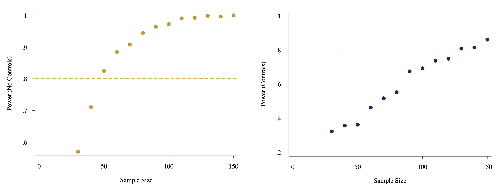

# Week 10 Assignment

Part 1. Minimum Sample Sizes and Detectable Effects

Simulated results indicate that a sample size of $n$ = 60 is required to detect treatment effects when excluding controls, in this case due to positive omitted variable bias. However, both power calculations and simulated results confirm that a larger sample of $n$ ≈ 130 is required when including proper controls. The minimum amount by which a credit score can change is 5pts, whuch would require a substantially larger sample size to detect $n$ ≈ 1800.

 

<b>Table 1. Variables and Intended Effects.</b>

| Variable                      | Description          | Effect on           |
|-------------------------------|----------------------|-------------------|
| $ŷ$                           | Credit Score         | -                 |
| $x$*treatment*     | Treatment (0 or 1)   | -                 |
| $x$*school*        | School (Strata)      | Treatment and $y$ |
| $x$*age*           | Age                  | Treatment and $y$ |
| $x$*parentscredit* | Parents credit score | $y$               |
| $x$*creditlimit*   | Credit limit         | Treatment         |
 

<b>Figure 1a. Sample size when $\beta$*treatment*&nbsp; = 20 Score Points.</b>
<i>Predicted Change in Credit Score = 20pts.</i>

 

<b>Figure 1b. Effect Size when $n$ = 130.</b>

 

<b>Figure 1c. Sample size when $\beta$*treatment*&nbsp; = 5 Score Points.</b>
<i>Minimum Change in Credit Score</i>

 

 

 

Part 2. CIs with Clustered Random Errors

I create 5 clusters within 6 strata (schools) at the student level and assign treatment and outcomes effects by cluster. Analytic and exact  confidence intervals follow distinct patters as sample size increases. 
* Analytic intervals behave conventionally without random effects by exponentiall decreasing as sample size increases. 
* Exact statistic always follow a more uniform distribution
* Analytics results resemble an even smoother uniform distribution when controlling for random effects.  
 

<b>Figure 2a.</b>

<b>Figure 2b.</b>

 

<b>Figure 2c.</b>

  