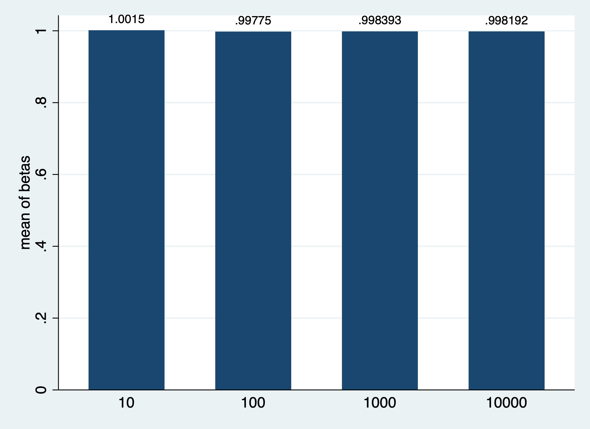

Keegan Brown
Week 8 Assignment 

## Part 1

	(1)	(2)
	n 10000	
VARIABLES	mean	sd
		
betas	1.002	
ses	0.00290	
interval	0.0114	
		

As we inrease sample size we can see that the betas tend to center to the population mean, and that the variance decreases. 

## Part 2 

	(1)	(2)	(3)	(4)	(5)	(6)	(7)	(8)	(9)	(10)	(11)	(12)	(13)	(14)	(15)	(16)	(17)	(18)	(19)	(20)	(21)	(22)	(23)	(24)	(25)	(26)	(27)	(28)	(29)	(30)	(31)	(32)	(33)	(34)	(35)	(36)	(37)	(38)	(39)	(40)	(41)	(42)	(43)	(44)	(45)	(46)	(47)	(48)	(49)	(50)	(51)	(52)
	samplesize 4		samplesize 8		samplesize 10		samplesize 16		samplesize 32		samplesize 64		samplesize 100		samplesize 128		samplesize 256		samplesize 512		samplesize 1000		samplesize 1024		samplesize 2048		samplesize 4096		samplesize 8192		samplesize 10000		samplesize 16384		samplesize 32768		samplesize 65536		samplesize 100000		samplesize 131072		samplesize 262144		samplesize 524288		samplesize 1000000		samplesize 1048576		samplesize 2097152	
VARIABLES	mean	sd	mean	sd	mean	sd	mean	sd	mean	sd	mean	sd	mean	sd	mean	sd	mean	sd	mean	sd	mean	sd	mean	sd	mean	sd	mean	sd	mean	sd	mean	sd	mean	sd	mean	sd	mean	sd	mean	sd	mean	sd	mean	sd	mean	sd	mean	sd	mean	sd	mean	sd
																																																				
betas	0.351		1.623		0.843		0.789		0.776		0.998		0.950		1.107		0.919		1.057		1.000		1.027		0.998		1.016		1.026		1.004		1.002		0.998		1.000		1.000		1.000		0.999		0.997		1.000		0.999		1.000	
se	1.375		1.344		1.036		0.773		0.551		0.370		0.307		0.270		0.188		0.131		0.0964		0.0943		0.0675		0.0467		0.0331		0.0299		0.0235		0.0166		0.0117		0.00948		0.00828		0.00586		0.00414		0.00300		0.00293		0.00207	
lower	-5.567		-1.665		-1.545		-0.869		-0.349		0.259		0.341		0.573		0.548		0.799		0.811		0.842		0.866		0.925		0.961		0.946		0.956		0.966		0.977		0.981		0.984		0.987		0.989		0.994		0.993		0.996	
upper	6.269		4.912		3.231		2.448		1.902		1.738		1.560		1.641		1.289		1.314		1.189		1.212		1.131		1.108		1.091		1.063		1.048		1.031		1.023		1.018		1.016		1.010		1.006		1.005		1.005		1.004	

From our graph, we can see that the true expected value of the betas is not changing, but our confiecne intervals around those values begin to grow smaller with increased sample size. 
					