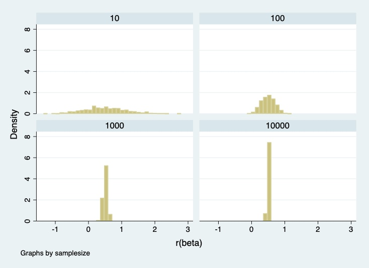
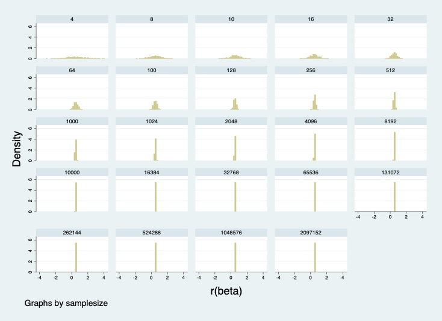

### Part 1:

My dataset of 2,000 regression results shows that the range of data narrows with larger sample sizes, meaning that a random sample from the "population" of 10,000 will likelier be near the true mean when the sample size is large. Our estimates vary much less, which is also reflected in the decrease in the standard error as sample size increases (see below table).

In the below visualization, we can see that the histogram becomes more compact around the population mean of 0.5 with greater sample sizes. 

The below table shows the interquartile range (IQR), or the range between the values at the 25th and 75th percentiles, to illustrate the distribution becoming more narrow with larger sample sizes. 

| samplesize | beta_coef | se       | lowerbound | upperbound |
|------------|-----------|----------|------------|------------|
| 10         | .8528116  | .2196625 | 1.01841    | 1.062416   |
| 100        | .2996107  | .0215875 | .2961054   | .3030261   |
| 1000       | .0835119  | .0019469 | .0860843   | .0820341   |
| 10000      | .0241674  | .0001934 | .0244318   | .0244547   |

### Part 2:

We are able to draw a larger sample size than in Part 1 because we no longer have a fixed "population" of 10,000. With the program for this question, we are essentially creating different samples from an "infinite" population so the sample size can be much larger than 10,000. The sizes of the SEM and confidence intervals are different than the powers of ten exercise in Part 1, because the "population" isn't 10,000 anymore like in Part 1, and because of that, the standard error will definitely be much different (the formula for SEM takes into account sample size. Relatedly, this also means that the confidence intervals will be different since the CI formula also takes into account sample size. 

The below table shows the interquartile range for each sample statistic. We can see that the IQR is getting smaller as the sample size gets larger.

| samplesize | beta_coef | se       | lowerbound | upperbound |
|------------|-----------|----------|------------|------------|
| 4          | 1.669973  | .7649495 | 3.702642   | 3.657247   |
| 8          | 1.040371  | .2883453 | 1.264862   | 1.160076   |
| 10         | .8333766  | .214225  | .9958369   | .9916942   |
| 16         | .6878898  | .1470353 | .7490716   | .7853458   |
| 32         | .4927524  | .066791  | .4708739   | .5282661   |
| 64         | .3482072  | .0299469 | .3431396   | .3477476   |
| 100        | .2938523  | .0208032 | .2889371   | .2938225   |
| 128        | .2215863  | .0160715 | .2247676   | .230391    |
| 256        | .1607429  | .0078905 | .1566968   | .1645301   |
| 512        | .1191933  | .0038624 | .1194752   | .122222    |
| 1000       | .0878934  | .0017876 | .0887795   | .0877911   |
| 1024       | .0819323  | .0017198 | .0844103   | .0803848   |
| 2048       | .0690091  | .0010528 | .0698907   | .0694952   |
| 4096       | .0440536  | .0004473 | .0444862   | .0435599   |
| 8192       | .0311541  | .0002449 | .031088    | .0308527   |
| 10000      | .0285302  | .0001861 | .0286206   | .0284284   |
| 16384      | .0218695  | .0001214 | .0220322   | .0218424   |
| 32768      | .0138608  | .000064  | .0138016   | .0140374   |
| 65536      | .0106483  | .0000316 | .010683    | .0106488   |
| 131072     | .0072305  | .0000146 | .0072046   | .0072297   |
| 262144     | .0057328  | 7.50e-06 | .0057296   | .0057195   |
| 524288     | .0037896  | 3.53e-06 | .0038009   | .0037784   |
| 1048576    | .0028277  | 1.94e-06 | .0028216   | .0028338   |
| 2097152    | .0018944  | 8.74e-07 | .0018984   | .0018903   |

A comparison table of the IQRs is below for the powers of ten examples from Part 1 and Part 2 (in a long format). We can see that the estimates are very similar across Parts 1 and 2.

| Population | samplesize | beta_coef | se       | lowerbound | upperbound |
|------------|------------|-----------|----------|------------|------------|
| 10,000     | 10         | .8528116  | .2196625 | 1.01841    | 1.062416   |
| "infinite" | 10         | .8333766  | .214225  | .9958369   | .9916942   |
| 10,000     | 100        | .2996107  | .0215875 | .2961054   | .3030261   |
| "infinite" | 100        | .2938523  | .0208032 | .2889371   | .2938225   |
| 10,000     | 1000       | .0835119  | .0019469 | .0860843   | .0820341   |
| "infinite" | 1000       | .0878934  | .0017876 | .0887795   | .0877911   |
| 10,000     | 10000      | .0241674  | .0001934 | .0244318   | .0244547   |
| "infinite" | 10000      | .0285302  | .0001861 | .0286206   | .0284284   |

I would expect the IQRs to be smaller for simulations with a higher number of repetitions since we're adding more observations to the histogram of each sample size (i.e. each repetition produces an additional data point or tally in our histogram). When I ran the simulation with a smaller set of 100 repetitions (not daring to go higher since it would take an obscene amount of time to run), it looks pretty inconclusive to me actually. Some distributions are wider, on average, when running 500 simulations, and others are wider when running 100 simulations, for the same sample size.

