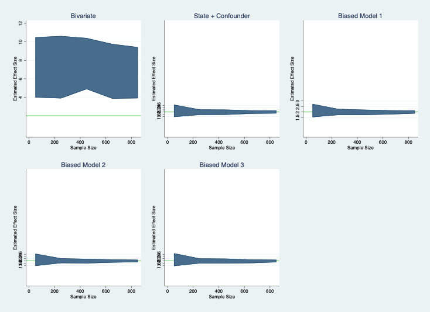

# Week 9 Assignment 

## Part 1: De-biasing a parameter estimate using controls

### Data Dictionary
_state_: US state (strata for this assignment)

_salary_: individual's salary (hourly $ wage)

_daca_: treatment dummy set equal to 1 when individuals have DACA; 0 otherwise

_corr_x_noenglish_: percentage of time at home spent speaking another language besides English. Related to an individual having DACA but not related to salary (in this flawed hypothetical)

_corr_y_healthcare_: individual out-of-pocket health care expenses. Related to salary but not DACA (in this flawed hypothetical)

_conf_school_: years of schooling. Related to both DACA status and salary.

### Regression Models
**Bivariate**: A simple bivariate regression of salary on DACA status.

**State + Confounder**: A multivariate regression of salary on DACA status, controlling for state fixed effects and years of schooling (confounder).

**Biased Model 1**: A multivariate regression of salary on DACA status, controlling for state fixed effects, years of schooling (confounder), and percentage of time at home spent speaking another language besides English (related to DACA status, not salary).

**Biased Model 2**: A multivariate regression of salary on DACA status, controlling for state fixed effects, years of schooling (confounder), and out-of-pocket health care expenses (related to salary, not DACA status).

**Biased Model 3**: A multivariate regression of salary on DACA status, controlling for state fixed effects, years of schooling (confounder), percentage of time at home spent speaking another language besides English (affects DACA status, not salary, and out-of-pocket health care expenses (related to salary, not DACA status).

### Discussion

Controlling for state fixed effects and a confounder really reduced the range of Beta estimates from my simple bivariate model. Once I controlled for those, the estimates increasingly narrowed as sample size grew around the true DACA effect of 2 (indicated by the green line). The biased models also narrowed around the true DACA effect as sample size increased, but they were less precise.

Somewhat surprisingly, the mean of the Beta estimates did hover around 2 across sample sizes. The standard error of the mean is approximately the same for all models except the bivariate one, but it's smallest for Biased Model 2. 

## Part 2: Biasing a parameter estimate using controls

### Data Dictionary

All variables from Part 1 are also applicable for Part 2. The following are additional variables:

_channel_jobchange_: A continuous variable measuring whether individuals changed jobs (a channel, or means for DACA status to affect salary)(a flawed hypothetical since a binary would make more sense)

_collider_luck_: A continuous variable measuring an individual's luck (a function of both DACA and salary (flawed but fun)

### Regression Models
**Bivariate**: A simple bivariate regression of salary on DACA status.

**State + Confounder**: A multivariate regression of salary on DACA status, controlling for state fixed effects and years of schooling (confounder).

**Biased Model 1**: A multivariate regression of salary on DACA status, controlling for state fixed effects, years of schooling (confounder), and job changes (a channel).

**Biased Model 2**: A multivariate regression of salary on DACA status, controlling for state fixed effects, years of schooling (confounder), and luck (a collider).

**Biased Model 3**: A multivariate regression of salary on DACA status, controlling for state fixed effects, years of schooling (confounder), job changes (a channel), and luck (a collider).

### Discussion

The first two models use the same variables as the Bivariate and State + Confounder models in Part 1, but neither show the true DACA effect of 2. This is because my outcome variable, salary, is a function of my channel, job changes. In turn, job changes is a function of DACA itself (2 * DACA). As a result, in the "State + Confounder" model--which I would expect to be unbiased--the estimated effect of DACA becomes augmented since I'm essentially considering it multiple times during my outcome variable generation process (DACA effect + channel = 2*DACA + 2*DACA = 4*DACA). In Biased Model 1, I control for the channel variable (job changes) and the Beta estimates produced remain upwardly biased. However, the most extreme change occurs in Biased Models 2 & 3, where I control for the collider, luck. The sign of the effects changes completely and it stays a constant negative value (-1.33, not pictured). It's a good illustration on why we should leave colliders out of our models completely. That being said, I was surprised by how all estimates for the Beta will be biased across all models. Again, this is because we included the channel in our DGP for the outcome.  

