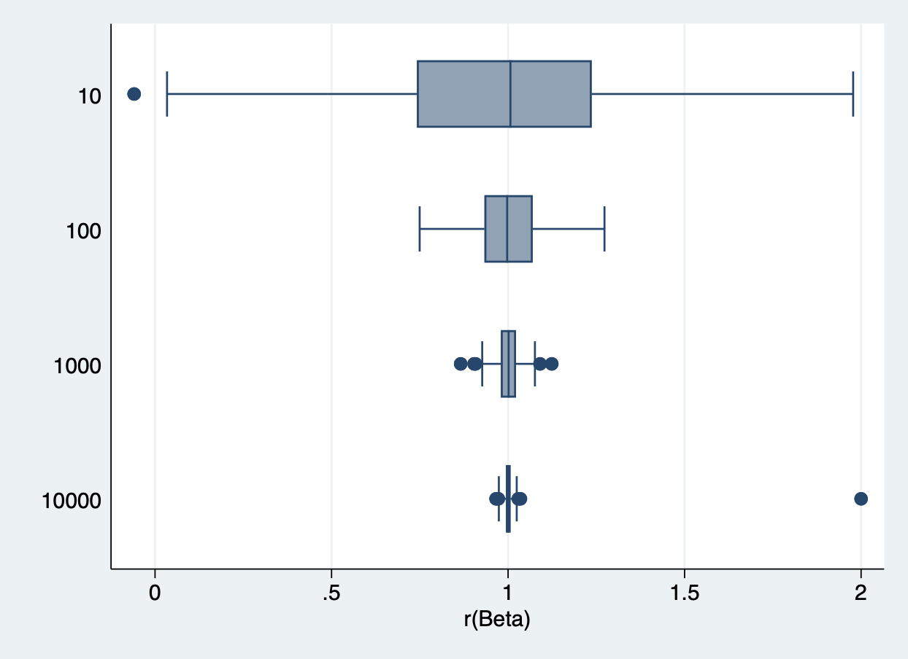
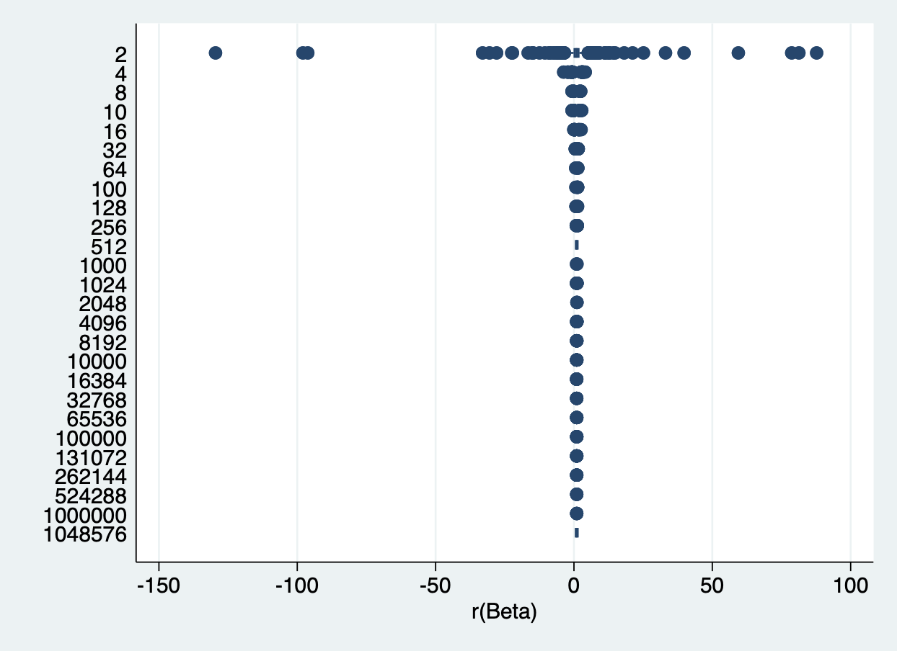

# Part 1

|samplesize |   beta    |   CI_L   |   CI_R    |    SEM   |
|:--------- |:----------|:---------|:----------|:---------|
|        10 |  1.002253 | .1836214 |  1.820885 | .3550002 |
|       100 |  1.002622 | .8027297 |  1.202513 | .1007282 |
|      1000 |  1.000917 | .9392642 |  1.06257  | .0314181 |
|     10000 |  1.002193 | .9807072 |  1.01968  | .009941  |

From the figure and table, the beta estimate does not change significantly according to the sample size, and is very close to 1.

As N gets larger, the SEM and confidence intervals should get smaller. This is because as we increase the sample size, we are reducing the sampling error, which is the variability in the estimates due to chance sampling. The standard error of the mean (SEM) is proportional to the standard deviation divided by the square root of the sample size. Therefore, as the sample size increases, the SEM decreases. Similarly, the confidence interval is inversely proportional to the square root of the sample size. Therefore, as the sample size increases, the confidence interval narrows.

# Part 2

|samplesize |      beta |     CI_L  |    CI_R   |    SEM    |
|:----------|:----------|:----------|:----------|:---------:|
|         2 |  .8458767 |        .  |       .   |      .    |
|         4 |  1.017252 |  -2.04752 | 4.082024  | .7122983  |
|         8 |  .9860938 |   .01206  | 1.960128  | .3980666  |
|        10 |  1.000697 | .1981487  | 1.803245  | .3480254  |
|        16 |  .9829751 |  .4129157 | 1.553035  | .2657884  |
|        32 |  1.005089 | .6283156  | 1.381862  | .1844872  |
|        64 |  .9987657 | .7437588  | 1.253773  | .127569   |
|       100 |   .999001 |   .798679 | 1.199323  | .100945   |
|       128 |  .9920567 | .8159204  | 1.168193  | .089004   |
|       256 |  1.000748 |  .8769003 | 1.124596  | .0628879  |
|       512 |  .9991645 | .9123122  | 1.086017  | .044208   |
|      1000 |  .9997497 |  .9377218 | 1.061778  | .0316091  |
|      1024 |   .998845 | .9373049  | 1.060385  | .0313614  |
|      2048 |  1.000581 |  .9572508 | 1.04391   | .0220943  |
|      4096 |  .9994394 | .9688063  | 1.030073  | .0156248  |
|      8192 |  1.000248 |  .9785931 | 1.021903  | .0110469  |
|     10000 |  .9999321 | .9803232  | 1.019541  | .0100035  |
|     16384 |  .9999704 |  .9846633 | 1.015277  | .0078093  |
|     32768 |  1.000032 | .9892084  | 1.010855  | .005522   |
|     65536 |   1.00039 |  .9927353 | 1.008045  | .0039055  |
|    100000 |  1.000153 | .9939555  | 1.006351  | .0031622  |
|    131072 |  .9999592 | .9945457  | 1.005373  | .002762   |
|    262144 |  .9998121 | .9959837  | 1.003641  | .0019533  |
|    524288 |  .9998652 | .9971581  | 1.002572  | .0013812  |
|   1000000 |  .9999775 | .9980175  | 1.001938  | .0010001  |
|   1048576 |  .9999334 | .9980194  | 1.001847  | .0009766  |
   
From the figure and table, we can find that, similar to Part 1, the beta value does not change much with the sample size, and the beta estimates to converge to the true value, while the SEM and confidence intervals shrink as the sample size increases. Not only that, but it can also be found from the table that as the sample size increases, the change range of SEM and CI becomes smaller.

The ability to draw a larger sample size in Part 2 compared to Part 1 is due to the fact that Part 2 involves sampling from an infinite superpopulation, whereas Part 1 involves sampling from a fixed population. As the sample size increases in Part 2, the SEM and confidence intervals may become smaller due to the larger sample size and the fact that the sample is more representative of the superpopulation. However, the sizes of the SEM and confidence intervals may be different at the powers of ten than in Part 1 because the superpopulation may have different characteristics or distributions than the fixed population.

Comparison table:

| Sample size | SEM (Part 1) | SEM (Part2) |
|:------------|:------------:|:-----------:|
| 10          |   .3550002   |  .3480254   |
| 100         |   .1007282   |  .100945    |
| 1000        |   .0314181   |  .0316091   |
| 10000       |   .009941    |  .0100035   |
| 100000      |              |  .0031622   |
| 1000000     |              |  .0010001   |

The results may change if we increase or decrease the number of repetitions, as this may affect the precision and accuracy of the estimates.