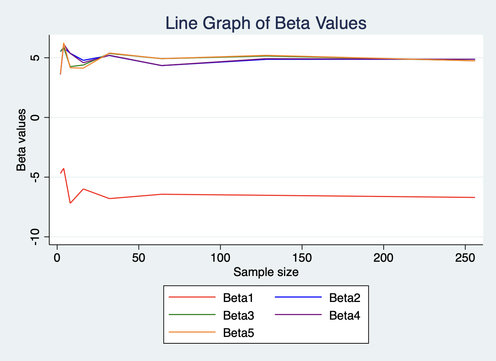
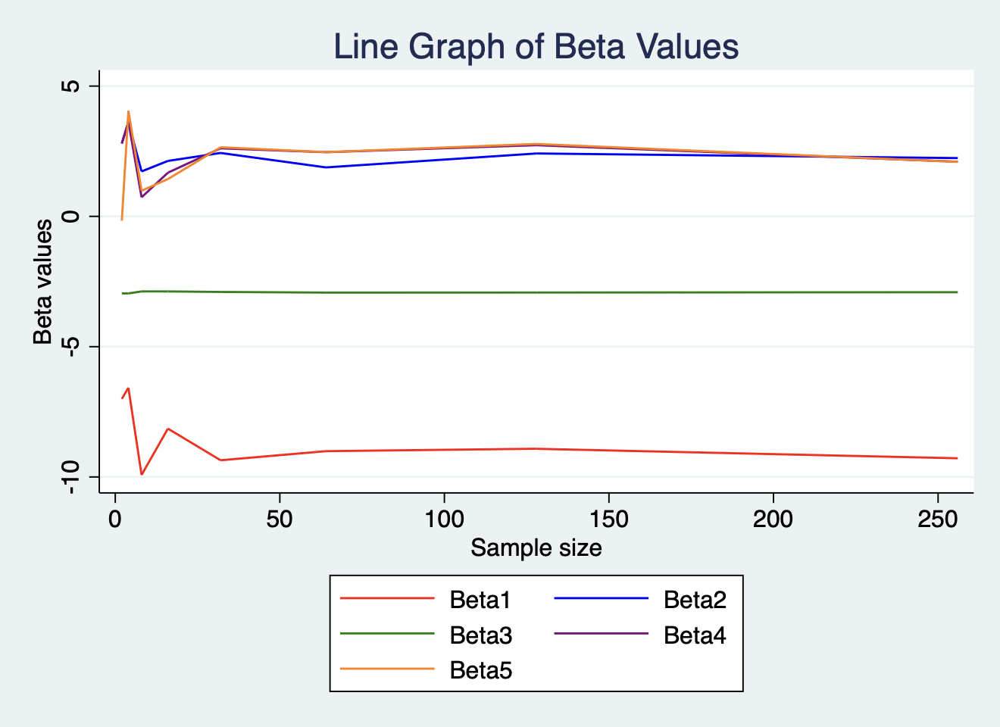

# Part one

|samplesize |   beta1  |   beta2  |   beta3  |   beta4  |   beta5  |
|:----------|:---------|:---------|:---------|:---------|:---------|
|         2 | -4.690646|  5.515604|  5.515536|  3.609921|  3.647691|
|         4 | -4.258713|  5.836529|  5.862241|  6.136644|  6.257674|
|         8 | -7.188596|  5.379711|  4.256903|  5.366421|  4.159163|
|        16 | -5.990525|  4.783673|  4.392635|  4.585372|  4.132096|
|        32 | -6.796387|  5.188379|  5.362726|  5.207388|  5.397692|
|        64 | -6.433371|  4.344003|  4.924297|  4.348243|  4.926929|
|       128 | -6.519008|  4.867979|  5.148422|  4.921265|  5.205618|
|       256 | -6.698785|  4.879347|  4.750026|  4.871841|  4.742855|

From the tables and figures we can observe that missing covariates distort the coefficient estimates for treat. At the same time, as the sample continues to increase, although the coefficient estimate of treat still fluctuates, it tends to the true value.

# Part two

|samplesize |     beta1 |    beta2 |    beta3  |  beta4   |   beta5  |
|:--------- |:----------|:---------|:----------|:---------|:---------|
|         2 | -7.004296 | 2.799126 |-2.954797  |2.79919   |-.1647684 |
|         4 | -6.577161 | 3.616373 |-2.956766  |3.628645  |4.054646  |
|         8 | -9.923226 | 1.725568 |-2.878554  |.7333176  |.9852172  |
|        16 | -8.143732 | 2.128747 |-2.880272  |1.676882  |1.431225  |
|        32 | -9.359378 | 2.43473  |-2.89901   |2.612908  |2.653395  |
|        64 | -9.010195 | 1.879616 |-2.923849  |2.463463  |2.466607  |
|       128 | -8.916148 | 2.414814 |-2.922263  |2.734034  |2.78197   |
|       256 | -9.282635 | 2.236676 |-2.907643  |2.096793  |2.092279  |

Similer to part one, from the tables and figures we can observe that missing covariates distort the coefficient estimates for treat. At the same time, as the sample continues to increase, although the coefficient estimate of treat still fluctuates, it tends to the true value. 

From Model 3 we can see that including colliders in the model may introduce bias in the estimate of the treatment effect. The collider is a variable that is affected by both treatment and outcome, controlling for it would produce a spurious relationship between treatment and outcome. Therefore, models that include colliders may produce biased estimates.