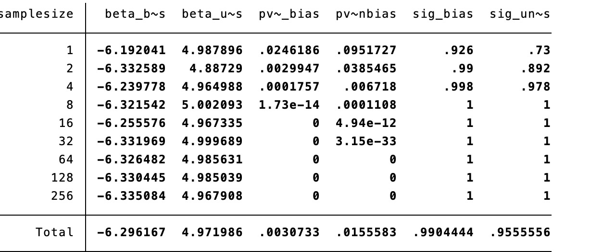
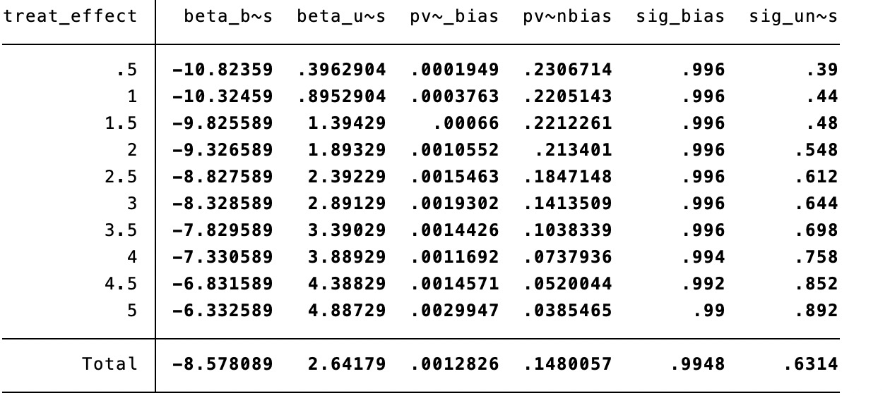
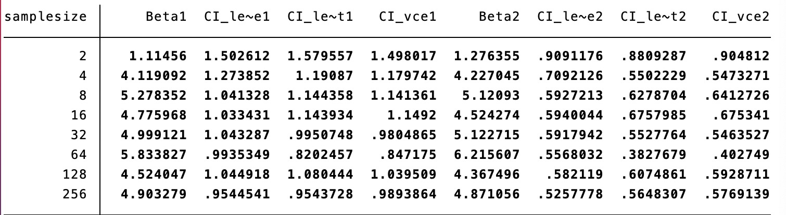
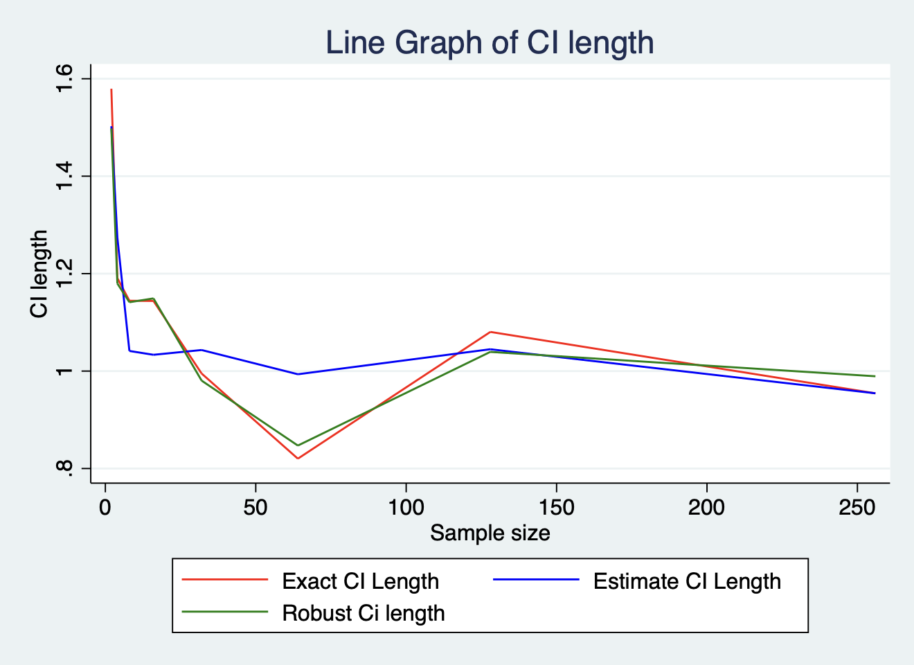
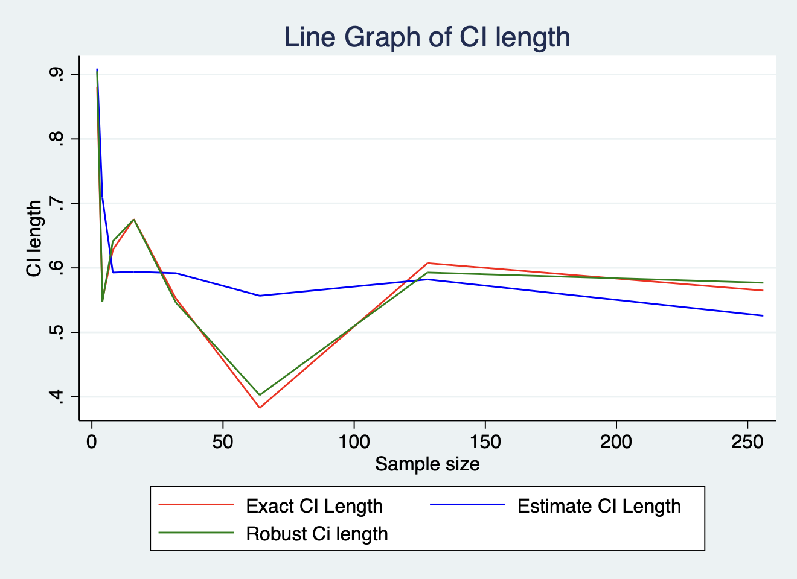

# Part one

Biased Model: Score = beta0 + beta1 * treat + u_i + u_ij + e_ijk
Unbiased Model: Score = beta0 + beta1 * treat + beta2 * urban + beta3 * teach_exp + beta4 * mother_educ + u_i + u_ij + e_ijk

The three random errors represent the random errors of the three strata levels of the school, classroom, and students, respectively.

From the table above, the "minimum sample size" required to achieve 80% power for the regression model with and without the unbiased control is 2.
Note: Since strata is added to the model, the obs (sample size) in the actual regression is equal to 2 * 10 * [16, 25] = [320, 500]. Therefore, we can think that the minimum sample size to achieve the target power is 320 to 500, which can be approximated as 320.

As can be seen from the figure above, when the number of fixed samples is 2, the "minimum detectable effect size" we found is 4.5 (its value should be between 4 and 4.5), that is, at this size, no matter whether the unbiased control is used or not , the regression model can obtain 80% power

# Part two

DGP1: Score = beta0 + beta1 * treat + beta2 * urban + u_i + u_ij

DGP1 without indvidual random error: Score = beta0 + beta1 * treat + beta2 * urban + u_i

u_i is the random error at the cluster level, and u_ij is the random error at the individual level

From the above table, we can relatively intuitively find that as the number of samples increases, the estimated value of beta will converge towards the true value, and the confidence interval will become narrower as a whole (length changes short).

From the above two figures, we can draw the following conclusions:
1) As the number of samples increases, estimate/analytical CI will gradually converge to empirical/exact CI.
2) If the random error term is only determined at the cluster level, then the convergence of estimate/analytical CI to empirical/exact CI will decrease as the sample increases. This difference is especially pronounced when the sample size is large.
3) The vce() option in regress can help "analytical" confidence intervals to be correct. From the figure, no matter whether the random error term at the group level is added or not, the estimated/analytical CI after vce is obviously closer to the empirical/exact CI, especially when the sample size is small.
