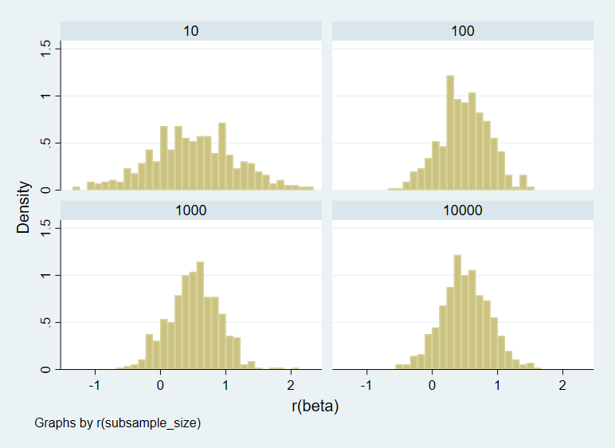
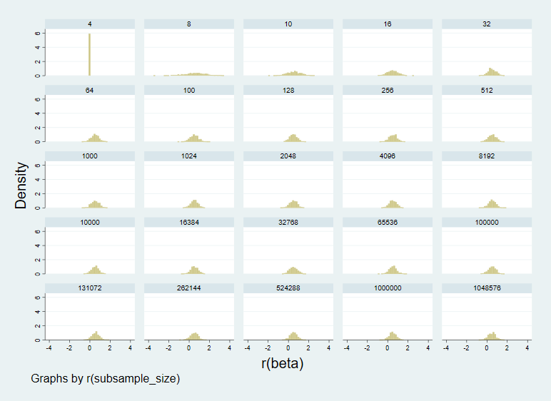

# Week 08 - Simulation Assignment 
Serenity Fan (kaf121)

## Part 1: Sampling noise in a fixed population

The graph below shows the result of performing 500 simulations at subsample sizes of 10, 100, 1000, and 10,000, respectively, where the size of the fixed population is 10,000. The data generating process is given by the equation  

gen y = x1 + treatment*runiform()  

where x1 is 10,000 random draws from the standard normal distribution, and the treatment 'treatment' applied is a dummy variable adding the standard uniform distribution in noise. The noise is generated by associating a random number (again drawn from the normal distribution) to each observation, ranking observations by these random numbers in sequence, and then applying the aforementioned treatment to all observations of rank>7.  

The graph shows, when comparing across increasing subsample size, some convergence to a value roughly at ~0.5. At N=10, while this rough mean is still apparent, it is very 'noisy', with other peaks around ~1.0 and ~0. In comparison, while N=100 still demonstrates some noisy behaviour, it is more well ordered, and narrower at extreme values than at N=10. This general trend continues for N=1000 and N=10,000, where the latter is the closest to appearing to approximate a normal distribution. However, it is notable that the most significant improvement occurs from N=10 to N=100; while even at N=10,000, the distribution is subtly though not substantially 'cleaner', and also subtly though not substantially narrower. 

  

The table below summarizes these simulation results for the fixed population: 

| N (sub-sample size) | mean(Beta)  | mean(SEM) | mean(CI)         | 
| ------------------- | ----------- | --------- | ---------------- |
| 10                  | 0.500       | 0.680     | (-1.069, 2.068)  | 
| 100                 | 0.495       | 0.407     | (-0.314, 1.304)  | 
| 1000                | 0.516       | 0.395     | (-0.259, 1.290)  | 
| 10,000              | 0.506       | 0.393     | (-0.265, 1.277)  | 

In terms of general trends as N (the sub-sample size) increases from 10, the minimum value selected, to 10,000, the maximum possible value (for which the sample is equal to the population), the mean value for beta 'hops around' the theoretical mean value of 0.5, though notably, from only these 4 simulations, there is no evidence of convergence to 0.5. However, the reduction in mean SEM with increasing N suggests convergence. The variation in mean SEM values with increasing N corroborates the previous visual observations from the graph: the steepest reduction in mean SEM occurs when going from N=10 to N=100 (with a reduction of 0.273 in mean SEM), compared to say the N=1000 to N=10,000 transition (with a reduction of only 0.002). The trend in the CI follows suit, with the most significant narrowing in the CI occuring from N=10 to N=100, with only a very marginal CI narrowing occuring from N=1000 to N=10,000.  

## Part 2: Sampling noise in an infinite superpopulation.

Now, we use the same data-generating process, but by varying the population, N (rather than sample) size. The graph below shows this process for selected values of N in alternating powers of 2, as well as in powers of 10, from a range of N=(4, 1,048,576). The mean values of the beta estimates, SEM, and CI's are also listed in the table below.  

  

| N (population size) | mean(Beta)  | mean(SEM) | mean(CI)         | 
| ------------------- | ----------- | --------- | ---------------- |
| 4                   | 0           | N/A       | N/A              | 
| 8                   | 0.532       | 1.028     | (-1.982, 3.047)  | 
| 32                  | 0.492       | 0.439     | (-0.404, 1.388)  | 
| 128                 | 0.518       | 0.403     | (-0.280, 1.316)  | 
| 512                 | 0.505       | 0.396     | (-0.272, 1.282)  |
| 2048                | 0.499       | 0.394     | (-0.273, 1.272)  | 
| 8192                | 0.505       | 0.394     | (-0.266, 1.276)  | 
| 32,768              | 0.495       | 0.393     | (-0.276, 1.266)  | 
| 131,072             | 0.538       | 0.393     | (-0.233, 1.309)  | 
| 1,048,576           | 0.490       | 0.393     | (-0.281, 1.261)  |
| 
| 10                  | 0.543       | 0.677     | (-1.018, 2.104)  | 
| 100                 | 0.491       | 0.407     | (-0.316, 1.299)  |
| 1000                | 0.524       | 0.395     | (-0.251, 1.299)  | 
| 10,000              | 0.503       | 0.394     | (-0.268, 1.275)  | 
| 100,000             | 0.497       | 0.393     | (-0.274, 1.268)  |
| 1,000,000           | 0.490       | 0.393     | (-0.281, 1.261)  | 

Beginning with N=4, all betas (as well as the mean value) are 0, in accordance with the fact that our data generating process only applied the treatment to observations of rank>7. However, with only 4 observations, this means that the treatment was not applied, in that particular simulation. As such, it follows that we should obtain a perfect estimtae of the mean of the standard normal distribution, of 0. At N=8, we see a very scattered distribution of beta estimates, corresponding to a large SEM of 1.028, and a large confidence interval of (-1.982, 3.047). The SEM decreases going up to N=100 (or 128), and the CI also narrows considerably. For values of approximately N>100, until approximately N=1,000,000 the mean SEM stays relatively constant, varying by less than 1%, and the mean CI also deviates correspondingly little. 

As with Part I, however, even upon looking at very large N values, mean Beta does not appear to converge to the theoretical value of 0.5. 