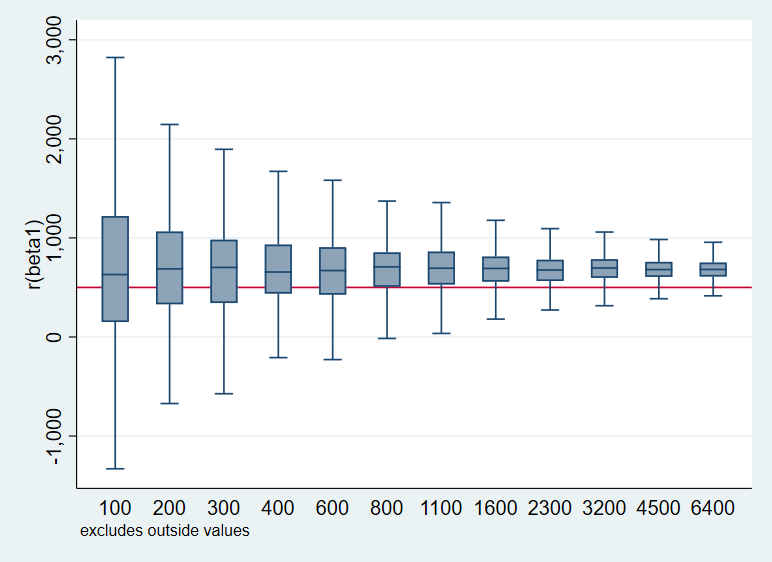
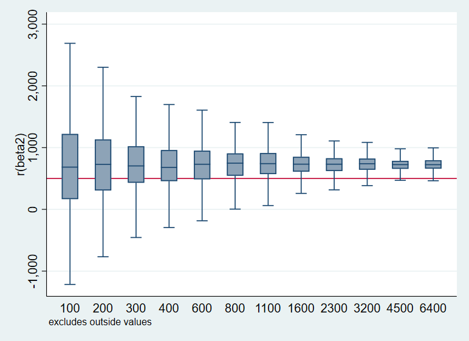
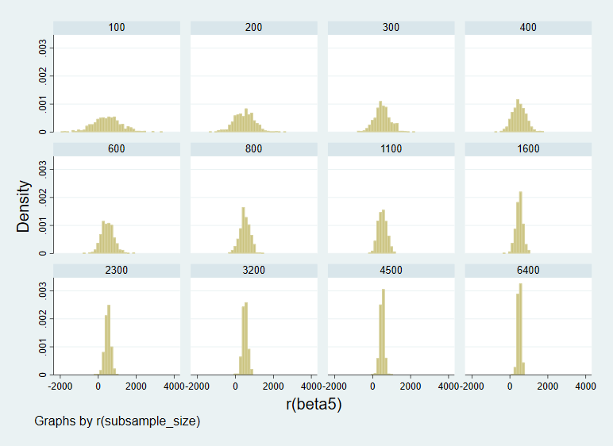
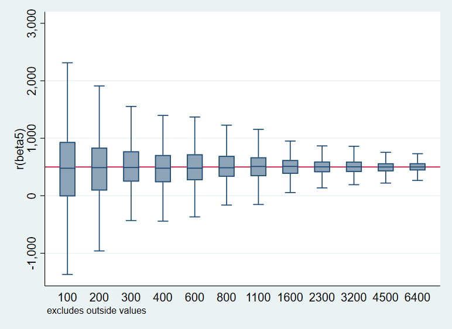
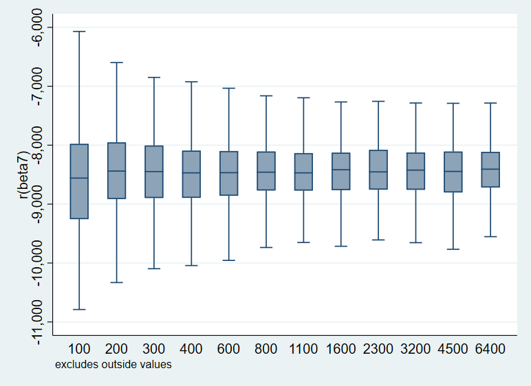

# Week 09: Multi-level Simulation Assignment

PPOL 768: Serenity Fan 
Last Updated: May 1st, 2023 

## Part 1: De-biasing a Parameter using Controls 

Applying the model to the policy problem of our group project, manual scavenging in India, I define a multi-level model with variables and levels i, j, k such that:  

* Y = Income 
* X1 = Treatment: Number of days spent attending employment training, mentorship, and services  
* X2 = Years of education (continuous covariate #1)
* X3 = Years to date spent working in manual scavenging field (continuous covariate #2)
* X4 = Door-to-door transit time to city centre (continuous covariate #2)
* X5 = Gender (indicator variable)

* i = District level (75 districts in UP)
* j = Village-level (panchiyat) or municipality 
* k = Household-level 

The data generating process (DGP) is
	income = 10000 + rnormal(500, 100) * treatment - 30*scav_years - 40*transit_time + 300*educ + u_i + u_ij + e_ijk  

where the treatment varies by village (50% of villages assigned to treatment, 50% to control), by gender (~85% of females are unconditionally assigned to treatment, 50% of males are unconditionally assigned to treatment), and by scav (Dalits with 0 years of experience have an unconditional 100% chance to be eligible, those with 30 years of experience have an unconditional 0% chance to be eligible, and for those in-between, there is a decreasing linear ramp in their unconditional probability of being eligible).	

I run 5 different regression models, where: 
* Model 1: Base binary, Y and treatment 
* Model 2: Add village indicators 
* Model 3: Add confounder: years worked in manual scavenging, affecting both the outcome and the likelihood of receiving treatment 
* Model 4: Add covariate (door-to-door transit time) that affects outcome but not treatment
* Model 5: Add covariate (years of education) that also affects outcome but not treatment 

The graphs below show the distribution of the betas and their biasedness/convergence, for each of the five models above, respectively. While all models demonstrate convergence (thinner confidence intervals) as N increases, models 1 and 2 are noticeably biased. The red horizontal line at 500 shows the 'true value' of the treatment effect, given that the treatment is a normal distribution of mean 500. However, from Model 3 onward, the addition of the confounder variable, years worked in manual scavenging, is added into the model, de-biases the treatment coefficient estimates, such that Models 3-5 do converge towards the true value. 

## Part 2: Biasing a Parameter using Controls 

Part 2 is similar to Part 1, except the DGP is modified for all models. 

Notably, the DGP has been modified to include an additional variable, social capital, the 'channel' (an intermediate variable that is a function of treatment): 

	gen income = 10000 + rnormal(500, 100) * treatment - 30*scav_years - 40*transit_time + 300*educ + 90 * social_capital * treatment + u_i + u_ij + e_ijk  

Likewise, Models 1-5 from part 1 are the same here (but applied to the modified DGP), with the addition of 2 more Models: 
* Model 6 - Add channel, social capital 
* Model 7 - Add collider, mental health, which is caused by both treatment and outcome (income) variables 

Then, the analogous plots to those produced above are as follows. Like Part 1, all Models converge. However, we see that all Models are now biased; the introduction of the social capital term in the DGP increases the value to which Models 1-6 converge by approximately ~3000 INR. However, Model 7 is different: the collider operates in the opposite (negative) direction, resulting in a large negative beta value! 

