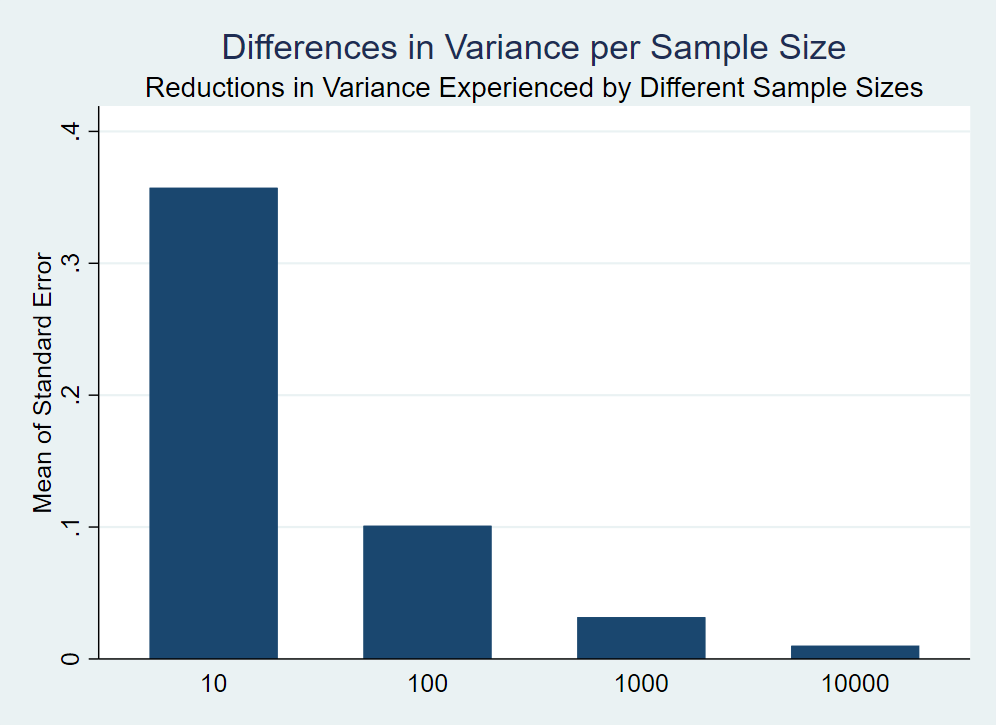
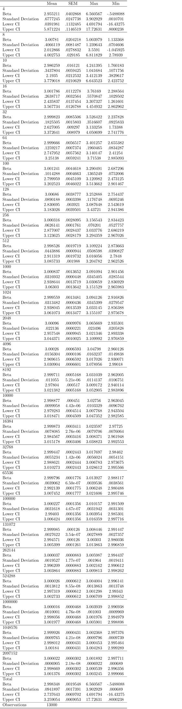
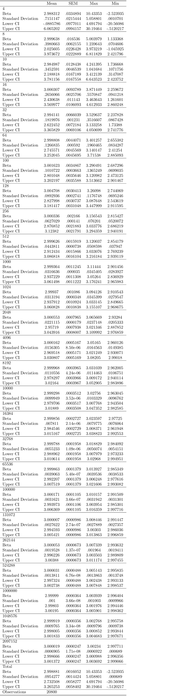

# Part 1: Sampling noise in a fixed population

### Comment

We can see that the betas tend to center to the mean as we increase the sample size, and the variance tends to become smaller.

This can also be seen from the change in the standard deviation of the Upper and Lower limits of the Confidence Intervals and the Betas.

# Part 2: Sampling noise in an infinite superpopulation

## 300 Iterations

## 500 Iterations

## 800 Iterations

### Comment

It seems that past the original 10000 sample size, increasing the N does not matter as much, as the betas come to stabilize and assume the same values.

This can be seen also for the Standard Deviation of the Confidence Interval and the Betas.

# Part 2.5: Comparisons

### Comment

We see that what we assumed before was true:

The sample size past 10000 does not matter as much, since the betas of our relationship don't vary as much once we go past that number.
