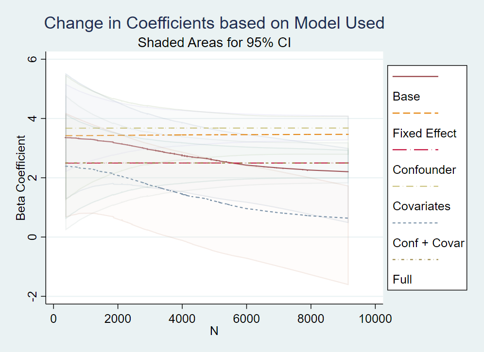
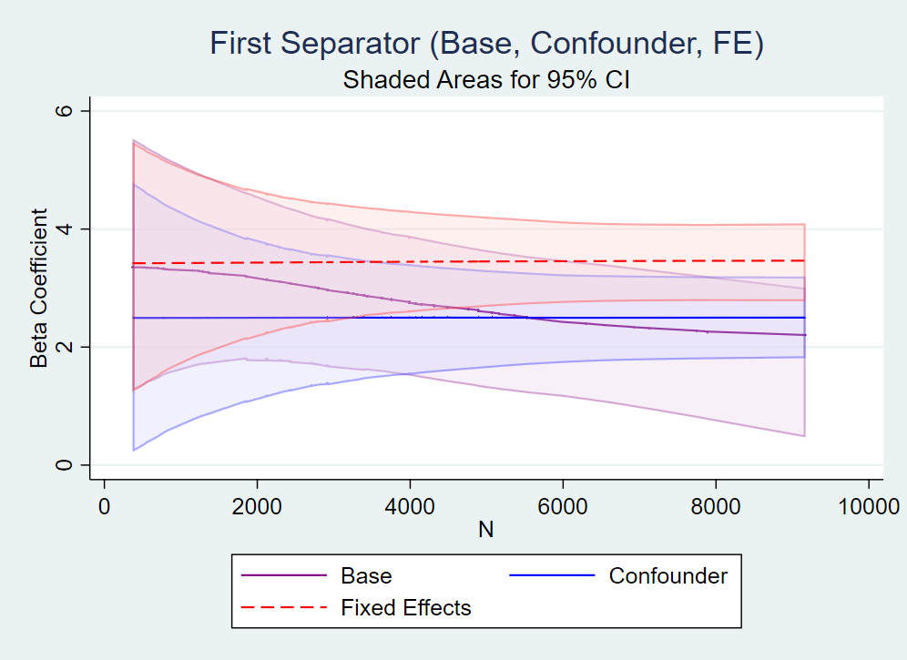
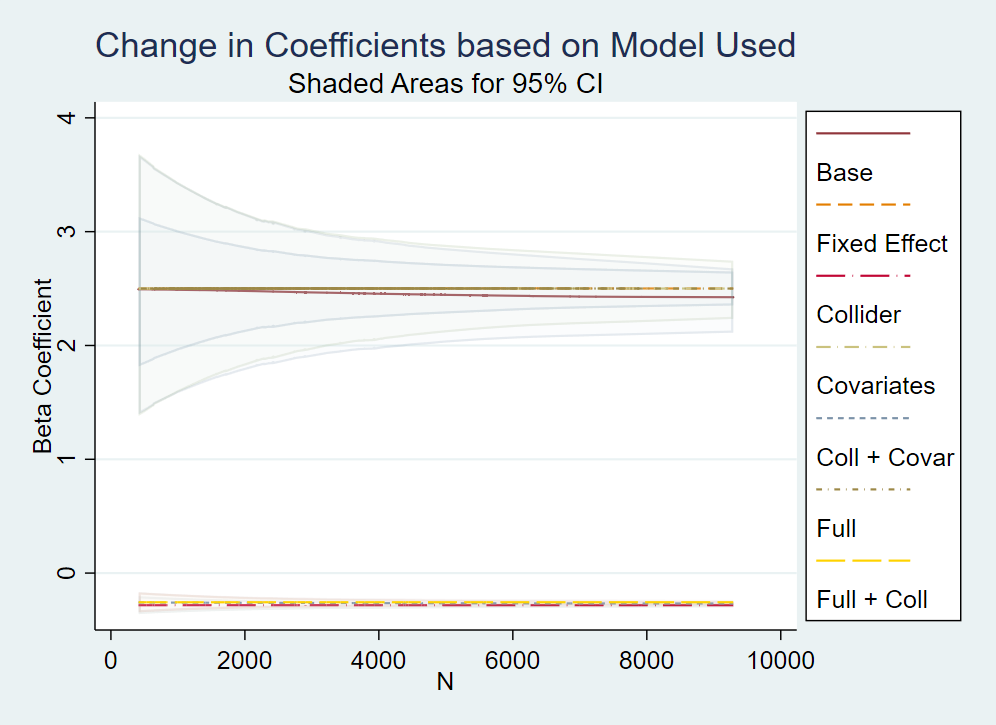
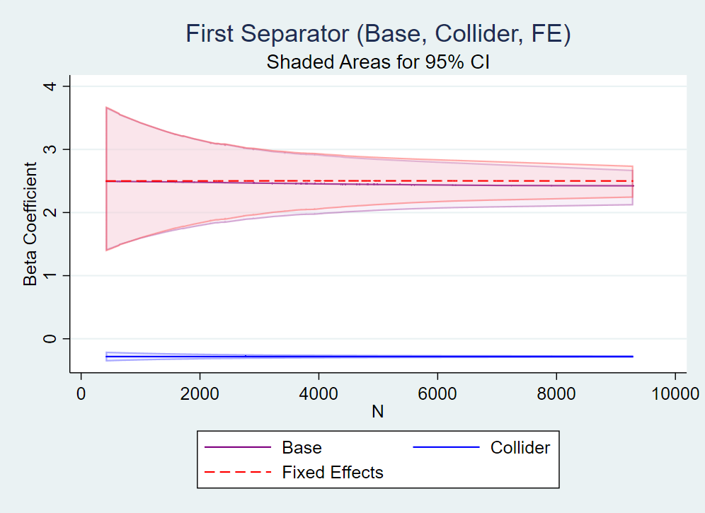

# Week 09 Assignment

Description of the regressions:

- Base: Only the outcome and treatment variable
- FE: Only the outcome and the fixed effect regional variable
- Confounder/Collider: Only the outcome and the confounder (for part 1) or the collider (for part 2)
- Covariates: The outcome and all the non-biasing Covariates
- Covariates and Confounder/Collider: The outcome, the non-biasing Covariates and also the biasing Covariates
- Full: All the variables included in the outcome DGP
- (only for Part 2) Full and Collider: All the variables included in the outcome DGP and the Collider

Description of the variables:

#### Part 1

*business_success*: the outcome variable, measuring on an imaginary scale the level of success change between the two treatment groups.

*region*: the fixed effect regional variance estimator.

*business_exp*: the confounder variable included in the treatment and the outcome. Measures the years of previous business experience

*customers*: the covariate included in the outcome equation. Measures the count of total customers engaging with the business. Should be lagged for endline survey.

*sales*: the covariate included in the treatment equation. Measures the count of total sales the business has made so far. Should be lagged for endline survey.

*treat*: the treatment variable measuring if a person is using the postal service or the digital wallet service.

*region_effect*: random effect of strata-level error.

*artisan_effect*: random effect of individual-level error.

#### Part 2

*business_success*: the outcome variable, measuring on an imaginary scale the level of success change between the two treatment groups.

*region*: the fixed effect regional variance estimator.

*business_exp*: the covariate included the outcome equation. Measures the years of previous business experience

*customers*: the covariate included in the outcome equation. Measures the count of total customers engaging with the business. Should be lagged for endline survey.

*sales*: the covariate included in the outcome equation. Measures the count of total sales the business has made so far. Should be lagged for endline survey.

*postal*: the proxy treatment variable measuring if a person has to rely more on the postal service than usual. Should be lagged for endline survey.

*capital*: the collider variable measuring the amount of capital a person possesses at the time of the study. It includes the proxy and a covariate in its equation.

*region_effect*: random effect of strata-level error.

*artisan_effect*: random effect of individual-level error.

## Part 1: De-biasing a parameter estimate using controls

**ORIGINAL DGP 1**

*business_success* = 3 + (-1)*region* + *business_exp* + (6)*customers* + (2.5)*treat* + *region_effect* + *artisan_effect*

In this equation, *business_exp* is the confounder covariate, with the added presence of strata and individual random effects. We can see from the table below that the effect of treatment is most closely followed by the confounder and full equation. The "kitchen sink" regression will of course lead us to achieve the closest beta coefficient to the real effect.

We can also see from the tables below that the variance decreases as the number of observations increases. It should be said that the base and covariates equations tend to lose the original real mean of the beta as we increase in N size. It should also be noted that the base and covariate equations lose their precision as N increases. This might be due to the bias of not including the confounder in the equation, which increases as the power of the effect increases.

## Part 2: De-biasing a parameter estimate using controls

**ORIGINAL DGP 2**

*business_success* = 3 + (-1)*region* + *business_exp* + (4)*sales* + (6)*customers* + (2.5)*postal* + *region_effect* + *artisan_effect*

The situation changes in this next equation when we have an already unbiased equation and we add biasing covariates in each. We see that most of the regressions come near the 2.5 treatment effect, even if we are using a proxy of the treatment itself. The trouble comes when we add the collider, which severely biases our beta into the opposite direction. It should be noted that the biasing effect is somewhat tamed by the addition of other covariates, but never to the point that it is completely eliminated.

As before, we see that the variance decreases as we go up the number of observations. A sidenote to notice that the variance in these regressions are way smaller than the previous part, perhaps due to the lack of intersectional variables disrupting the effect of the treatment and outcome equations. Nevertheless, the collider equations instead are much less burdened by high variance, though we can see how different the original betas can become.

