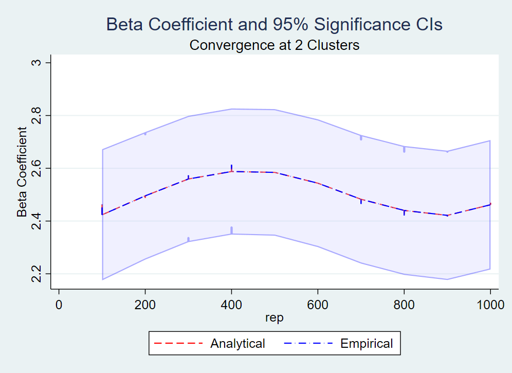

# Week 10 Assignment

The variables and DGP will be discussed summarily since the main point of the assignment is to show the changes in power and MDE as sample size and cluster size grows. The variables and DGP used are similar to Week 9 anyway.

*business_success*: the outcome variable, measuring on an imaginary scale the level of success change between the two treatment groups.

*region*: the fixed effect regional variance estimator.

*business_exp*: the confounder variable included in the treatment and the outcome. Measures the years of previous business experience

*customers*: the covariate included in the outcome equation. Measures the count of total customers engaging with the business. Should be lagged for endline survey.

*sales*: the covariate included in the treatment equation. Measures the count of total sales the business has made so far. Should be lagged for endline survey.

*treat*: the treatment variable measuring if a person is using the postal service or the digital wallet service.

*region_effect*: random effect of strata-level error.

*artisan_effect*: random effect of individual-level error.

## Part 1
**ORIGINAL DGP 1**
gen business_success = 3 + (-1)*region* + *business_exp* + (6)*customers* + (2.5)*treat* + *region_effect* + *artisan_effect*

As we can see in the figure below, the power of our biased models (Base, Confounder) tends to be lower on average compared to our unbiased models (Covar+Conf, Covar, Full). However, the power then starts to equal out as we increase our sample size. The ideal is then finding the right sample size to coincide both the need to find a MDE, and the budget constraints of an excessively high sample size.

#### Simulation 1 increases in power by sample size

The sample at which all models would converge first at .8 is 213 with 5 strata groups.

### Inputting a stable sample size
**ORIGINAL DGP 2**
gen business_success = 3 + (-1)*region* + *business_exp* + (6)*customers* + *treat_effect*#*treat* + *region_effect* + *artisan_effect*

Since the distribution used has a mean of 0, the closest numbers can be found among the non-biased models. Accordingly, the more covariates we include, the closest the model reaches the set population effect.

#### Minimum Detectable Effects based on Model

## Part 2

As we can see from the tables below, the betas tend to be similar, however the CIs vary wildly from Analytical to Empirical. A secondary issue is that as the cluster size increases, so does the difference increase. At such point, considering the clustering in our regression through the svy command might allow us to converge the values more easily.

#### Differences in Analytical and Empirical Values (Original)

#### Convergence of CI with Clustered Regression

### Removing the Random Error and Leaving the Cluster error

Evidently, removing the error makes cluster number much more influential in the convergence of the Analytical and Empirical CIs. Once again, increasing the cluster means increasing the difference. However, this time, the separation is less pronounced.

#### Differences in Analytical and Empirical Values (Cluster Error)

#### Convergence of CI with Clustered Regression containing only Cluster Error

### Using the VCE(robust) command to create robust standard errors

It seems that using this command does not resolve the problem. I would have assumed that it would but I stand corrected. The assignment is complicated, so I might have just made a mistake here.

#### Differences in Analytical and Empirical Values (VCE Robust)

#### Convergence of CI with VCE Robust Clustered Regression

