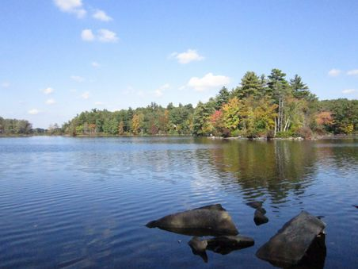

#Introductory Bio#

Hi! My name is Maeve and I've been kicking around McCourt for a year and half working towards an MPP. Like the rest of us, I've learned STATA in this time, but immensely prefer to work in R. In R I'm mostly self-taught as a result of different jobs here and there but had some formal training in undergrad. Similarly,I have only limited git and GitHub experience from poking around on the internet and occaisional freelance work. I don't have much experience with SurveyCTO, but have used Alchemer a bit. Excited to solidfy some skills in this class and be ready to integrate into real-world projects! 

I came to DC from Massachusetts by way of Vermont and NYC. See my  and   if you're curious! I also love to cook, sew, crochet, knit, learn to build things, hike, keep bees, bike and travel. My favorite thing I've made recently are little costume-capes for my two nephews - too cute. Always looking for another project or adventure.

##Research Interests ##

My main research interests are centered around impact evaluation on:
* transit design and use
* affordable housing
* accessibility

One fun fact about me is that I used to keep bees and work in a honey store! As an example of a table, here are my top 3 honeys that I've ever tasted:

|-----|----------------------|---------------|----------------------------------------------------------------------------------------------------------------------|
|Rank |Brand                 |Origin         |Comment                                                                                            |
|     |                      |               |                                                                              
|One  |Swan's Maine Beekeeper|Albion, ME     | This one is somehow creamy! great on everything!                                                                    |
|Two  |Bar Hill              | Montpelier, VT| This honey is my favorite wildflower honey, both floral and earthy. Fun fact - it's also used to make and flavor gin!|
|Three|Laulina Farm Honey    | Hana, Hawaii  |a bit tart! Really unique. Pairs well with rose tea                                                                  |
