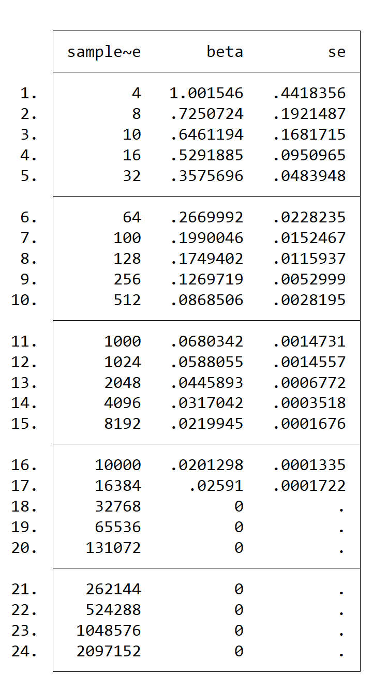

## Week 8 results discussion ##

### Sampling noise in a fixed population ## 

The below series of histograms displays the distribution of beta -hat as sample size increases. As evident by this illustration, as N increases, the variance of the beta-hat distribution shrinks and centers around the true beta.

We see a similar pattern when we look at the confidence interval for the predictions:

Below is a table showing the standard deviation of beta by sample size.

Here we can see mathematically that as N increases, the standard deviation of the distribution of both the beta-hat predictions and the SEM decreases.

### Sampling noise in an infinite population ## 

When sampling infinite population, we see a similar, more gradual trend as above:

The above table shows the standard deviation for beta-hat and the SEM as n increases. We see that the the standard deviation of beta hat goes to zero as n increases.

When decreasing the number of repetitions to 100, we see that samples of the same size with fewer repetitions have greater variance in the distribution of beta hat:

