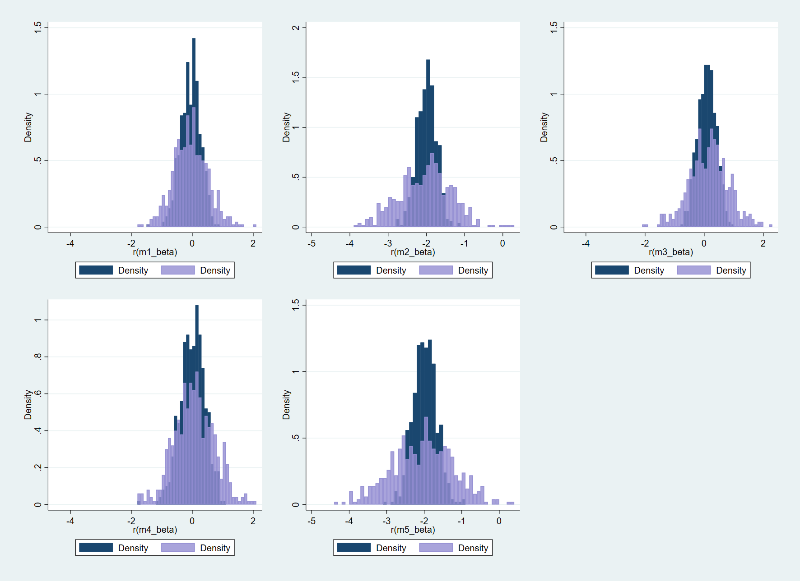

# Week 09 Assignment

For this week's assignment, I have chosen to imagine a study that is testing a behavioral intervention to reduce risky driving. The treatment is imagined to take place at an individual level, in a few towns that are spread accross 5 regions. 

The outcome is measured through the citations a driver might get. 

## Part One De-biasing parameter estimate controls

In this section, regional effects and liklihood to be policed are confounding variables. Education affects treatment and not citation risk and income affects citation risk and not treatment.

Data were generated using this data generating process:
*citation_risk* = 2 +  (1.5)*police* -  (2)*ln(income)*  - (2)*treatment*  + (4)*rnormal()* + 2 *commute* + (.5)*distance*  + *u_regions* + *u_towns* + *u_individual*

To understand how including confounding variables and the other continuous covariates (education and income) affects model accuracy, I evaluated the 5 regressions below:

*model 1*: citation_risk treatment

*model 2*: citation_risk treatment police i.region

*model 3*: citation_risk treatment education i.region i.towns

*model 4*: citation_risk treatment education income commute distance i.towns

*model 5*:  citation_risk treatment education income commute distance  i.towns

Each regression was evaluated at sample sizes (individuals/town) from 5 to 40 in increments of 5 and simulated with data 500 times. The below figures contrast the smallest sample size (5) in lavender with the largest sample size (40) in navy. 

Above, we can see that as n increases, the variance of the distribution of the treatment effect decreases. We can also see that model 2 and model 5 are the only models that come close to approximating the "true" treatment effect per the data generating process (2). This makes sense because only model 2 and model 5 have both confounders. Model 5 differs from model two in that it takes into account the effect education and income, which affect only treatment and outcome respectively.  Excluding confounders introduces bias into our model, as seen in the histograms for models 3 and 4. 

## Part 2: Biasing Parameter Estimates

In this section, I use the same data, but introduce both a collider and a "channel". The channel (*registeredvoter*) is used as a proxy for treatment in the data generating process: 

*citation_risk* = 2 +  (1.5)*police* -  (2)*ln(income)*  - (2)*registeredvoter*  + (4)*rnormal()* + 2 *commute* + (.5)*distance*  + *u_regions* + *u_towns* + *u_individual*/

To evaluate the effects of including or not including channels and colliders in regression models, I evaluated the below regressions:

*model A*: citation_risk treatment

*model B*: citation_risk treatment police i.region

*model C*: citation_risk treatment police registeredvoter i.region 

*model D*: citation_risk treatment police collider i.region 

*model E*:  citation_risk treatment police collider registeredvoter i.region

As in part one, each regression was evaluated at sample sizes (individuals/town) from 5 to 40 in increments of 5 and simulated with data 500 times. The below figures contrast the smallest sample size (5) in lavender with the largest sample size (40) in navy. 

Same as in part one, we can see that as n increases, the variance of the estimate of the treament effect shrinks. Only in model B, however, does this estimate center on the true treatment effect. That is the case because in each of the other models, bias has been introduced. In model C, the channel introduces bias, in model D, the collider introduces bias, and in model E both are present and introduce bias. 