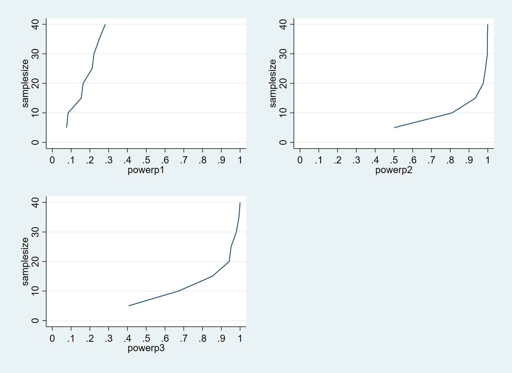

# Week 10 Assignment

For this week's assignment, I have chosen to use only a slightly altered version of my DGP from week nine. Then, I imagined a study that is testing a behavioral intervention to reduce risky driving. The treatment is imagined to take place at an individual level, in a few towns that are spread accross 5 regions. 

The outcome is measured through the citations a driver might get. 

Data were generated using this data generating process:
*citation_risk* = 2 +  (1.5)*police* -  (2)*ln(income)*  - (2)*treatment*  + (4)*rnormal()* + 2 *commute* + (.5)*distance*  + *u_regions* + *u_towns* + *u_individual*

## Part One Calculating required sample sizes and minimum detectable effects

To understand how power varies by sample size, I evaluated the 3 regressions below:

*model 1*: citation_risk treatment

*model 2*: citation_risk treatment police i.region

*model 3*: citation_risk treatment police i.region education income 

Each regression was evaluated at sample sizes (individuals/town) from 5 to 40 in increments of 5 and simulated with data 500 times.

In the increments here, the smallest sample size at which >80% of regressions will return a beta coefficient on the treatment variable with a p-value <= .05 is 10 for model 2 and 15 for model 3. The first model does not have sufficient power at any sample size tested.

Then, I moved on to calculate the minimum detectable effects with a fixed samplesize of 10. 

## Part 2: Calculating power for DGPs with clustered random errors
In this section, error is introduced in the regional effects, making clusters.

I've run into some trouble calculating confidence intervals here. 