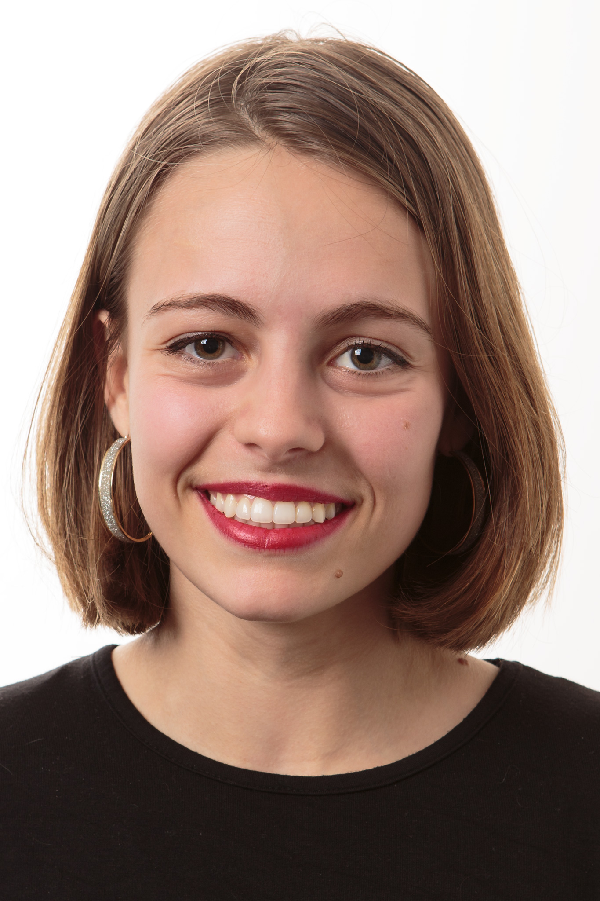
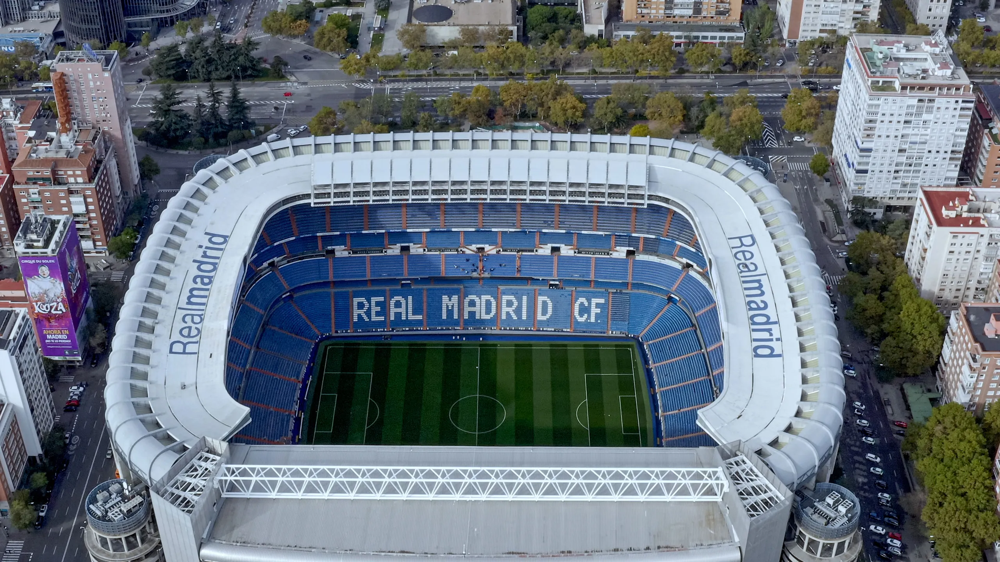

# My bio

## Where I studied and worked

Hello, My name is Lidia Guzmán Fernández, I was born and raised in Madrid, Spain, but left at the age of sixteen to study in the UK until the age of twenty-one. 

For the next three years I lived and worked in the fashion industry in Barcelona, Spain, and the following three years in Paris, France. In August 2021 I arrived in DC. Here I am a second year MPP student. Below you will find a table with all the schools /universities I went to and their location:

| Name of School | City   | Country |
|----------------|--------|---------|
| San Agustín    | Madrid | Spain   |
| Millfield      |Street  | UK      |
| KCL            |London  | UK      |
| Georgetown     |DC      | USA     |

### My (non-existent)research design technical expertise
My level of experience with Stata, GitHub, and SurveyCTO is minimal and extremely close to zero. Prior to this MPP I had never used Stata nor Github, what I know is what I have been taught at the school. I had a two-day SurveyCTO training but never used it professionally.

## My favourite sports
To get to know me better, here is a list of my type favourite sports:

- Water sports
  - Swimming
  - Surf
  - Water-ski
- Ground sports
  - Football ( I refuse to call it soccer)
  - Tennis (to watch)
  - Badminton
- Alpine sports
  - Skying
  
I used to regularly practice [Asthanga Yoga](http://www.ashtanga.com/) and I am reintroducing it to my routine as it was extremely good for my well-being. 
  
## My favourite geometrical shape

My favourite geometrical shape is the *circle*, a  circle never ends, its continuous and its infinite. 
Here is the formula of its area: 

$$A = \pi r^2$$
  
