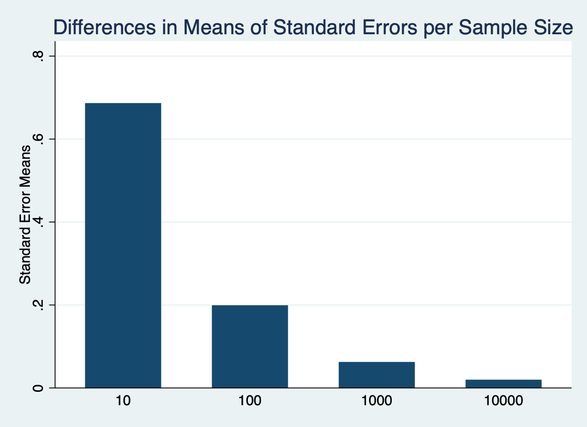
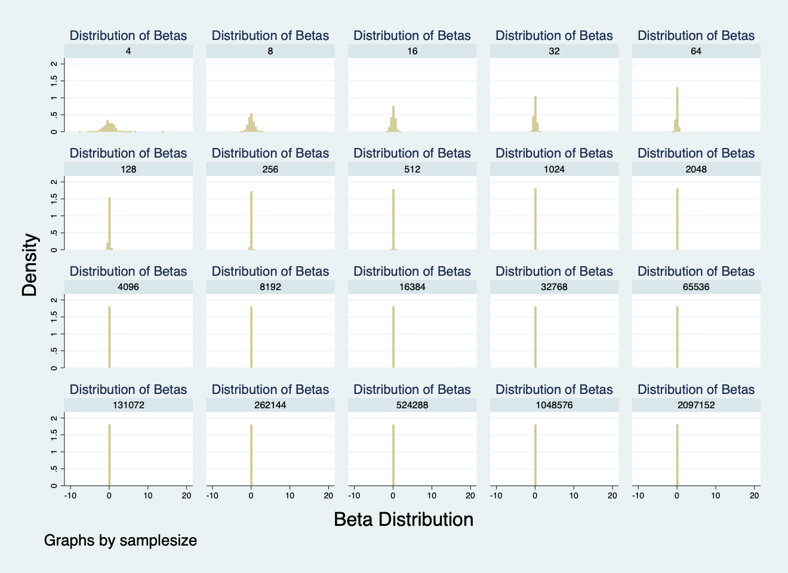

Part 1 Figures and table results:

The beta distribution represents the likelihood of probabilities. It captures the uncertainty surrounding the probability of a random event being successful. We find a normal distribution on sample size 100. As the sample size gets larger, the distribution of betas is more concentrated around 0, hence the probability distribution of the probability of being successful gets smaller. We are more certain about the probability of success. On the other hand, as the sample size gets smaller, the distribution of betas is larger, as we see when N=10 is still normal but very distributed, hence, the probability distribution of the probability of being successful gets larger. There are more possible different probabilities,i.e. scenarios of success (or not success), meaning more uncertainty. 

We find the difference in means of standard errors to quantify how far the sample mean is from the true population mean. As we see, the smaller the sample size, the higher the mean of SE, hence the further the sample mean is likely to be from the true population mean.Instead, the larger the sample size, the closer is likely to be to the true population mean. As with the previous graph, uncertainty is larger with N = 10, and the difference with N = 100 is extremely large. After 100, the differences diminish.

Table with Means of Standard Errors and Confidence Intervals:

Summary statistics: Mean SD
     for variables: beta sem lci uci
  by categories of: samplesize

  samplesize |   e(Mean)      e(SD) 
-------------+----------------------
10           |                      
        beta |  .5783779   3.839903 
         sem |  3.532907   1.340774 
         lci |   .488958   .2952568 
         uci |  -7.56852   4.967572 
-------------+----------------------
100          |                      
        beta |  .5059663   1.000851 
         sem |  1.006796    .103998 
         lci |  .4738009   .2952649 
         uci | -1.491988   1.015862 
-------------+----------------------
1000         |                      
        beta |  .5020953   .3074558 
         sem |  .3169651    .010046 
         lci |  .2295117    .268408 
         uci | -.1198992   .3090624 
-------------+----------------------
10000        |                      
        beta |   .500524   .1036794 
         sem |  .1002399   .0007245 
         lci |  .0003927    .003783 
         uci |  .3040336   .1036197 
-------------+----------------------
Total        |                      
        beta |  .5217409   1.989494 
         sem |  1.239227   1.522536 
         lci |  .2981658   .3188876 
         uci | -2.219094   4.053211 

As precision is measured by finding the average deviation, as the sample size grows, the SD is smaller, and the estimates become more precise. As we see on the table, the bounds of CI also become smaller as the sample size grows, hence our report of the accuracy of the model can actually be more accurate. More chances that the true estimate is within the CI bounds. 

Part 2:

Figures and table results and their differences with part 1: 

The normal distribution in this case is most clearly seen in the scenarios 16 to 64. After 4096, the beta distribution practically becomes zero and it grows in density. Meaning we are more certain about the probability of success.This certainty in part 2 with the required adaptation, happens at a smaller sample size than in part 1. This is because we are adding the first twenty powers of two, and it is giving more accuracy to the sample even at a smaller sample size given in part 1.

Here the analysis remains as in part 1. The smaller the sample size, the higher the mean of SE, hence the further the sample mean is likely to be from the true population mean.THe difference here is we have more numbers of different sample sizes. And again as in the figure above, just after approx 1,000, the standard errors means become really close to 0. 

Question 6, do these results change if you increase to 700 repetitions or decrease to 200? 

700 repetitions: 

Summary statistics: Mean SD
     for variables: beta sem lci uci
  by categories of: samplesize

  samplesize |   e(Mean)      e(SD) 
-------------+----------------------
4            |                      
        beta |    .69553   8.096568 
         sem |   6.87256    5.94375 
         lci |  .5039611   .2964014 
         uci | -28.87471   26.62704 
-------------+----------------------
8            |                      
        beta |  .3112438   4.642269 
         sem |  4.115229   1.904468 
         lci |  .4826101    .281024 
         uci | -9.758359   6.380354 
-------------+----------------------
16           |                      
        beta |  .5393862   2.831995 
         sem |  2.722863   .7988093 
         lci |  .4813212   .2891776 
         uci | -5.300575   3.240465 
-------------+----------------------
32           |                      
        beta |  .4593876   1.896148 
         sem |  1.831863   .3396969 
         lci |  .4871737    .299877 
         uci | -3.281776   2.009685 
-------------+----------------------
64           |                      
        beta |  .4994942    1.29212 
         sem |  1.260455    .157433 
         lci |  .4668899   .2945117 
         uci | -2.020119   1.343452 
-------------+----------------------
128          |                      
        beta |  .4944738   .9097555 
         sem |  .8900975   .0787264 
         lci |  .4462478    .301965 
         uci | -1.267003   .9320296 
-------------+----------------------
256          |                      
        beta |  .4852289   .6121802 
         sem |   .627245   .0403515 
         lci |  .4212551   .2974439 
         uci | -.7500345   .6148538 
-------------+----------------------
512          |                      
        beta |  .4862322   .4377445 
         sem |  .4430904   .0186923 
         lci |  .3448772   .2956884 
         uci | -.3842748   .4386743 
-------------+----------------------
1024         |                      
        beta |  .4941514    .318846 
         sem |  .3126546   .0093834 
         lci |    .22969   .2673791 
         uci | -.1193669   .3188621 
-------------+----------------------
2048         |                      
        beta |  .4967758   .2202001 
         sem |  .2212695   .0049722 
         lci |  .1091606   .1878982 
         uci |  .0628389   .2203077 
-------------+----------------------
4096         |                      
        beta |  .5026893   .1533617 
         sem |  .1562449   .0025419 
         lci |  .0205618   .0622901 
         uci |  .1963644   .1537049 
-------------+----------------------
8192         |                      
        beta |  .5005843   .1101623 
         sem |  .1104997   .0012588 
         lci |   .000858   .0037566 
         uci |  .2839768   .1102476 
-------------+----------------------
16384        |                      
        beta |  .4996364   .0801713 
         sem |  .0781184   .0006241 
         lci |  8.32e-06   .0001795 
         uci |  .3465158   .0802527 
-------------+----------------------
32768        |                      
        beta |  .4985121   .0561306 
         sem |  .0552332   .0003102 
         lci |  1.73e-12   3.22e-11 
         uci |   .390253   .0561529 
-------------+----------------------
65536        |                      
        beta |  .4987808   .0378203 
         sem |  .0390677   .0001462 
         lci |  6.18e-25   1.61e-23 
         uci |   .422208   .0378347 
-------------+----------------------
131072       |                      
        beta |  .4997741   .0280477 
         sem |  .0276266   .0000757 
         lci |         0          0 
         uci |  .4456265   .0280547 
-------------+----------------------
262144       |                      
        beta |  .4999716   .0194782 
         sem |  .0195324   .0000381 
         lci |         0          0 
         uci |  .4616886   .0194748 
-------------+----------------------
524288       |                      
        beta |  .4992986   .0135094 
         sem |  .0138106   .0000196 
         lci |         0          0 
         uci |  .4722304     .01351 
-------------+----------------------
1048576      |                      
        beta |  .4997685   .0098506 
         sem |  .0097654     .00001 
         lci |         0          0 
         uci |  .4806285   .0098509 
-------------+----------------------
2097152      |                      
        beta |  .4996603   .0067778 
         sem |  .0069053   4.71e-06 
         lci |         0          0 
         uci |  .4861261   .0067784 
-------------+----------------------
Total        |                      
        beta |   .498029    2.25745 
         sem |  .9907066   2.215459 
         lci |  .1997307    .295003 
         uci | -2.385388   9.024509 

200 repetitions: 

Summary statistics: Mean SD
     for variables: beta sem lci uci
  by categories of: samplesize

  samplesize |   e(Mean)      e(SD) 
-------------+----------------------
4            |                      
        beta |   .810659   8.205519 
         sem |  7.006408    6.08134 
         lci |  .4914901   .2865287 
         uci | -29.33548   26.20191 
-------------+----------------------
8            |                      
        beta |  .9007417   4.724301 
         sem |  4.209372   2.200239 
         lci |  .4663355   .2840019 
         uci | -9.399221   6.828137 
-------------+----------------------
16           |                      
        beta |  .6512223   2.961242 
         sem |  2.712362   .8052213 
         lci |  .4539821   .2979153 
         uci | -5.166216   3.414988 
-------------+----------------------
32           |                      
        beta |  .4768438   1.717434 
         sem |  1.834063   .3388555 
         lci |  .5134995   .2904086 
         uci | -3.268812   1.833699 
-------------+----------------------
64           |                      
        beta |  .4299933   1.267898 
         sem |   1.25802   .1561925 
         lci |  .4787491   .2958631 
         uci | -2.084753   1.348028 
-------------+----------------------
128          |                      
        beta |  .4663496   .9360596 
         sem |  .8912392   .0827668 
         lci |  .4229388   .2867467 
         uci | -1.297387     .95579 
-------------+----------------------
256          |                      
        beta |  .4934613   .5912304 
         sem |  .6285289   .0396069 
         lci |  .4427915   .3024999 
         uci | -.7443306   .5953717 
-------------+----------------------
512          |                      
        beta |  .5426915   .4511636 
         sem |  .4420595    .019528 
         lci |  .3201038   .2908358 
         uci | -.3257903   .4520166 
-------------+----------------------
1024         |                      
        beta |  .4846114   .3296242 
         sem |  .3119131   .0091177 
         lci |  .2449269   .2738131 
         uci | -.1274519    .330685 
-------------+----------------------
2048         |                      
        beta |  .4766267    .212553 
         sem |   .221942   .0044716 
         lci |  .1208386   .1938226 
         uci |  .0413709   .2127267 
-------------+----------------------
4096         |                      
        beta |  .4942367   .1521175 
         sem |  .1562092   .0023356 
         lci |   .020769   .0727476 
         uci |  .1879817   .1529978 
-------------+----------------------
8192         |                      
        beta |  .5020235    .101725 
         sem |  .1104896   .0012927 
         lci |  .0005535   .0024418 
         uci |  .2854359   .1015818 
-------------+----------------------
16384        |                      
        beta |  .4970708   .0800937 
         sem |  .0781486   .0005981 
         lci |  .0000249   .0003352 
         uci |  .3438911   .0802508 
-------------+----------------------
32768        |                      
        beta |  .4991098   .0554682 
         sem |  .0552076   .0003096 
         lci |  7.17e-13   9.70e-12 
         uci |  .3909009   .0555362 
-------------+----------------------
65536        |                      
        beta |   .498772   .0399004 
         sem |   .039072   .0001416 
         lci |  1.32e-26   1.74e-25 
         uci |  .4221909   .0399218 
-------------+----------------------
131072       |                      
        beta |  .5005172   .0258814 
         sem |  .0276292   .0000766 
         lci |         0          0 
         uci |  .4463645   .0258925 
-------------+----------------------
262144       |                      
        beta |  .4996786   .0167986 
         sem |  .0195324   .0000365 
         lci |         0          0 
         uci |  .4613956   .0167945 
-------------+----------------------
524288       |                      
        beta |  .4986326   .0123594 
         sem |  .0138119   .0000213 
         lci |         0          0 
         uci |  .4715616   .0123598 
-------------+----------------------
1048576      |                      
        beta |  .4996414   .0096456 
         sem |  .0097668   .0000102 
         lci |         0          0 
         uci |  .4804987   .0096451 
-------------+----------------------
2097152      |                      
        beta |  .4996032   .0062537 
         sem |  .0069054   4.83e-06 
         lci |         0          0 
         uci |  .4860689   .0062536 
-------------+----------------------
Total        |                      
        beta |  .5361243   2.284413 
         sem |  1.001634   2.270016 
         lci |  .1988502   .2928808 
         uci | -2.386589   9.025178 
         
Performing more repetitions of a regression analysis in Stata is done to to evaluate the stability of the regression outputs. Running the regression multiple times helps identify any inconsistencies  in the data. Once the results surpass the 131,072 the lci becomes zero as we have seen on the tables above, the sample size at 131,072 is largely accurate, and Since the limitation imposed for this exercise required 13,000 regression results, after that zero there are no changes to the statistics. Meaning running the experiment again you have a good chance of finding no difference between groups.

Once again, as the sample size grows and more the repetitions performed, the SD is smaller, and the estimates become more precise. The bounds of CI also become smaller, hence our report of the accuracy of the model can actually be more accurate. More chances that the true estimate is within the CI bounds. 

We can also see the more repetitions, the smaller the SEM, making the results of the regression outputs not only more accurate but also more stable.

         

