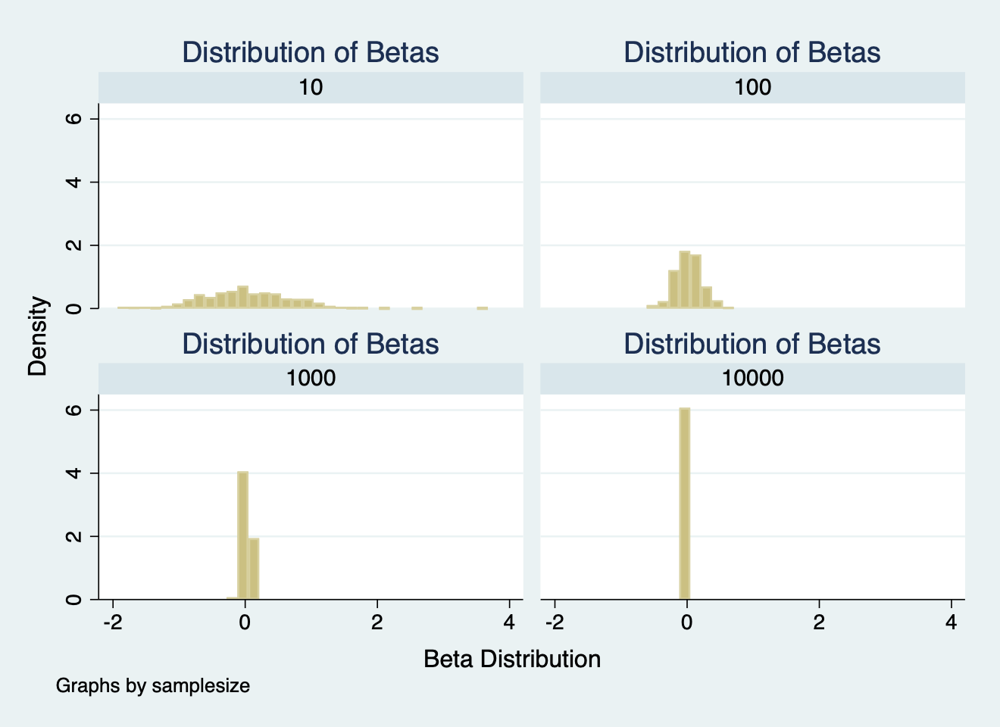
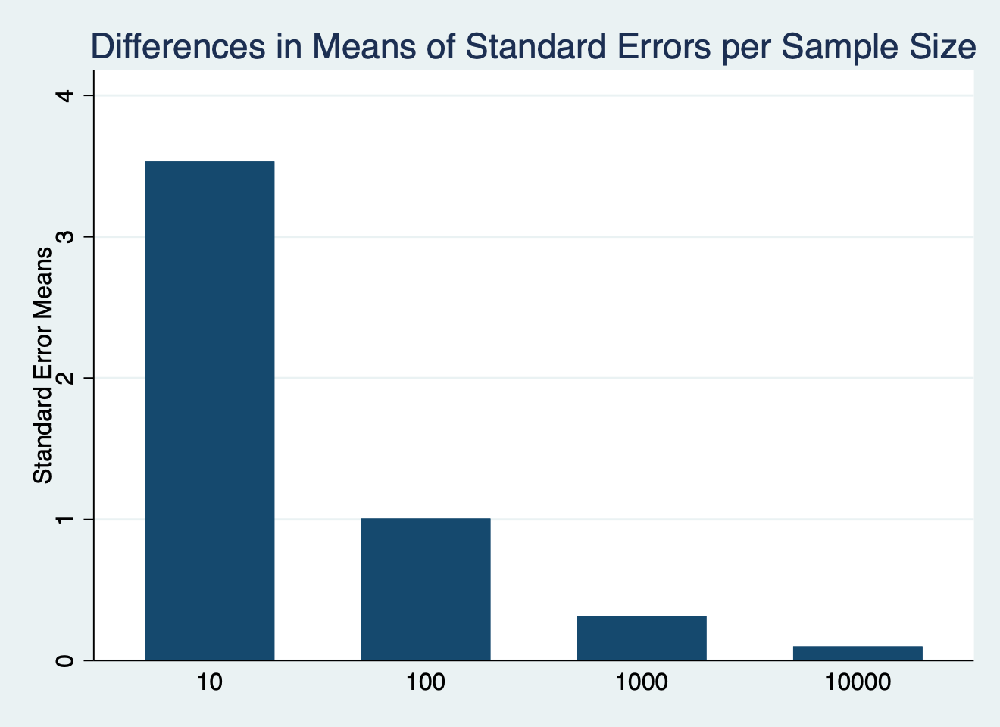
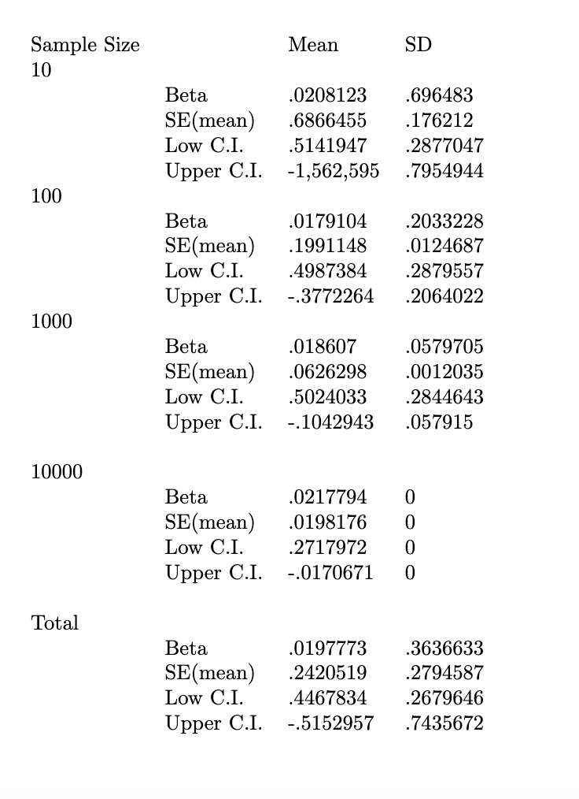
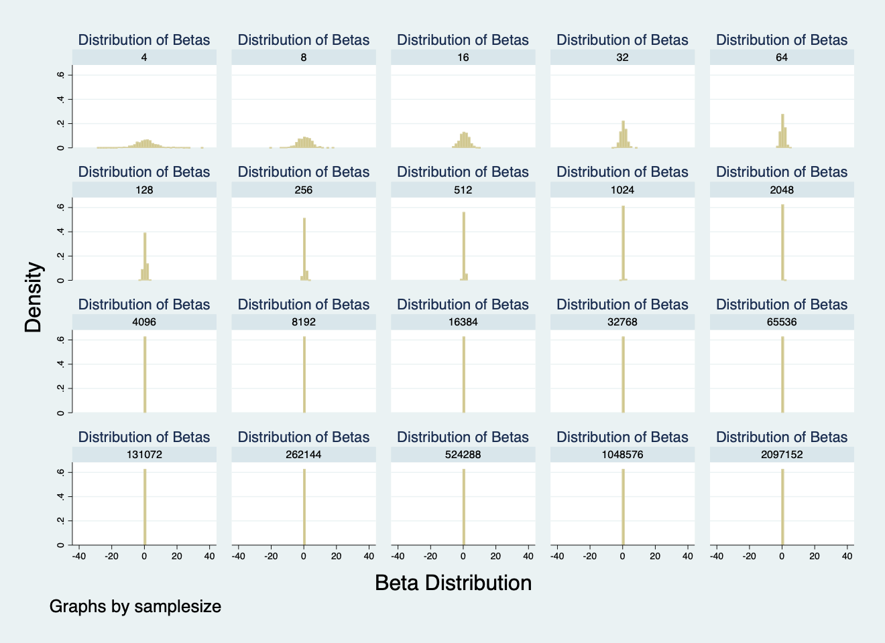
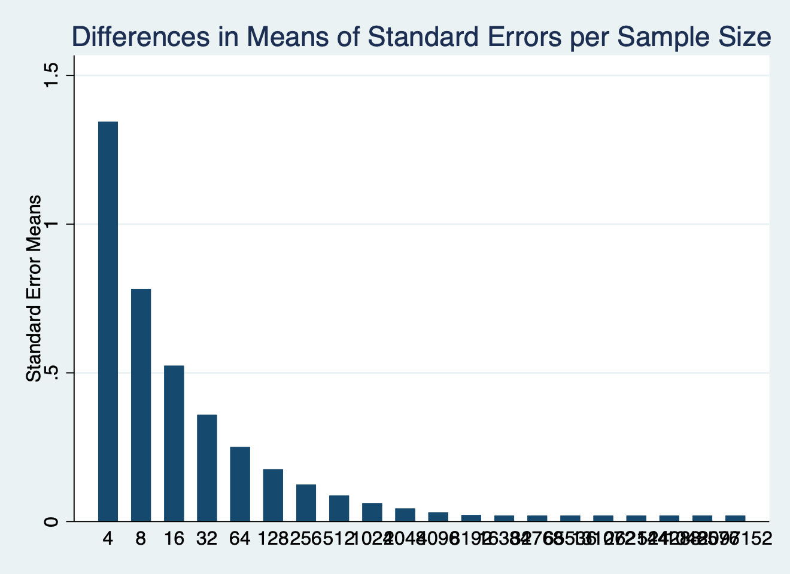

Part 1 Figures and table results(completed once answered this):

 We find a normal distribution on sample size 100.
 As the sample size gets larger 

We find 

Part 2:

Figures and table results: 

Raw table  with Means of Standard Errors and Confidence Intervals

Question 5, differences between Part 1 and Part 2: 
 

Question 6, do these results change if you increase to 700 repetitions or decrease to 200? 

500 repetitions (clean table shown in Part1): 

700 repetitions: 

  samplesize |   e(Mean)      e(SD) 
-------------+----------------------
4            |                      
        beta |  .0168005   1.706851 
         sem |   1.36684   1.231401 
         lci | -5.864236   5.362331 
         uci |  5.897837   5.763324 
-------------+----------------------
8            |                      
        beta |  .0189731   .8138365 
         sem |  .7824719   .2647993 
         lci | -1.895667   1.081694 
         uci |  1.933613   .9971214 
-------------+----------------------
16           |                      
        beta |  .0400975    .520064 
         sem |  .5187622   .0906555 
         lci | -1.072537   .5601572 
         uci |  1.152732   .5502439 
-------------+----------------------
32           |                      
        beta |  .0239525   .3543002 
         sem |  .3574389   .0408993 
         lci | -.7060351   .3632543 
         uci |  .7539401   .3647701 
-------------+----------------------
64           |                      
        beta |  .0266454   .2491728 
         sem |  .2506045   .0205881 
         lci |  -.474306   .2545331 
         uci |  .5275968   .2505485 
-------------+----------------------
128          |                      
        beta |  .0170487    .179167 
         sem |  .1759232   .0099607 
         lci | -.3310982    .181312 
         uci |  .3651956   .1791778 
-------------+----------------------
256          |                      
        beta |   .017182   .1276481 
         sem |  .1240761   .0048285 
         lci |  -.227167   .1281683 
         uci |  .2615311   .1278351 
-------------+----------------------
512          |                      
        beta |  .0203897   .0871562 
         sem |  .0875697   .0023919 
         lci | -.1516521    .087051 
         uci |  .1924315    .087514 
-------------+----------------------
1024         |                      
        beta |  .0202785   .0587005 
         sem |  .0618736   .0011734 
         lci | -.1011353   .0586513 
         uci |  .1416924   .0588398 
-------------+----------------------
2048         |                      
        beta |  .0201526   .0383355 
         sem |  .0437902   .0005445 
         lci | -.0657254   .0383655 
         uci |  .1060307   .0383352 
-------------+----------------------
4096         |                      
        beta |  .0220694   .0245593 
         sem |   .030972   .0002344 
         lci | -.0386526    .024584 
         uci |  .0827913   .0245431 
-------------+----------------------
8192         |                      
        beta |  .0218564   .0099136 
         sem |  .0218957   .0000656 
         lci | -.0210646   .0099182 
         uci |  .0647774   .0099108 
-------------+----------------------
16384        |                      
        beta |  .0217794          0 
         sem |  .0198176          0 
         lci | -.0170671          0 
         uci |  .0606259          0 
-------------+----------------------
32768        |                      
        beta |  .0217794          0 
         sem |  .0198176          0 
         lci | -.0170671          0 
         uci |  .0606259          0 
-------------+----------------------
65536        |                      
        beta |  .0217794          0 
         sem |  .0198176          0 
         lci | -.0170671          0 
         uci |  .0606259          0 
-------------+----------------------
131072       |                      
        beta |  .0217794          0 
         sem |  .0198176          0 
         lci | -.0170671          0 
         uci |  .0606259          0 
-------------+----------------------
262144       |                      
        beta |  .0217794          0 
         sem |  .0198176          0 
         lci | -.0170671          0 
         uci |  .0606259          0 
-------------+----------------------
524288       |                      
        beta |  .0217794          0 
         sem |  .0198176          0 
         lci | -.0170671          0 
         uci |  .0606259          0 
-------------+----------------------
1048576      |                      
        beta |  .0217794          0 
         sem |  .0198176          0 
         lci | -.0170671          0 
         uci |  .0606259          0 
-------------+----------------------
2097152      |                      
        beta |  .0217794          0 
         sem |  .0198176          0 
         lci | -.0170671          0 
         uci |  .0606259          0 
-------------+----------------------
Total        |                      
        beta |  .0219841   .4522305 
         sem |  .1990379   .4362977 
         lci | -.5542906   1.794068 
         uci |  .5982588   1.851714 

200 repetitions: 

 samplesize |   e(Mean)      e(SD) 
-------------+----------------------
4            |                      
        beta | -.1931021   1.900382 
         sem |  1.373447   1.236994 
         lci | -6.102568   5.361421 
         uci |  5.716364   5.927308 
-------------+----------------------
8            |                      
        beta | -.0376779   .7418947 
         sem |  .8042258   .2352649 
         lci | -2.005548   .9296799 
         uci |  1.930192   .9483188 
-------------+----------------------
16           |                      
        beta | -.0130559   .5091131 
         sem |  .5243479    .082951 
         lci |  -1.13767    .545428 
         uci |  1.111559   .5331098 
-------------+----------------------
32           |                      
        beta | -.0084819    .341712 
         sem |  .3591474   .0399221 
         lci | -.7419588   .3563671 
         uci |   .724995   .3461669 
-------------+----------------------
64           |                      
        beta |  .0099781   .2397841 
         sem |  .2497178   .0206131 
         lci | -.4892007   .2485991 
         uci |   .509157   .2378802 
-------------+----------------------
128          |                      
        beta |  .0047439   .1685063 
         sem |  .1757867   .0098756 
         lci | -.3431328   .1710021 
         uci |  .3526206   .1682586 
-------------+----------------------
256          |                      
        beta |  .0105239   .1233271 
         sem |  .1241404    .004861 
         lci | -.2339516   .1241289 
         uci |  .2549995   .1232658 
-------------+----------------------
512          |                      
        beta |  .0134109   .0890168 
         sem |  .0876791   .0022953 
         lci | -.1588458    .089046 
         uci |  .1856676   .0892158 
-------------+----------------------
1024         |                      
        beta |  .0176397   .0590731 
         sem |  .0618761   .0011363 
         lci |  -.103779   .0590363 
         uci |  .1390583   .0591939 
-------------+----------------------
2048         |                      
        beta |  .0196172   .0348908 
         sem |  .0437754   .0005728 
         lci | -.0662318   .0351428 
         uci |  .1054663   .0346733 
-------------+----------------------
4096         |                      
        beta |  .0238826   .0231471 
         sem |  .0309743   .0002321 
         lci | -.0368438   .0231406 
         uci |  .0846091   .0231626 
-------------+----------------------
8192         |                      
        beta |  .0213948   .0094239 
         sem |   .021894   .0000669 
         lci |  -.021523   .0094157 
         uci |  .0643125    .009434 
-------------+----------------------
16384        |                      
        beta |  .0217794          0 
         sem |  .0198176          0 
         lci | -.0170671          0 
         uci |  .0606259          0 
-------------+----------------------
32768        |                      
        beta |  .0217794          0 
         sem |  .0198176          0 
         lci | -.0170671          0 
         uci |  .0606259          0 
-------------+----------------------
65536        |                      
        beta |  .0217794          0 
         sem |  .0198176          0 
         lci | -.0170671          0 
         uci |  .0606259          0 
-------------+----------------------
131072       |                      
        beta |  .0217794          0 
         sem |  .0198176          0 
         lci | -.0170671          0 
         uci |  .0606259          0 
-------------+----------------------
262144       |                      
        beta |  .0217794          0 
         sem |  .0198176          0 
         lci | -.0170671          0 
         uci |  .0606259          0 
-------------+----------------------
524288       |                      
        beta |  .0217794          0 
         sem |  .0198176          0 
         lci | -.0170671          0 
         uci |  .0606259          0 
-------------+----------------------
1048576      |                      
        beta |  .0217794          0 
         sem |  .0198176          0 
         lci | -.0170671          0 
         uci |  .0606259          0 
-------------+----------------------
2097152      |                      
        beta |  .0217794          0 
         sem |  .0198176          0 
         lci | -.0170671          0 
         uci |  .0606259          0 
-------------+----------------------
Total        |                      
        beta |  .0021554   .4834706 
         sem |  .2007776   .4384652 
         lci | -.5788895   1.828684 
         uci |  .5832003   1.847965 

