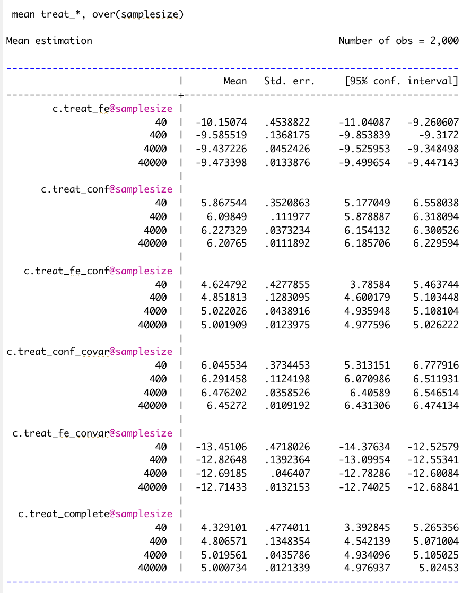
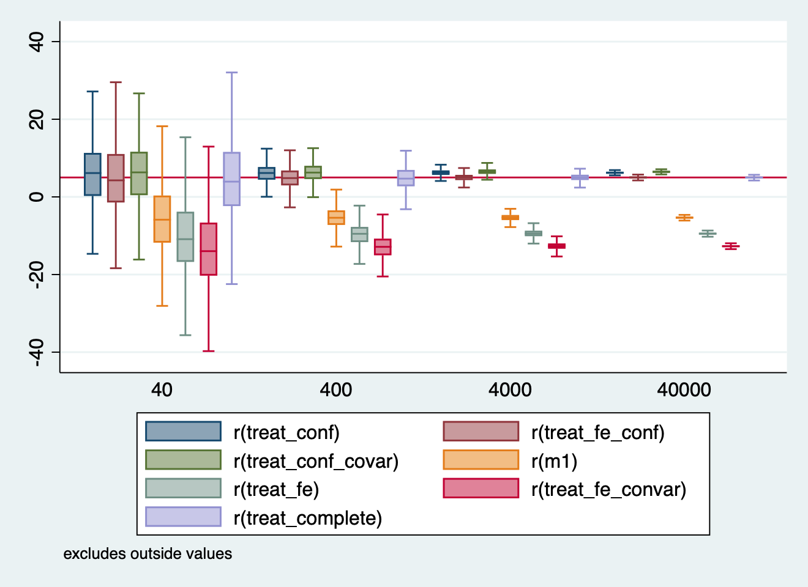
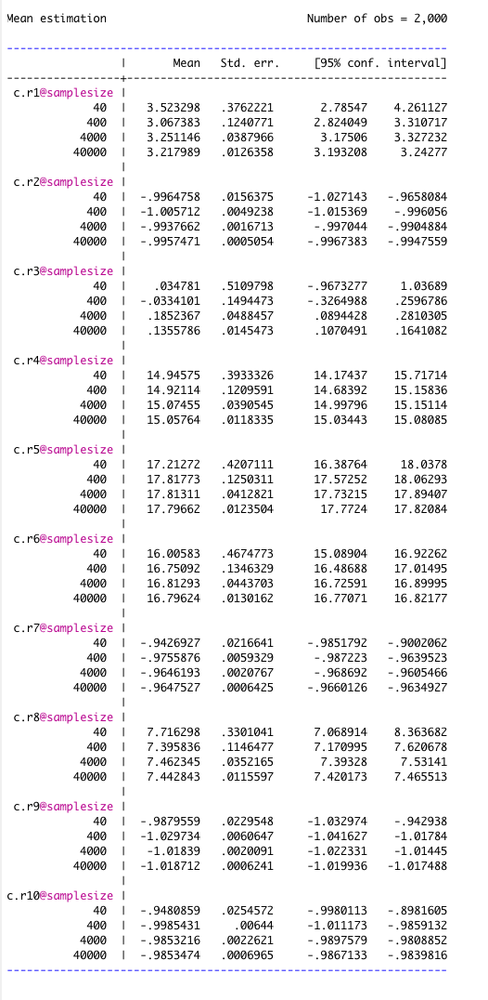

---
output:
  pdf_document: default
  html_document: default
---
WEEK 9

Part 1:

Note that from the model, the "true" parameter value is marked at 5, because we have designed the treatment to have an effect of 5 units.

Table showing the mean and variance of beta for different regression models, as a function of N:

 
These findings are then ploted on a boxplot below: 

Where the x axis represents N and the Y-axis the Variance of Beta, and where outliers have been eliminated.

And where: 

m1 = reg y treatment

treat_fe = reg y treatment i.strata

treat_conf = reg y treatment  cov_xy 

treat_fe_conf = reg y treatment i.strata cov_xy

treat_conf_covar = reg y treatment cov_xy cov_x cov_y

treat_fe_convar = reg y treatment i.strata cov_x cov_y

treat_complete = reg y treatment i.strata cov_xy cov_x cov_y

From the table we can see the c.treat_fe and c.treat_fe_convar regardless of their N are the most biased regressions as their mean is far from the "true" parameter value of 5. Instead, the ones that converge the most to the "true" parameter value are c.treat_complet and c.treat_fe_conf when they reach N = 40,000. We can see that as N grows in most regression models, the means of the regressions converge to 5, meaning the higher N the more likely to reach the "true" treatment effect. c.treat_conf is the exception, but since the model does not include covariates nor strata, it seems plausible to become more biased as N increases.

As on the table above, we see the yellow, red, and green figures, being the m1, c.treat_fe and c.treat_fe_convar models correspondingly, are further away from the "true" parameter value of 5,  meaning they are the most biased models. 

Where it seems again, c.treat_complete in purple, is the most accurate model, the box is in the line of the "true" parameter, as it includes the confounder and the covariates variables. i.e. is the most complete model. 

Part 2: 

Note again that from the model, the "true" parameter value is marked at 5, because we have designed the treatment to have an effect of 5 units.

Table showing the mean and variance of beta for different regression models, as a function of N:

These findings are then ploted on a boxplot below: 

Where the x axis represents N and the Y-axis the Variance of Beta, and where outliers have been eliminated.

where: 

r1 = reg y treatment
r2 = reg y treatment z coll
r3 = reg y treatment z i.strata
r4 = reg y treatment z cov_xy 
r5 = reg y treatment i.strata cov_xy
r6 = reg y treatment i.strata z cov_xy
r7 = reg y treatment i.strata z coll cov_xy
r8 = reg y treatment cov_xy cov_x cov_y
r9 = reg y treatment i.strata z coll cov_x cov_y 
r10 = reg y treatment i.strata z coll cov_xy cov_x cov_y

This time none of the regression models truly converge to the "true" parameter, however it seems r8 is the closest. This regression includes the confounder but not the collider nor strata. Since the purpose of the excersise was to bias a parameter, these results match the expectation. In Part 2, as opposed to part 1, it appears, as N grows, the regressions become more biased, and their means move away from the true parameter. r2 and r3 have different jumps in the means with changes in N, and this might be caused by the fact that their models do not include neither confounders nor covariate effects. 

