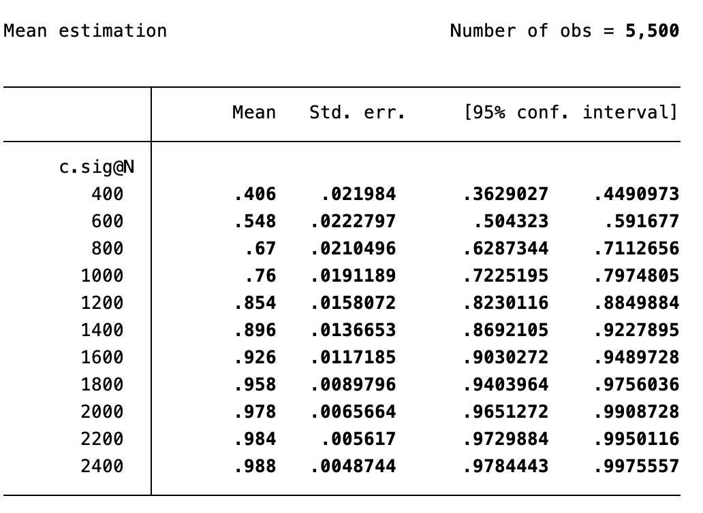
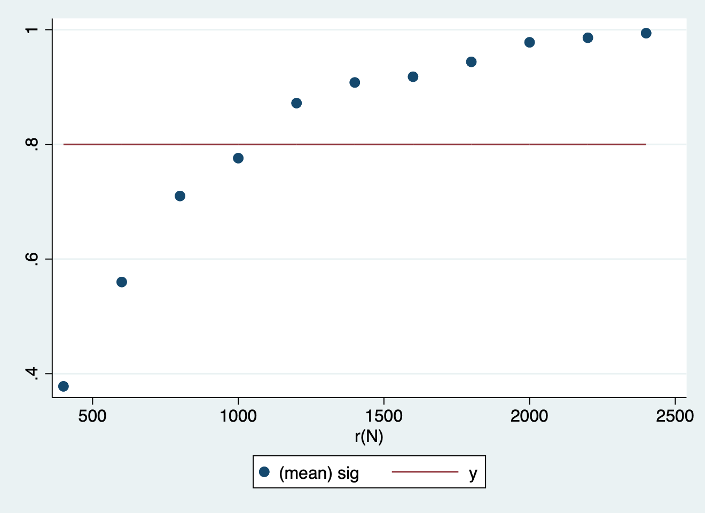
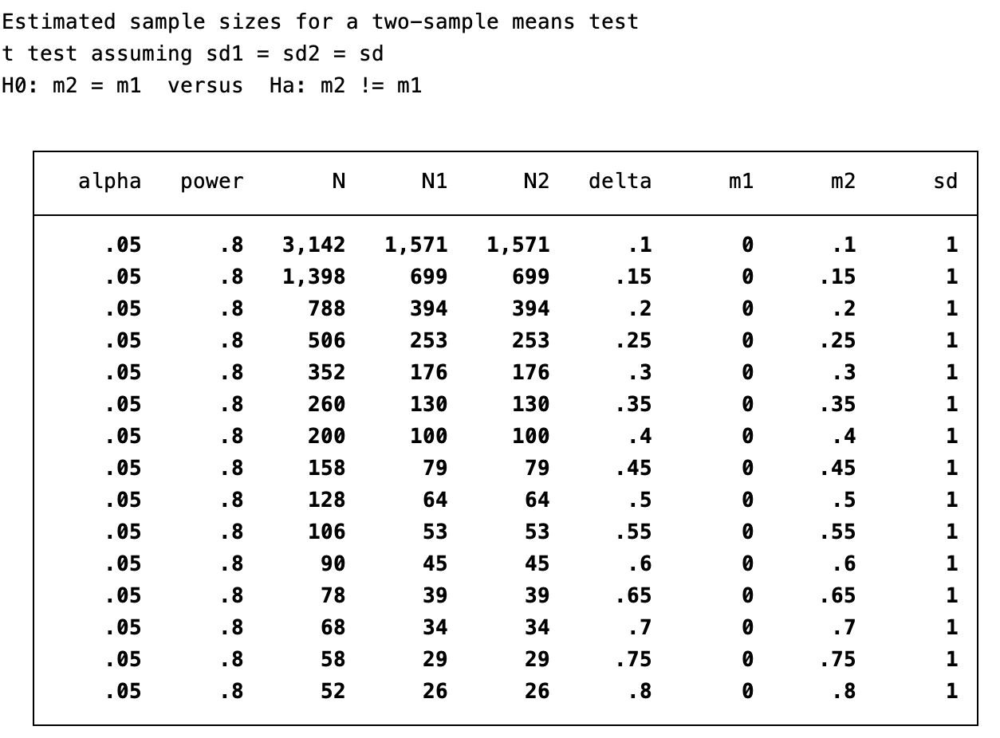

Week 10

Part 1:

Figures and table results:

From this table and graph we can interpret that the "minimum sample size" required to obtain 80% power for regression models is between N = 1000 (mean .792) and N = 1200 (mean .856). 

From this table we can see from the fixed sample sizes, how they can be split in treatment and control groups to carry the  p<0.05 for the treatment effect and 80% power for the regression models. 

