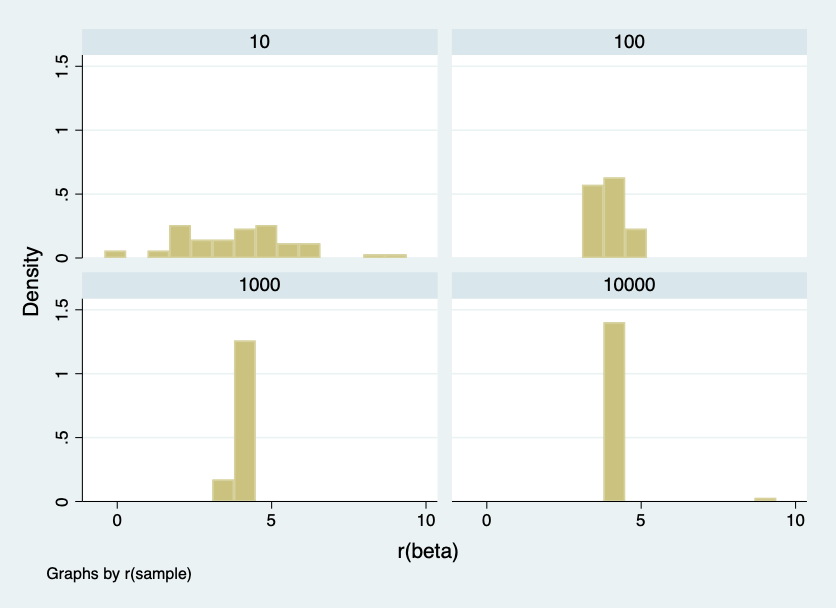
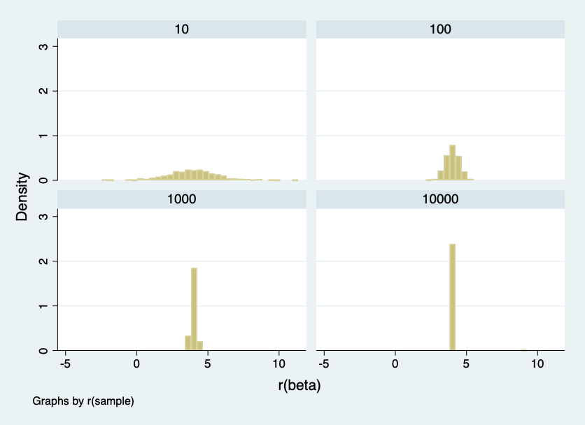
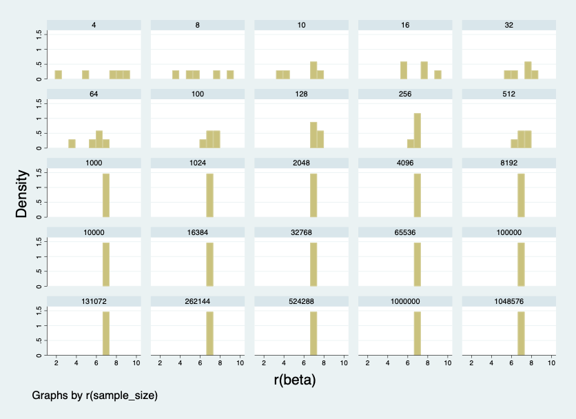
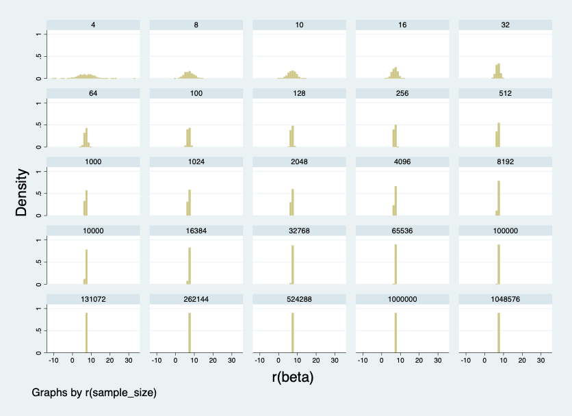

Week 8 Assignment

Part I

The following describes the result of the simulations in the Week 8 Assignment.
The first simulation consisted of the following  

      Random dataset generated 10000 observations; Seed set to 3005
      Written program to randomly simulate the 10000 observations
      Sample size of the dataset increases: 10 ^ (1,2,3,4)

|       Sample Size        |    Beta estimate   | Std.error |  Conf.Interval |
-------------------------- | -------------------|-----------|----------------
|          10              |        4.43        |    1.61   |  0.71 - 8.15   |
|          100             |         4.38       |    0.47   |   3.44 - 5.32  |
|         1000             |         4.09       |   0.16    |   3.78 - 4.41  |
|        10000             |         4.01       |    0.04   |   3.91 - 4.10  |

The beta, SEM and confidence intervals get smaller as the sample size gets larger. The larger sample size means that estimates   are getting closer to the true population estimate.

Part II

(i) Sample size changes
(ii) Number of simulations change

To analyze these differences, I made changes to the simulations and the sample sizes. First I ran five hundred simulations and then five simulations at the sample sizes ranging from 10 to 1000000.

In conclusion, as the sample size gets larger in the simulation, the beta estimates are centered around the mean of the sample. Similarly, as the number of simulations increase, the beta estimates are clustered around the mean and the distribution has less variation as opposed to a smaller sample with less simulations which have more variation. The SEM and confidence intervals are larger because the increase in sample size reduces the SEM and confidence intervals.

|       Sample Size        |  Beta estimate     |    Reps     | Std. error | Conf. Interval |   
|--------------------------| ------------------ |-------------| -----------| -------------- |
|          10              |       5.81         |     500     |            |                |
|          100             |       7.18         |     500     |   0.57     |  6.04 - 8.33   |
|          1000            |       6.99         |     500     |   0.18     |  6.62 - 7.36   |
|          10000           |       6.89         |     500     |   0.05     |  6.78 - 7.01   |
|          100000          |       6.97         |     500     |   0.01     |  6.94 - 7.01   |
|          1000000         |       7.00         |     500     |   0.00     |  6.99 - 7.01   |

|       Sample Size        |    Beta estimate   |   Reps    | Std. error | Conf. Interval |
| -------------------------| -------------------| ----------| ---------- |----------------|
|          10              |       9.57         |     5     |   1.57     | 5.94 - 13.19   |
|          100             |       7.18         |     5     |   0.57     |  6.04 - 8.33   |
|          1000            |       6.99         |     5     |   0.18     |  6.62 - 7.36   |
|          10000           |       6.89         |     5     |   0.05     |  6.78 - 7.01   |
|          100000          |       6.97         |     5     |    0.01    |  6.94 - 7.01   |
|          1000000         |       7.00         |     5     |   0.00     |  6.99 - 7.01   |
