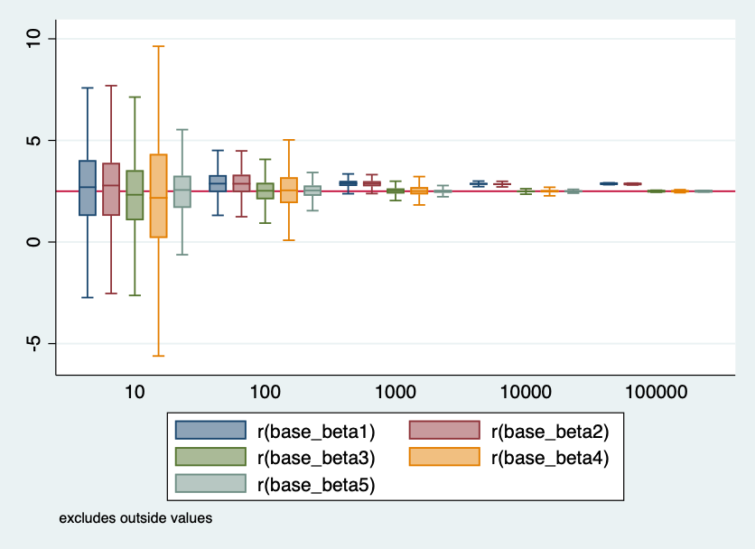
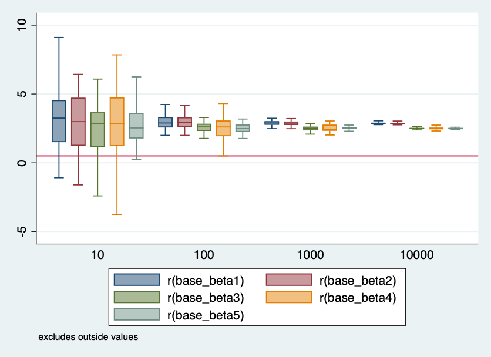
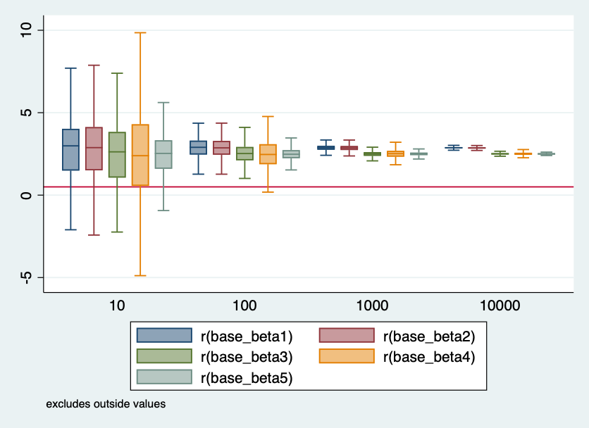

Week 9 - Part 1

In these five models we are trying to limit bias by controlling for the treatment variable and including a confounder in the third model to observe its impact on the results of the regression model. WE've built the model in each regression including fixed effects and covariates as we run a new model.

The debias is apparent in the third model. When we include the confounder variable in the model, we observe the true treatment effect of 2.5. The confounder affects both the outcome and the treatment variable, by not including it in the model we are biasing the parameter and not observing the true treatment effect.

Part II

In part two of the model we observe what happens to our estimates when we include a collider variable and a channel. In the first two models the predicted treatment effect is very close to the true estimate. In the fourth regression, the estimate on the collider variable is very far from the true estimate which indicates that the collider variable is creating bias. 
