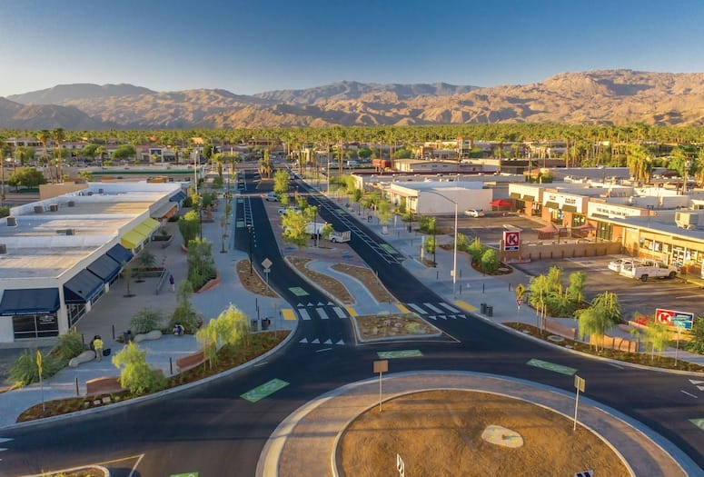

# Bio
 

My name is Chance Hope, and I am a second year MPP student at Georgetown University. I am originally from [Palm Desert, California](https://www.worldatlas.com/cities/palm-desert-california.html), and I went to UC Santa Barbara for undergrad. As a policy student, I have a strong interest in: 
- Energy
- Transportation
- Health policy. 

After this program, I am planning to stay in the DC area. 

I am proficient in stata, having recently used it in multiple core classes. I am also familiar with github, although I had not used it in quite some time until now. I have no experience with SurveyCTO, and look forward to learning more about it. I am hoping to apply the technical competencies that I develop during this course to an analytic role. Ideally, I would go into sustainability consulting and spend my time researching the effects of environmental policy.

### Industries with the highest environmental impact measured by emissions:

| Industry                         | Greenhouse Gasses Emitted World Wide, 2022 |
| -------------------------------- | ------------------------------------------ |
| Energy (Electricity and Heating) | 15.83 billion tons                         |
| Transport                        | 8.43 billion tons                          |
| Manufacturing and construction   | 6.3 billion tons                           |
