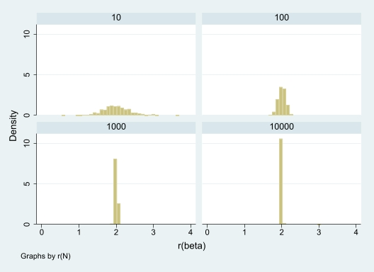
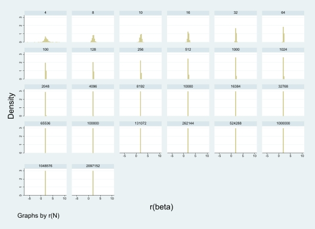

1.5: Figure & Tables

	Summary of
	cidif
r(N)	Mean
	
10	1.6267532
100	.40256665
1000	.12441161
10000	.03932007

	Summary of
	r(SEM)
r(N)	Mean
	
10	6.4531545
100	19.970409
1000	63.19531
10000	199.40332

1.6: The width of the confidence interval decreases as the sample size increases. The SEM also increases as sample size increases, which is a function of the data generation process including an error source and would not normally be observed. 

2.3: Figure & Tables

	Summary of
	cidif
r(N)	Mean
	
4	6.1532259
8	1.9224094
10	1.6522549
16	1.1655495
32	.7471624
64	.50445725
100	.40210066
128	.35287309
256	.24682015
512	.1744886
1000	.12464315
1024	.12314539
2048	.08674339
4096	.06122341
8192	.04329652
10000	.03921742
16384	.0306448
32768	.02165257
65536	.01531308
100000	.01239459
131072	.0108285
262144	.00765596
524288	.00541421
1000000	.00392
1048576	.00382814
2097152	.00270683

	Summary of
	r(SEM)
r(N)	Mean
	
4	5.7520844
8	6.0480082
10	6.3354319
16	7.9231733
32	11.263224
64	16.041472
100	19.966399
128	22.625223
256	32.04385
512	45.217217
1000	63.122523
1024	63.838146
2048	90.552993
4096	128.16125
8192	181.14051
10000	199.95089
16384	255.82396
32768	362.14588
65536	512.01228
100000	632.5667
131072	723.96388
262144	1024.0074
524288	1447.9961
1000000	1999.9777
1048576	2047.9336
2097152	2896.3199

2.4: The width of the confidence interval decreases as the sample size increases. The SEM also increases as sample size increases, which is a function of the data generation process including an error source and would not normally be observed. 

2.5: Unclear about what this is asking for. To my understanding, I was able to draw a larger sample size because I specified a larger sample size in my code. I used the same data generating process for both parts because that was what the instructions appeared to specify, or at least allow for. A comparison table would show nothing of interest given these conditions. 

2.6: Changing repetitions from 500 did not change anything.  

