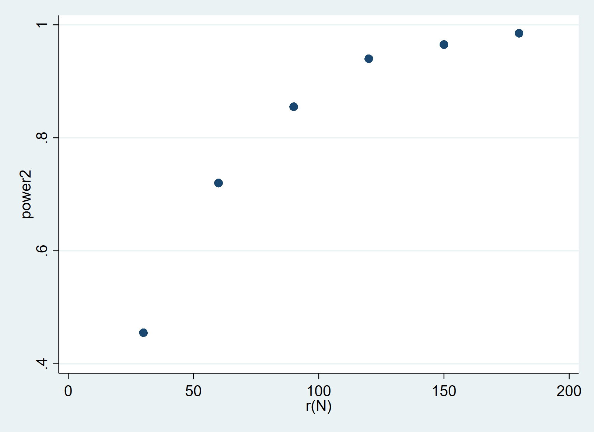
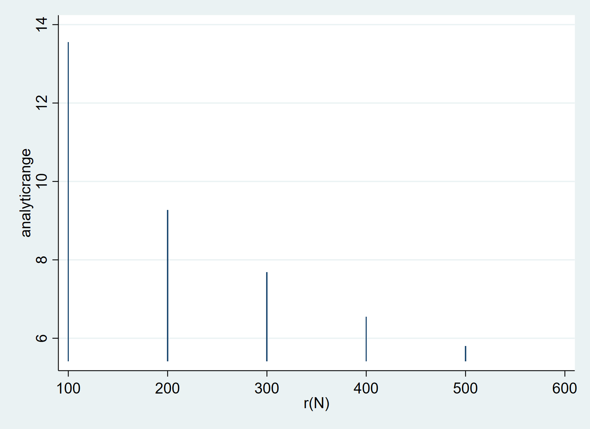

**Chance Hope**

**Week 10**

Pt1. 

*Figure 1: No controls* 

*Figure 2: With controls*

The above graphs show the minimum sample size to detect a ten point difference in score between treatment and control group with and without controls. With controls, the minimum sample size  is around 115. Without controls, it is around 75. The non simulated power calculation indicates that a sample of 128 observations is required to detect a ten point difference between the two groups. Results from simulated data may indicate a lower sample size required to detect the specified effect because there is less variance in the simulated data. 

*Figure 3: Effect sizes when n = 100 without controls*

*Figure 4: Effect sizes when n = 100 with controls*

The graphs show probability of detecting effects of a given size when sample size = 100. Figure 3 shows a minimum detectable effect of 11 without controls, and figure 4 shows a minimum detectable effect of 9 with controls. 

Pt2.

*Figure 5: Mean exact confidence interval*

*Figure 6: Mean analytic confidence interval*

Figure 7: Mean exact confidence interval (all effects at the cluster level).

*Figure 8: Mean exact confidence interval (all effects at the cluster level).*

I create 20 clusters that contribute to some portion of the random error term and assign treatment at the cluster level. Figure 5 shows that the mean exact confidence interval is uniformly distributed. Figure 6 shows that the mean confidence interval decreases as sample size increases. Figures 7 and 8 show similar results when all effects are at the cluster level. I was not able to correct analytic results using the vce() option in regress. 

