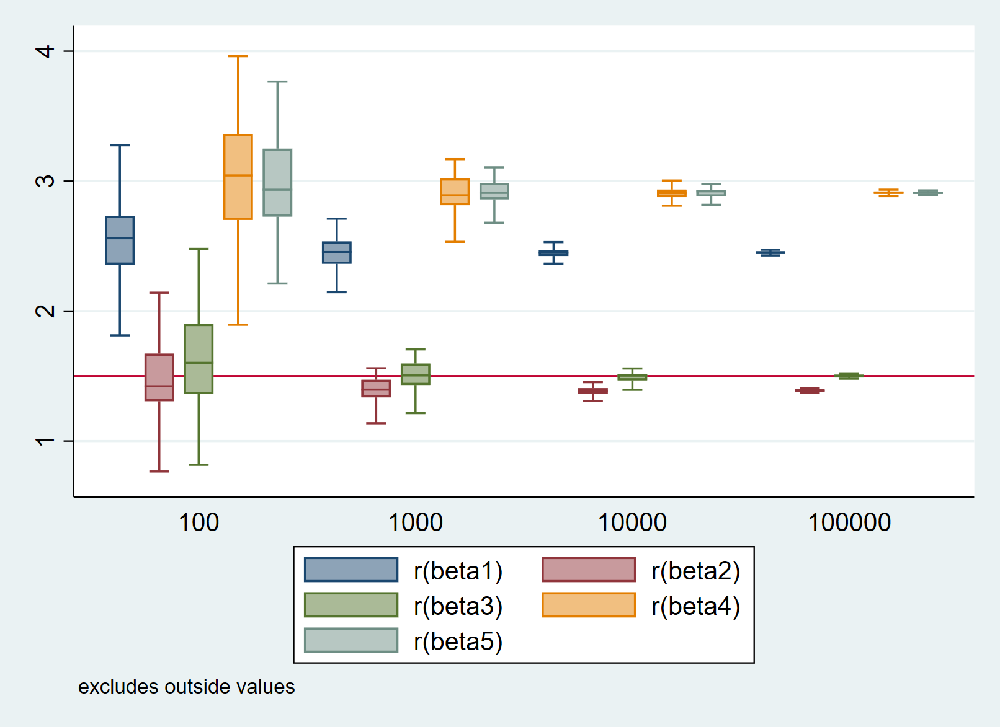
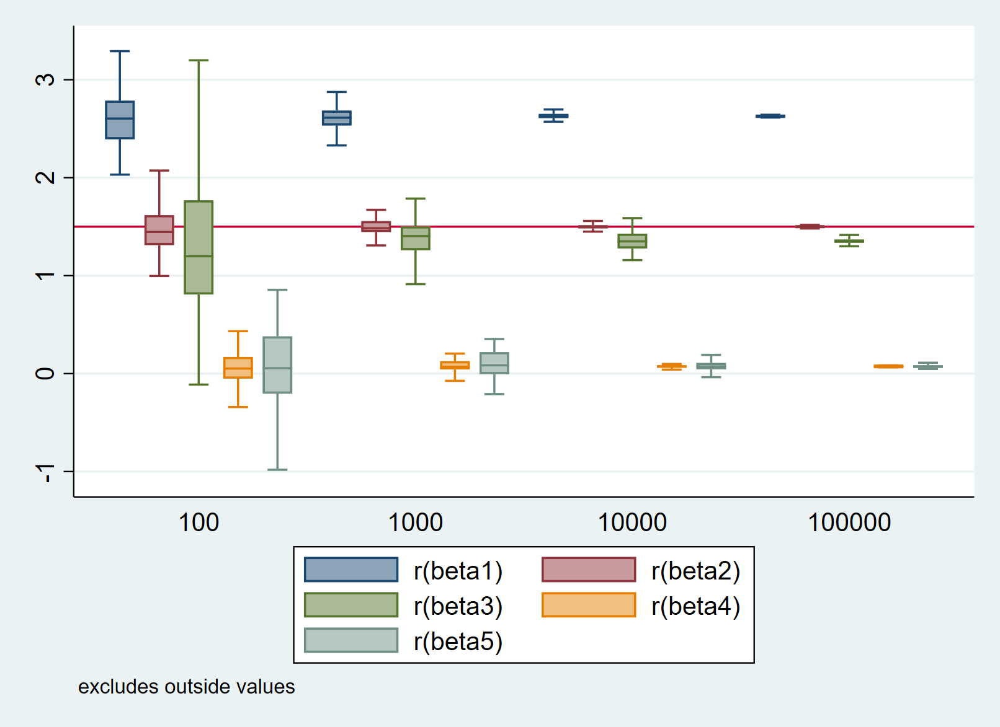

# Young-Ju Nam (Week_09)

Part 1. 
===================

Some people might think that a treatment alone affects to the outcome based on the regression. However, when we compare the results of 5 regressions, just using treatment variable would not make a suitable prediction model. In my case, model 3 shows the closest beta (slope) with the beta (1.5) from sales equation.  The reason is that 'sales' (Y) does not just depend on 'treatment'. There is a common cause, which affect both 'sales' and 'treatment'. We call it 'confounder', and as we can find at the result, when the confounder (bsize) is included in the model, it most closely predict beta. Thus, we should always think about this confounder, and use it to adjust ('de-biase') treatment's biased effect on the model.

Part 2.
===================

When we compare the results of 5 regressions, we can find that the 2nd model, which only contains normal variables, shows best prediction of beta (slope) from the sales equation. If we put 'collider', the models show very astried beta '0' (slope) with the beta (1.5) of sales model. 'channel' variable also shows different beta with the original beta of sales model. This is because 'collider' and 'channel' variables are consist of 'treatment' and 'outcome(Y)', but do not affects any of 'treatment' nor 'outcome(Y)' (No exit). Thus, we should be very careful using only affected by 'outcome' and 'treatment' because they make biased effect on the model.
