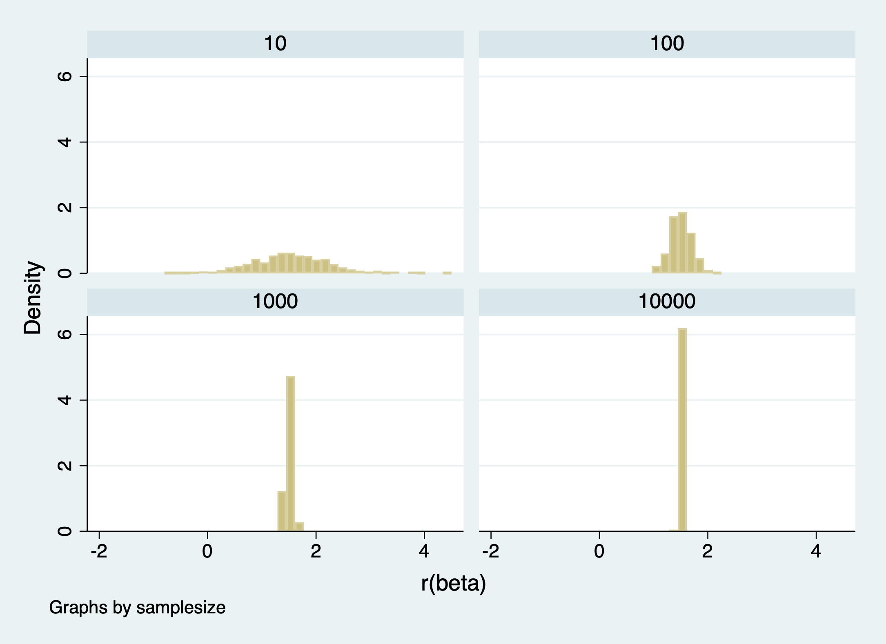
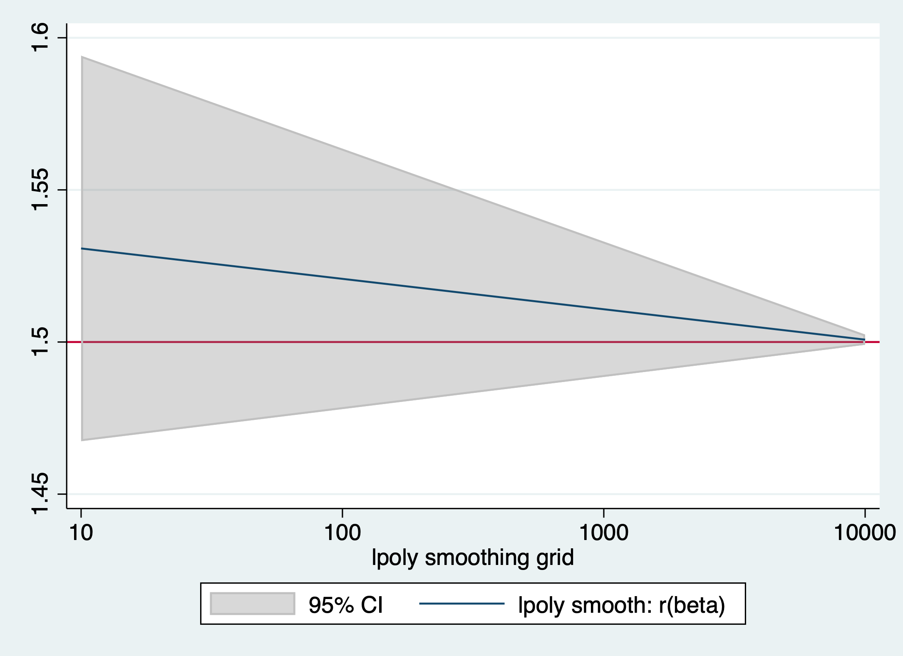
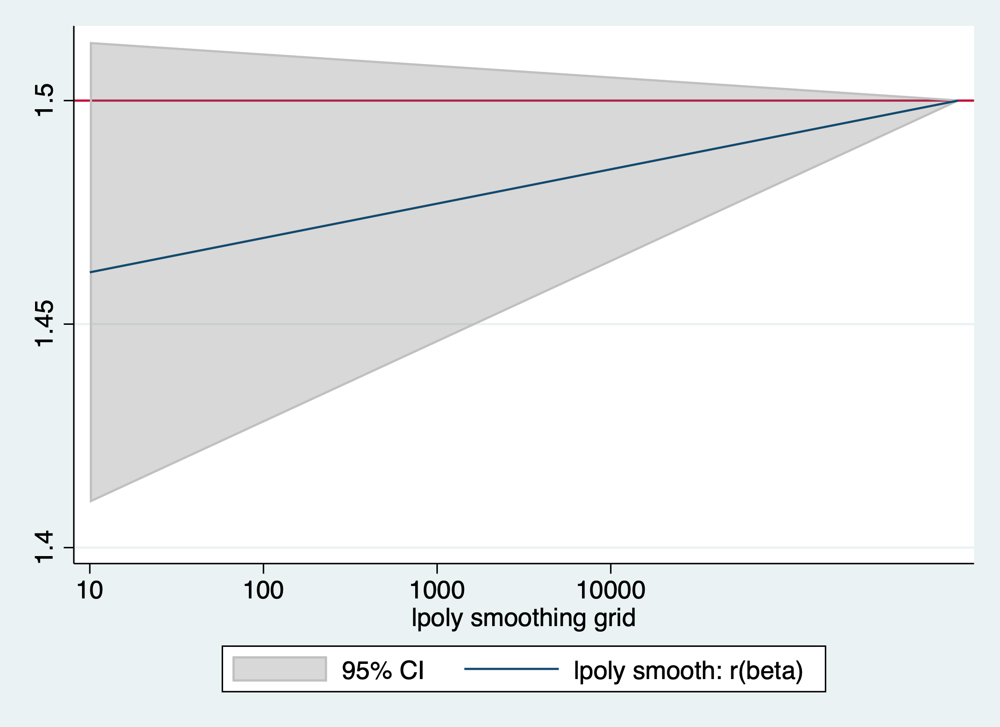
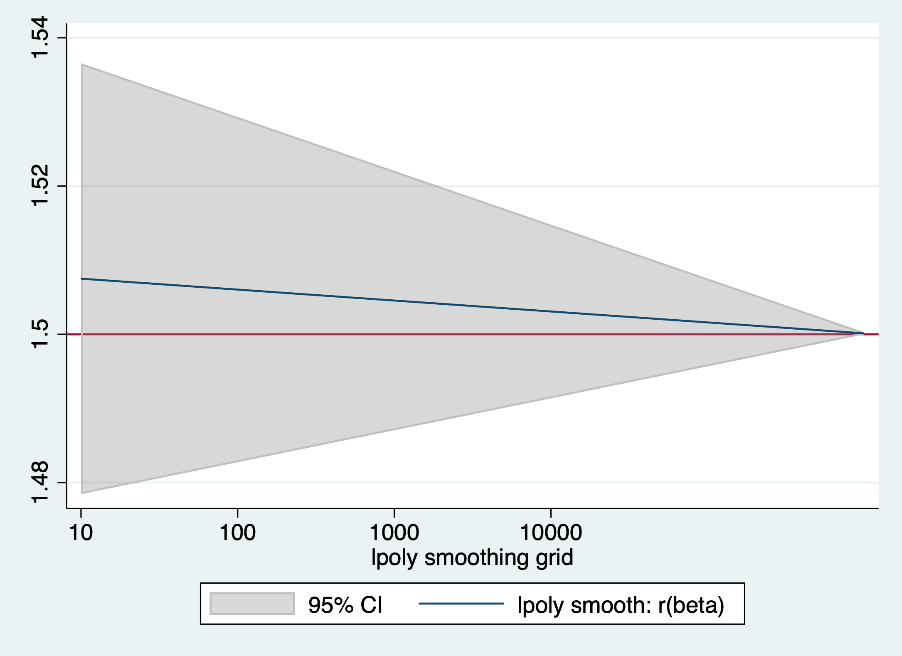
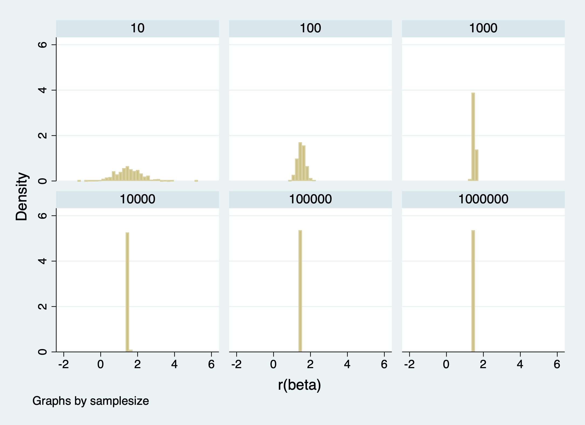

# Week 8 Assignment 

## Part 1: 

In these graphs we can see how the estimates for the betas get more accurate as the sample size increases. When the sample size is 10 there is more variation in the estimates for beta, there is a higher standard error and the confident intervals are larger compared to when the sample size is 10,000. 

The following graph also visually illustrates how the estimates of beta get closer to the real value as the sample size increases. The real value is 1.5 and we can that when the sample size is 10,000, the estimate is the closest to 1.5 out of the other sample sizes 

In addition to getting better estimates for the betas, increasing sample size also leads to a smaller standard error and a smaller confidence interval because the accuracy of the estimates increases. We can see this with the table below where the bigger the sample size, the smaller the se and ci. 

## Sampling noise in a fixed population

| Sample Size |   Beta   |    SE     |
|:-----------:|:-------:|:--------:|
|      10     | 1.530769| 0.6976818|
|     100     | 1.499314| 0.2009754|
|    1000     | 1.503507| 0.0631152|
|   10000     |  1.50078| 0.0199232|

## Part 2: 

We can observe the same relationship between sample size and the accuracy of the betas in this part. The bigger the sample size, the more accurate the beta gets. The table below demonstrates this relationship. 
## Sampling noise in an infinite superpopulation

|   samplesize   |    beta    |     se     |
|:--------------:|:---------:|:----------:|
|       10       |  1.503419 |  0.6971474 |
|      100       |  1.505167 |  0.2032555 |
|      1000      |  1.498117 |  0.0632275 |
|     10000      |  1.497662 |   0.020012 |
|     100000     |  1.500171 | 0.0063259  |
|    1000000     |  1.500104 |    0.002   |

When we observe the graph of the different betas by sample size we can also confirm that as sample size grows the estimated beta is more accurate. If the number of repetitions increases the estimates for beta are overestimations of the real value. If the repetitions decrease then the estimates for beta are underestimations of the real value. We can see this with the graphs below. 

### Using 250 repetitions

### Using 750 repetitions

### Using 500 repetitions

##Comparison of the two processes with 500 repetitions: 

| Sample size_Super Population |   Beta1   |    SE1     | Sample size_Fixed Population |   Beta2   |    SE2     |
|:----------------------------:|:---------:|:----------:|:---------------------------:|:---------:|:----------:|
|              10              |  1.503419 |  0.6971474 |               10            | 1.530769  | 0.6976818  |
|             100              |  1.505167 |  0.2032555 |               100           | 1.499314  | 0.2009754  |
|             1000             |  1.498117 |  0.0632275 |               1000          | 1.503507  | 0.0631152  |
|            10000             |  1.497662 |  0.020012  |              10000          | 1.50078   | 0.0199232  |
|            100000            |  1.500171 | 0.0063259  |               -             |    -      |     -      |
|           1000000            |  1.500104 |     0.002  |               -             |    -      |     -      |

The table above compares the results of the simulations with a super population and a fixed population. We can see that the estimated beta is different for both population types for the same sample size. This is because the super population takes into account any possible population that has or could ever exist. Because of this the estimates for Beta get even more accurate than with a fixed population.  

 

