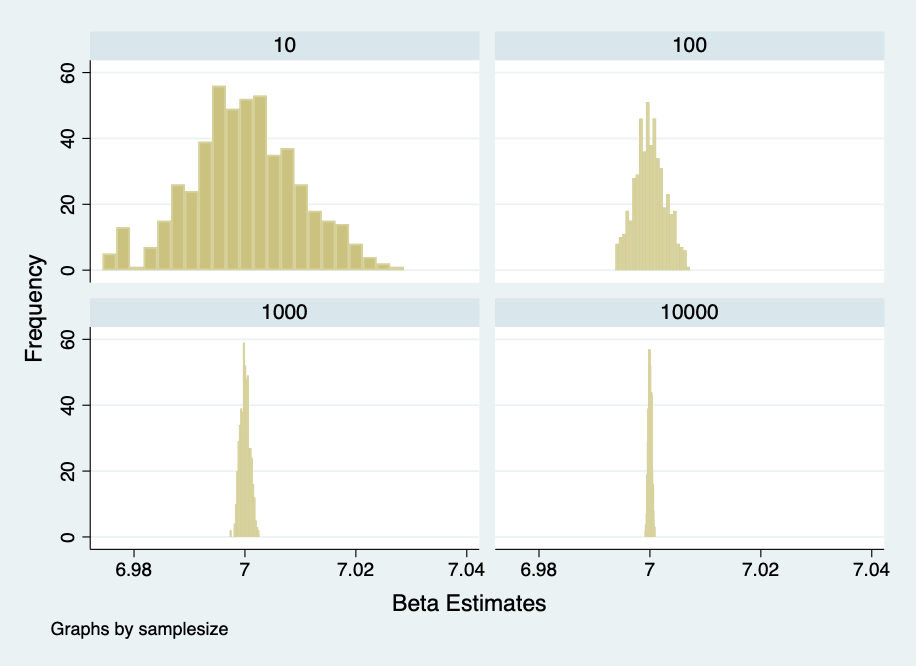
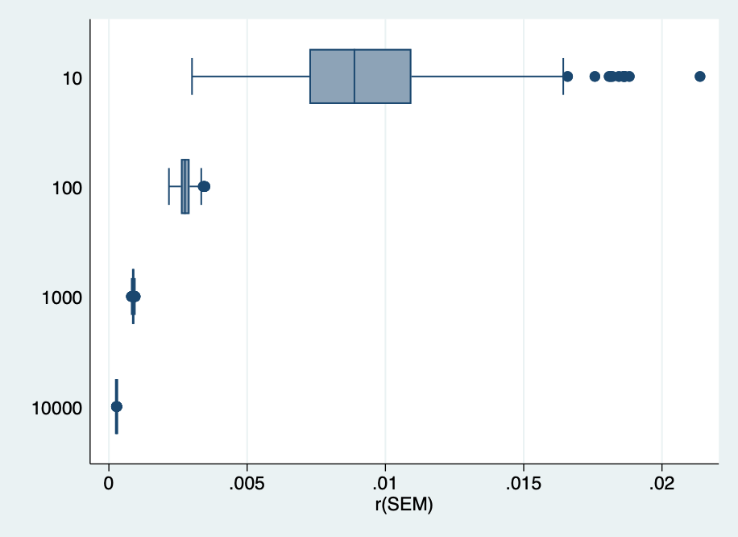
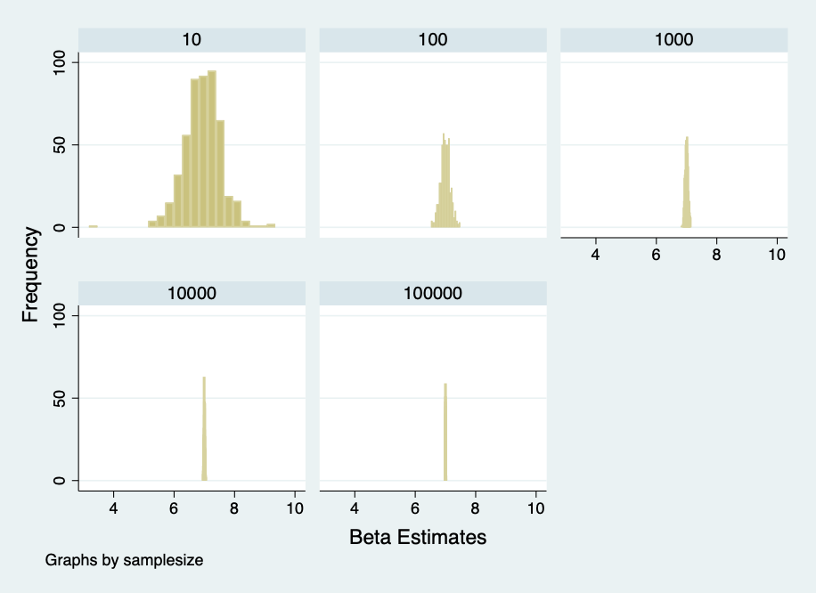
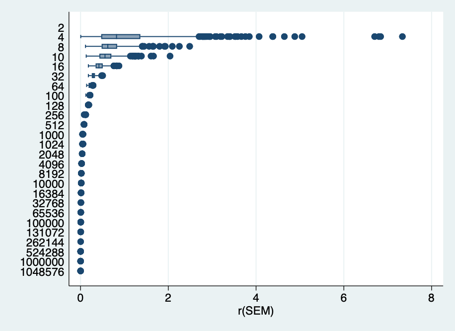

# Week 08 Assignement
Data generation process:
X is normally distributed fixed population of 10,000 individual observations with a mean of 100 and a standard deviation of  5.
Y=7*X + normally distributed error term with mean of 27 and standard error of 8

## Part 1

*Result Graph and Table

*Table 
| Samplesize | beta | pval | SEM | ul | ll |
|---|---|---|---|---|---|
| 10 | 6.999889 | 1.24e-19 | .0093414 | 7.02143 | 6.978348 |
| 100  | 6.999987 | 0 | .0027717 | 7.005487 | 6.994486 |
| 1000  | 7.000021 | 0 | .0008801 | 7.001748 | 6.998294 |
| 10000  | 7.00001 | 0 | .000278 | 7.000555 | 6.999465 |
| Total  | 6.999977 | 3.09e-20 | .0033178 | 7.007305 | 6.992648 |

### Discussion

According to the histogram, beta estimates for X is centered around 7. As the sample size gets larger, the beta estimates are more closely clustered around 7, meaning the sample estimates are more close to the true population parameter. 
The table reports estimates' mean, standard deviation and confidence interval for different sample size. As sample size gets larger, estimates' mean, standard deviation and the confidence interval becomes smaller. As the sample size (n) gets larger, it is less likely to have extreme values and variance in the sample. It is more close to the parameter and less biased.  

## Part 2

*Result Graph and Table

*TABLE
| Sample size  | beta | p-value | SEM | ul | ll |
|---|---|---|---|---|---|
| 2 | 8.634536 | . | . | . | . |
| 4  | 7.033941 | .0408181 | 1.111097 | 11.81461 | 2.253276 |
| 8  | 6.98974 | .0005433 | .6784557 | 8.649861 | 5.329619 |
| 10  | 6.94995 | .0003687 | .5909867 | 8.312767 | 5.587132 |
| 16  | 7.00405 | 2.25e-08 | .4326432 | 7.931977 | 6.076123 |
| 32  | 7.00947 | 3.44e-17 | .2957621 | 7.613496 | 6.405443 |
| 64  | 7.01264 | 3.79e-36 | .2019105 | 7.416253 | 6.609026 |
| 100  | 6.996421 | 0 | .1617114 | 7.317332 | 6.67551 |
| 128  | 6.998704 | 0 | .1423715 | 7.280453 | 6.716955 |
| 256  | 7.000139 | 0 | .1005228 | 7.198103 | 6.802175 |
| 512  | 6.996082 | 0 | .0707452 | 7.13507 | 6.857094 |
| 1000  | 7.001377 | 0 | .0506339 | 7.100738 | 6.902016 |
| 1024  | 6.999789 | 0 | .0501181 | 7.098135 | 6.901443 |
| 2048  | 7.001385 | 0 | .0353721 | 7.070754 | 6.932016 |
| 4096  | 7.000487 | 0 | .0249783 | 7.049458 | 6.951516 |
| 8192  | 6.999289 | 0 | .0176677 | 7.033922 | 6.964656 |
| 10000  | 7.000889 | 0 | .015992 | 7.032237 | 6.969542 |
| 16384  | 6.999363 | 0 | .0124969 | 7.023858 | 6.974868 |
| 32768  | 6.99944 | 0 | .0088416 | 7.01677 | 6.982111 |
| 65536  | 7.000734 | 0 | .0062504 | 7.012985 | 6.988484 |
| 100000  | 7.000291 | 0 | .00506 | 7.010209 | 6.990374 |
| 131072  | 7.000189 | 0 | .0044199 | 7.008852 | 6.991526 |
| 262144  | 7.0001 | 0 | .0031249 | 7.006224 | 6.993975 |
| 524288  | 6.999953 | 0 | .0022096 | 7.004284 | 6.995622 |
| 1000000  | 6.999942 | 0 | .0016001 | 7.003079 | 6.996806 |
| 1048576  | 6.999897 | 0 | .0015624 | 7.00296 | 6.996835 |
| Total  | 7.062646 | .0016692 | .1610614 | 7.445775 | 6.553766 |

*Table for repeat 100 times

| sample size | beta | pvalue | SEM | ul | ll |
|---|---|---|---|---|---|
| 10  | 6.973254 | .0000218 | .5622538 | 8.269813 | 5.676694 |
| 100  | 6.995121 | 0 | .1612868 | 7.31519 | 6.675053 |
| 1000  | 6.998483 | 0 | .0504983 | 7.097578 | 6.899388 |
| 10000  | 6.999783 | 0 | .0160047 | 7.031155 | 6.96841 |
| Total  | 6.99166 | 5.46e-06 | .1975109 | 7.428434 | 6.554886 |

### Discussion
* The beta estimates, again is centered around 7, the true population parameter. The mean and SEM shrink when sample size gets larger. The estimates less biased as sample size exceeds 1000. 
* We're able to draw larger sample size because the data generating process is also incorporated in the program. By setting observations as `samplesize', we could control how many observations we want. 
* When repeat the simulation 100 times, the beta estimates are less precise than that of 500 times. Confidence intervals and SEMs are similar to that of 500 times.
