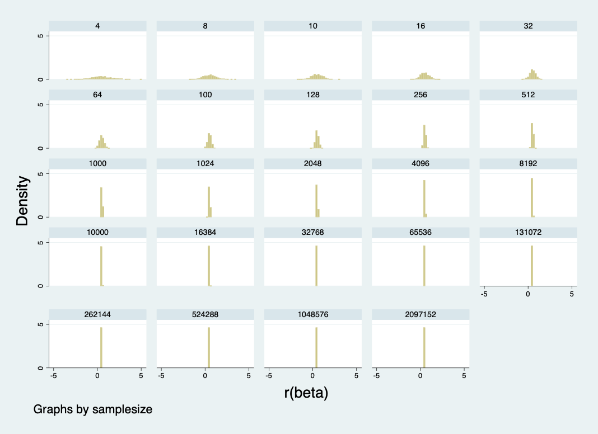

Author: Peyton Weber
Week 08 Assignment as of 12:05PM EST on April 1, 2023. 

# Part 1: 

## Dataset of 2,000 Regression Results: 

The 2,000 regression results provide evidence that the data distribution narrows as the sample size increases. As we obtain an increasingly larger sample size, we are more likely to obtain the "true" mean. As expected, the standard errors become increasingly smaller as our sample size grows. 

The following table illustrates the IQR of the beta coefficient estimates, the standard errors, and the confidence intervals at various sample sizes. 

| samplesize | beta_coef | se        | lowerbound | upperbound |
|------------|-----------|-----------|------------|------------|
| 10         | 0.8927522 | 0.2030702 | 1.034762   | 0.9813862  |
| 100        | 0.2483946 | 0.0209054 | 0.2620605  | 0.2520711  |
| 1000       | 0.0860347 | 0.0019721 | 0.0867666  | 0.083747   |
| 10000      | 0.0266173 | 0.0001771 | 0.0262856  | 0.0266407  |

# Part 2: 

## "Infinite" Population Regression Results: 

Similarly to part one, the IQR becomes smaller with larger sample sizes. Unlike part one, we are no longer constrained to a population of 10,000 observations. I believe this is why the standard errors and confidence intervals would be different. 

The following table illustrates the IQR generated for part two. 

| samplesize | beta_coef | se        | lowerbound | upperbound |
|------------|-----------|-----------|------------|------------|
| 4          | 1.585568  | 0.7880153 | 3.660982   | 3.871675   |
| 8          | 1.04563   | 0.2731606 | 1.202178   | 1.230911   |
| 10         | 0.8922067 | 0.2147065 | 1.067776   | 1.002107   |
| 16         | 0.6695507 | 0.1306789 | 0.7553309  | 0.7317256  |
| 32         | 0.4664112 | 0.0625731 | 0.4989685  | 0.4864686  |
| 64         | 0.370642  | 0.0294874 | 0.3851625  | 0.3588083  |
| 100        | 0.2880853 | 0.0192288 | 0.2797746  | 0.2957802  |
| 128        | 0.2547821 | 0.0167545 | 0.2574732  | 0.2500474  |
| 256        | 0.1565864 | 0.0085183 | 0.1619766  | 0.1546358  |
| 512        | 0.1231909 | 0.0036602 | 0.1232348  | 0.1218113  |
| 1000       | 0.0869465 | 0.0019263 | 0.0874889  | 0.0862498  |
| 1024       | 0.0821008 | 0.001838  | 0.0816928  | 0.0812832  |
| 2048       | 0.0596936 | 0.0010388 | 0.0591342  | 0.0590382  |
| 4096       | 0.0426897 | 0.0004753 | 0.0420281  | 0.0424011  |
| 8192       | 0.0291818 | 0.0002149 | 0.0293075  | 0.029295   |
| 10000      | 0.0269354 | 0.000169  | 0.0271106  | 0.02687    |
| 16384      | 0.0210909 | 0.0001043 | 0.0210662  | 0.0211173  |
| 32768      | 0.0158641 | 0.0000517 | 0.0158618  | 0.015976   |
| 65536      | 0.0109348 | 0.0000305 | 0.0109268  | 0.0109246  |
| 131072     | 0.0077119 | 0.0000151 | 0.0077138  | 0.0077228  |
| 262144     | 0.0056798 | 7.86E-06  | 0.0056912  | 0.0056815  |
| 524288     | 0.0039143 | 3.85E-06  | 0.0039079  | 0.0039152  |
| 1048576    | 0.0025522 | 1.84E-06  | 0.0025523  | 0.0025494  |
| 2097152    | 0.0018914 | 9.87E-07  | 0.0018917  | 0.0018914  |

## Adjusting the Simulation Reps 

| samplesize | beta_coef | se        | lowerbound | upperbound |
|------------|-----------|-----------|------------|------------|
| 4          | 1.671313  | 0.835167  | 3.868153   | 3.445945   |
| 8          | 1.094188  | 0.2111229 | 1.075544   | 1.11762    |
| 10         | 0.654607  | 0.2139953 | 0.9424583  | 0.7836142  |
| 16         | 0.6522775 | 0.1122889 | 0.7981498  | 0.6649911  |
| 32         | 0.4808487 | 0.0755522 | 0.4718302  | 0.5215497  |
| 64         | 0.4406761 | 0.0348483 | 0.4729802  | 0.4515485  |
| 100        | 0.3448398 | 0.0176246 | 0.3623589  | 0.3311605  |
| 128        | 0.2168937 | 0.0187295 | 0.2524221  | 0.2244539  |
| 256        | 0.1476192 | 0.0069019 | 0.1694129  | 0.153819   |
| 512        | 0.1060876 | 0.0031986 | 0.1073149  | 0.108578   |
| 1000       | 0.0717102 | 0.0017622 | 0.0689498  | 0.0689929  |
| 1024       | 0.0871615 | 0.0014197 | 0.0894761  | 0.0858358  |
| 2048       | 0.0663363 | 0.0010859 | 0.0677812  | 0.0658489  |
| 4096       | 0.0439811 | 0.0003632 | 0.0445096  | 0.0434526  |
| 8192       | 0.0273283 | 0.000128  | 0.0260885  | 0.0275249  |
| 10000      | 0.0312776 | 0.0001652 | 0.0315929  | 0.031238   |
| 16384      | 0.0213072 | 0.0000941 | 0.0213492  | 0.0214057  |
| 32768      | 0.0174713 | 0.0000455 | 0.0175376  | 0.0174708  |
| 65536      | 0.0093375 | 0.0000342 | 0.0093037  | 0.0093713  |
| 131072     | 0.0094813 | 0.0000124 | 0.0094674  | 0.0094951  |
| 262144     | 0.006956  | 7.11E-06  | 0.0069597  | 0.0069522  |
| 524288     | 0.0042983 | 3.75E-06  | 0.0043074  | 0.0042892  |
| 1048576    | 0.0027341 | 2.16E-06  | 0.0027282  | 0.0027401  |
| 2097152    | 0.0017831 | 8.27E-07  | 0.0017848  | 0.0017815  |

