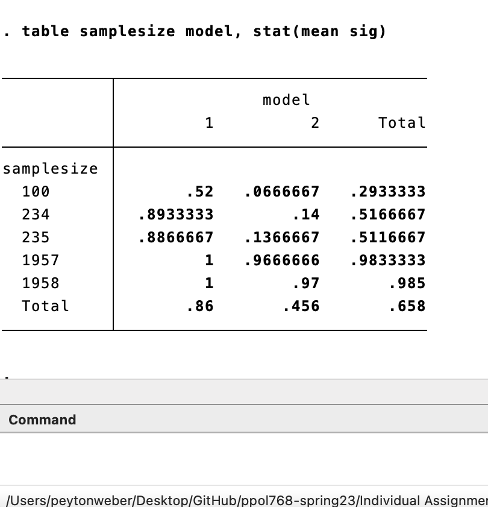
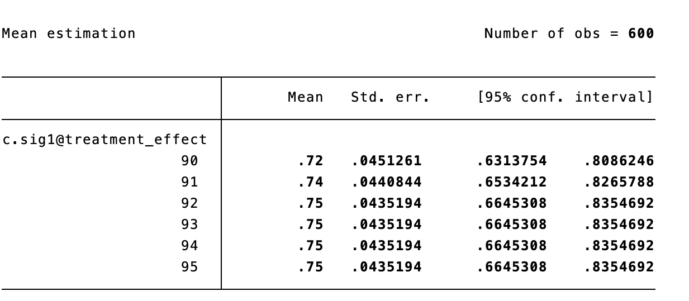
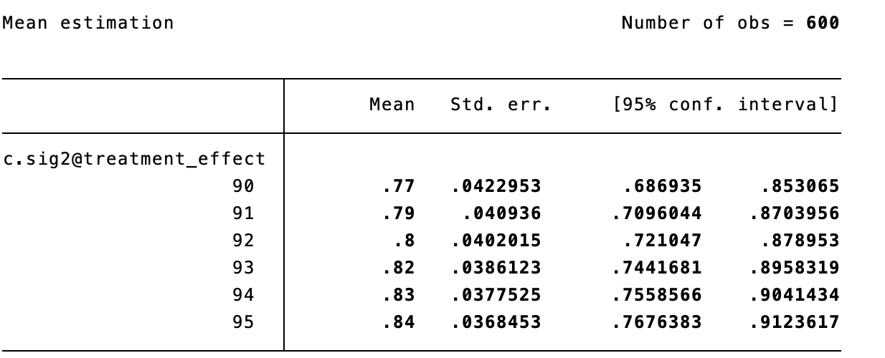
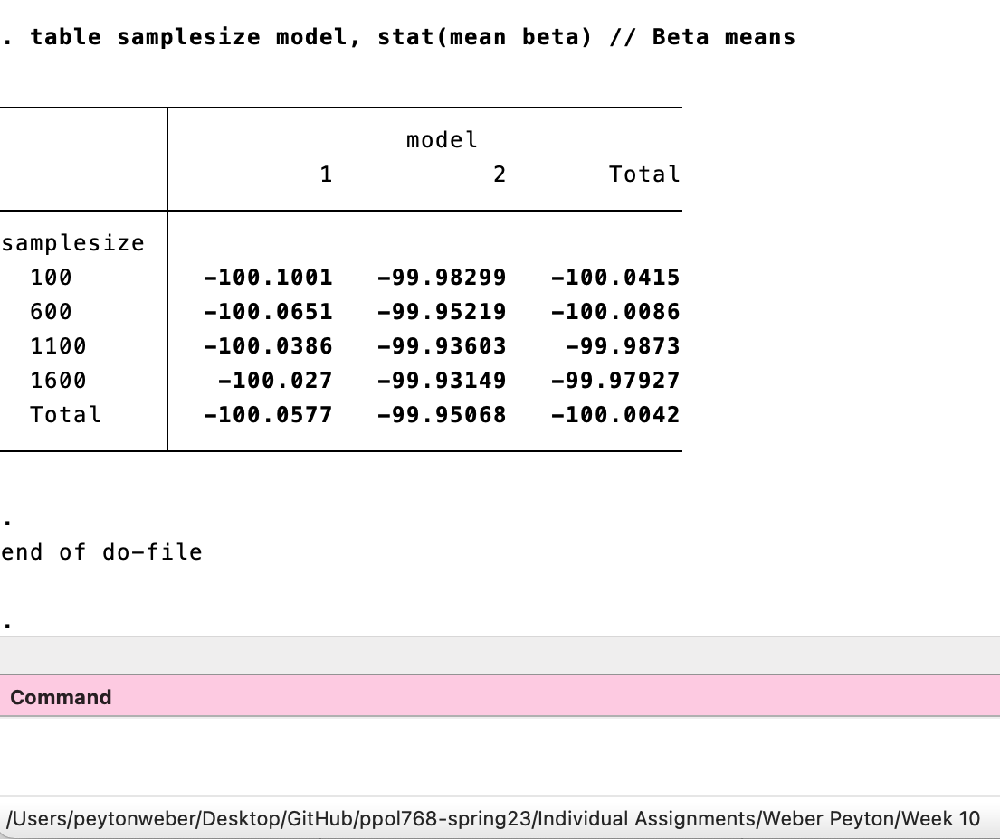
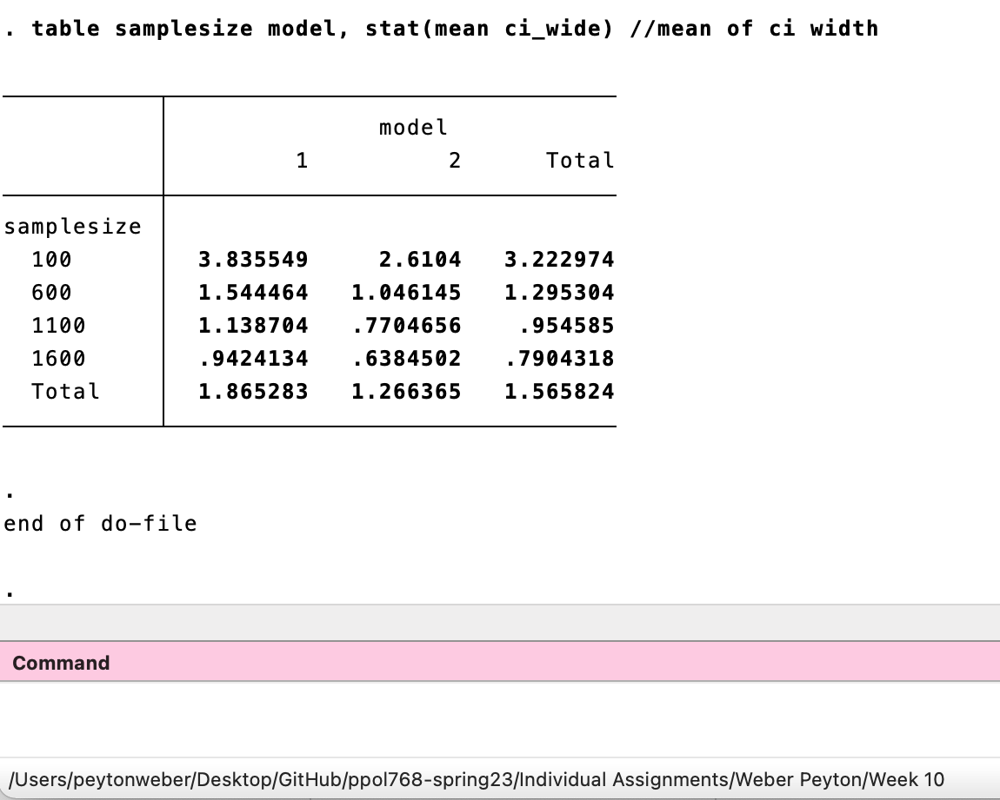

# PPOL 768-01 Research Design and Implementation Week 10 Assignment 
Author: Peyton Weber

## Part One 

The table below shows results for the unbiased model: 

The table below shows results for the biased model:

## Part Two

