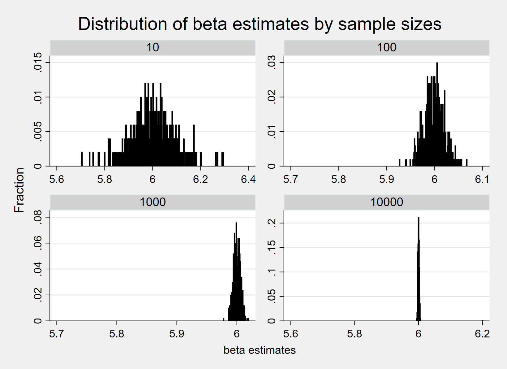
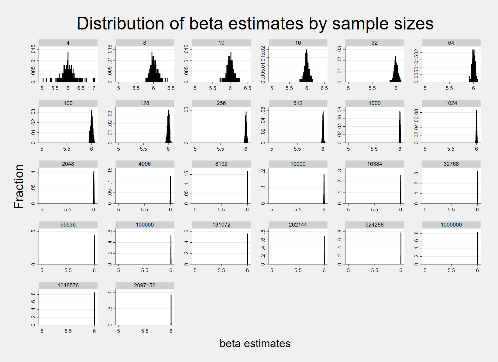
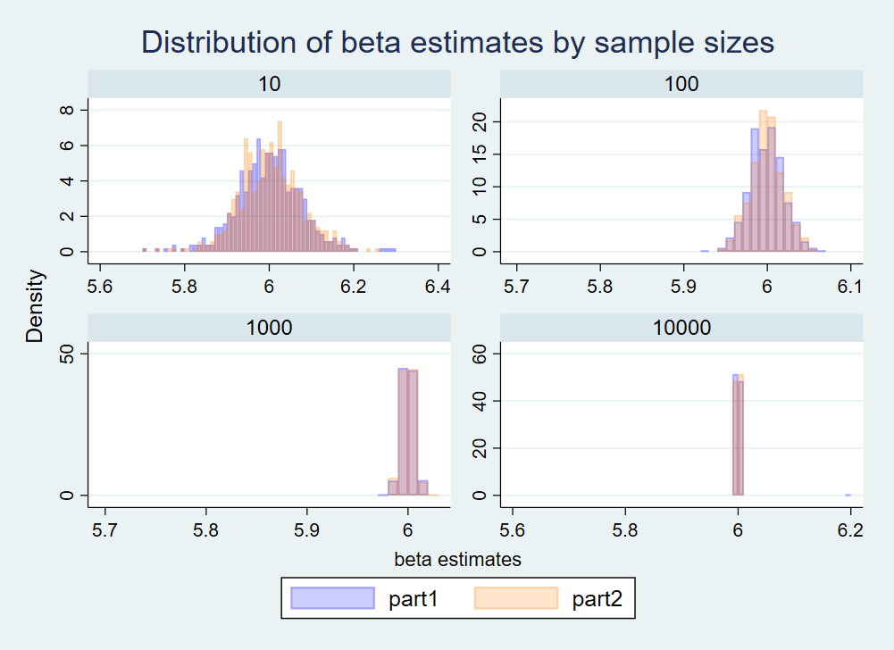
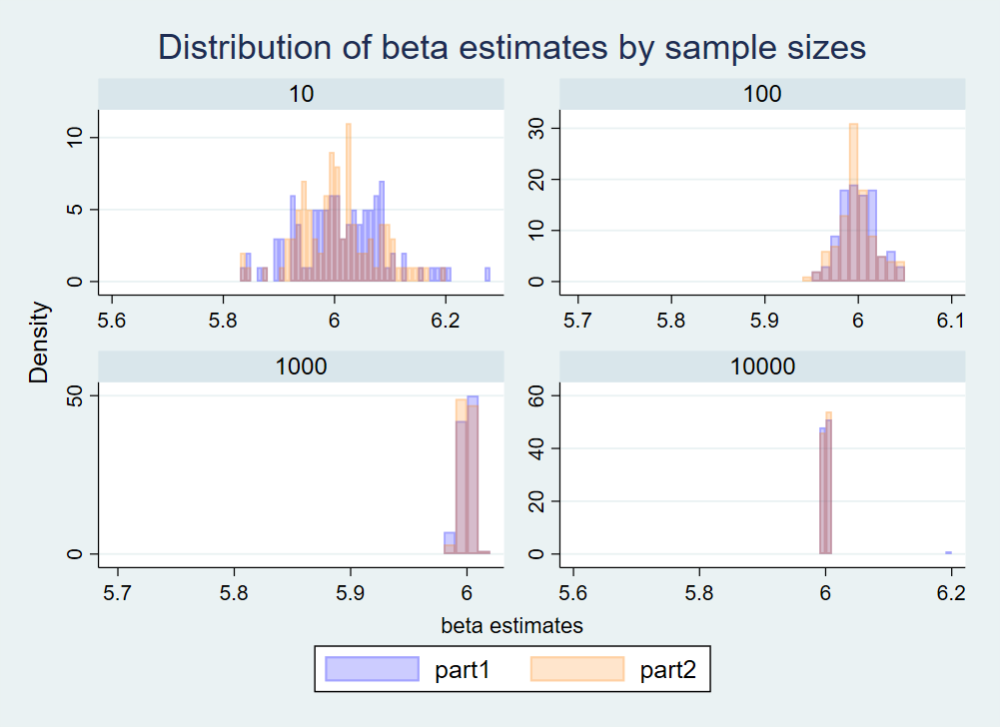

* Note: For both part 1 and 2, y = 30 + 6*x + normally distributed error term

* Part 1

| Sample Size | Estimates | Standard Error | Confidence Interval |
|:-----------:|:---------:|:--------------:|:-------------------:|
| 10 | 6.001 | 0.0698 | 0.322 |
| 100 | 5.999 | 0.0200 | 0.0794 |
| 1000 | 6.000 | 0.00629 | 0.0247 |
| 10000 | 6.000 | 0.00199 | 0.00779 |

Based on the histogram of the estimates, although the distribution of coefficient estimates for x by each sample size is centered around 6, which is the population parameter (the true relationship between x and y), the distribution is less dispersed as the sample size increases. The table above reports the mean of estimates, estimates' standard errors and the confidence interval width by sample size. Again, the mean of estimates' standard error and confidence interval width is smaller as the sample size enlarges. It is because a large sample contains more possible population values and is less likely to consist of extreme values only. Thus the estimates based on a large sample will be less variated from one sample draw to another. Also, the estimates are less biased when the sample size increases.

* Part 2

| Sample Size | Estimates | Standard Error | Confidence Interval |
|:-----------:|:---------:|:--------------:|:-------------------:|
| 4 | 6.003 | 0.134 | 1.152 |
| 8 | 6.008 | 0.0823 | 0.403 |
| 10 | 6.002 | 0.0702 | 0.324 |
| 16 | 5.999 | 0.0527 | 0.226 |
| 32 | 6.000 | 0.0365 | 0.149 |
| 64 | 6.000 | 0.0255 | 0.102 | 
| 100 | 6.000 | 0.0203 | 0.0806 |
| 128 | 6.000 | 0.0178 | 0.0706 |
| 256 | 5.999 | 0.0126 | 0.0497 |
| 512 | 6.001 | 0.00886 | 0.0348 |
| 1000 | 6.000 | 0.00633 | 0.0249 |
| 1024 | 6.000 | 0.00626 | 0.0246 |
| 2048 | 6.000 | 0.00442 | 0.0173 |
| 4096 | 6.000 | 0.00313 | 0.0123 |
| 8192 | 6.000 | 0.00221 | 0.00866 |
| 10000 | 6.000 | 0.00200 | 0.00784 |
| 16384 | 6.000 | 0.00156 | 0.00613 |
| 32768 | 6.000 | 0.00110 | 0.00433 |
| 65536 | 6.000 | 0.000781 | 0.00306 |
| 100000 | 6.000 | 0.000632 | 0.00248 |
| 131072 | 6.000 | 0.000552 | 0.00217 |
| 262144 | 6.000 | 0.000391 | 0.00153 |
| 524288 | 6.000 | 0.000276 | 0.00108 |
| 1000000 | 6.000 | 0.000200 | 0.000784 |

The insight extracted from the results of part2 is as same as the part1. Based on the histogram of the estimates, the distribution of estimates by each sample size is centered around 6, but the distribution is less dispersed as the sample size increases. The mean of estimates' standard error and confidence interval width is smaller as the sample size enlarges. The estimates are less biased when the sample size increases. Notably, the estimates are consistently identical to population parameter 6 when the sample size is over 1000. 

I was able to draw a larger sample in part 2 because I set the number of observations and generated data inside of the program here instead of drawing a subsample from a pre-defined dataset of 10000 observations like in part 1. In other words, in part 2, for each simulation repeat, I generated data from a normalized distribution in any sample size of my choice. In contrast, in part 1, I drew observations from the dataset I generated in part 1, step 2, with a maximum of 10000 observations.

|             | Estimates || Stardand Error || Confidence Inverval ||       
| Sample Size | Part1 | Part2 | Part1 | Part2 |  Part1 | Part2 |
|:-----------:|:--------------:|:-------------------:|
| 10 | 6.001 | 6.002 | 0.0698 |  0.0702 | 0.322 | 0.324 |
| 100 | 5.999 | 6.000 | 0.0200 | 0.0203 | 0.0794 | 0.0806 |
| 1000 | 6.000 | 6.000 | 0.00629 | 0.00633 | 0.0247 | 0.0249 |
| 10000 | 6.000 | 6.000 | 0.00199 | 0.00200 | 0.00779 | 0.00784 |

In part 2, with a certain sample size, to allow the sample drawn to differ from each other, I need to remove "set seed" from the data generation process. Otherwise, the estimates will be the same in 500 repeats for each sample size. And the removal of "set seed," the difference in the sample drawn, makes the results of part 2 slightly different from part 1.

If decrease the times of repetition from 500 to 100:

|             | Estimates || Stardand Error || Confidence Inverval ||       
| Sample Size | Part1 | Part2 | Part1 | Part2 | Part1 | Part2 |
|:-----------:|:----------:|:--------------:|:---------------------:|
| 10 | 6.013 | 6.006 | 0.0669 |  0.0702 | 0.309 | 0.324 |
| 100 | 6.001 | 5.998 | 0.0199 | 0.0203 | 0.0792 | 0.0806 |
| 1000 | 6.000 | 6.000 | 0.00627 | 0.00633 | 0.0246 | 0.0249 |
| 10000 | 6.002 | 6.000 | 0.00199 | 0.00200 | 0.00779 | 0.00784 |

When repeating the simulation 100 times by each sample size, the estimates are more biased than when repeating 500 times. But the standard error and confidence interval results are very similar, especially when the sample size is large.