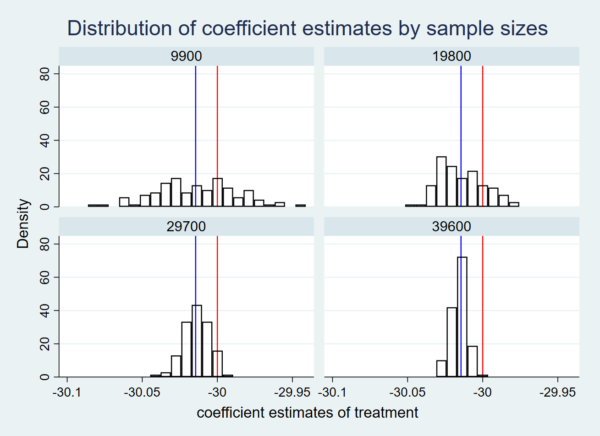
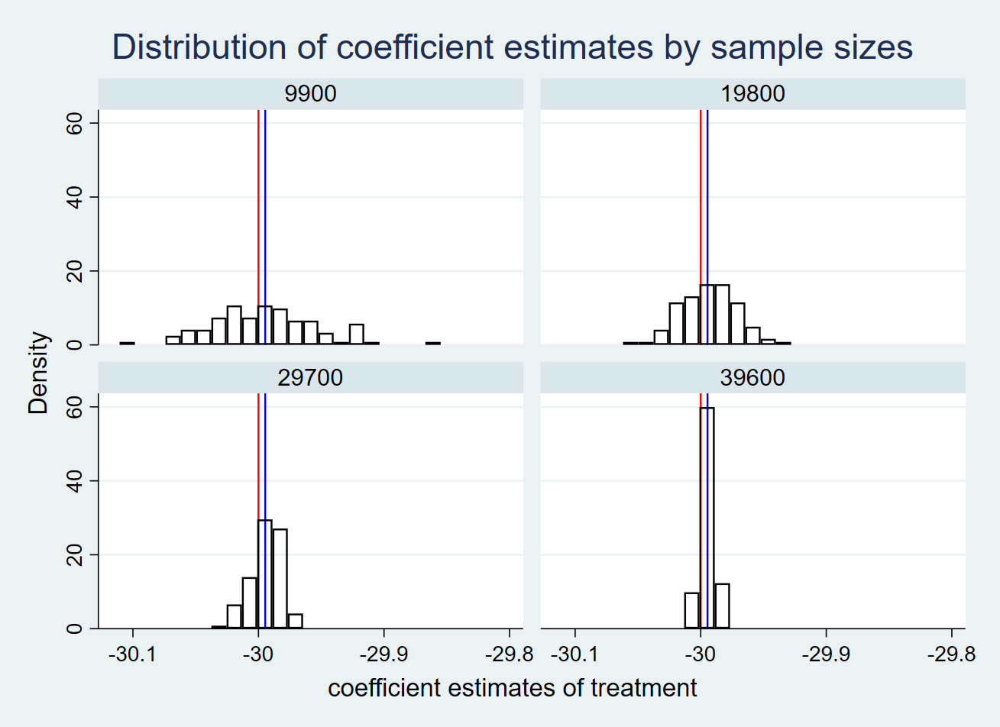
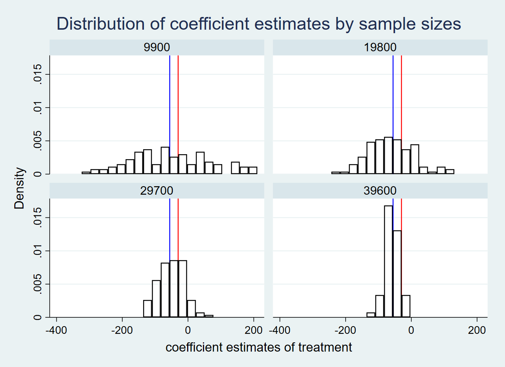
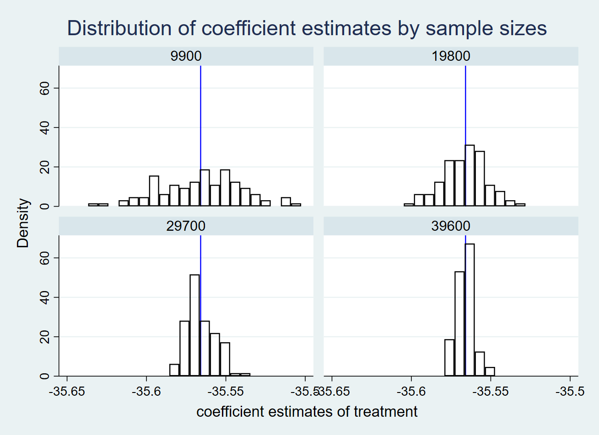
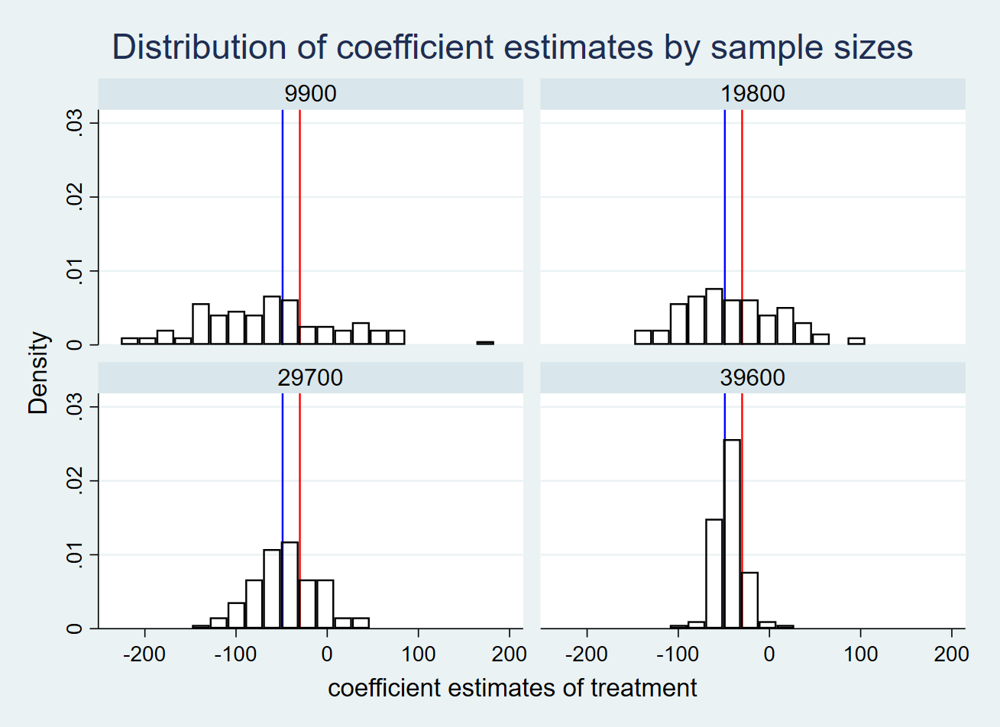
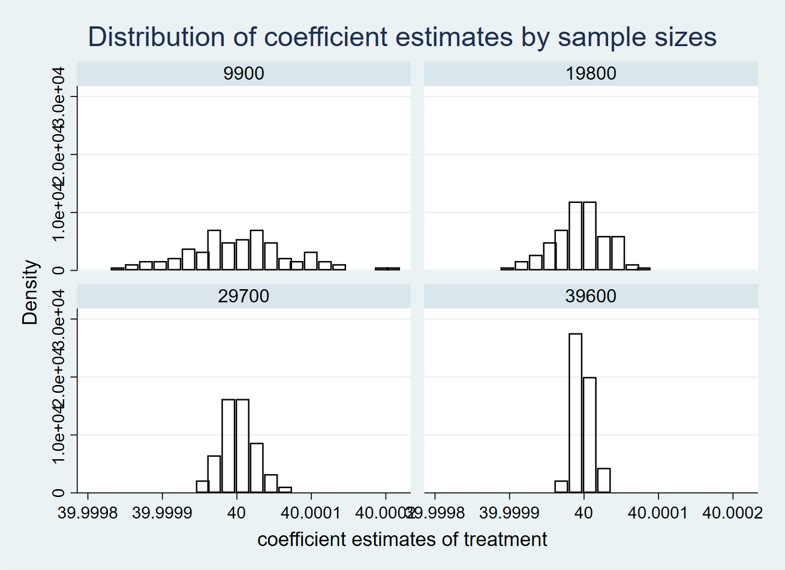
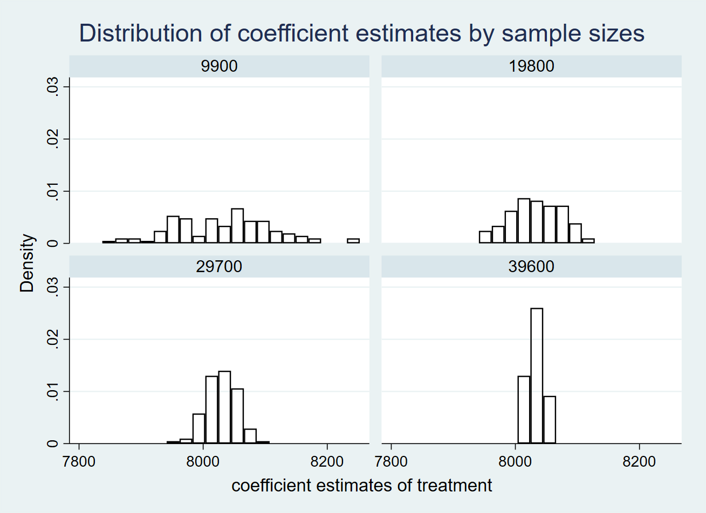
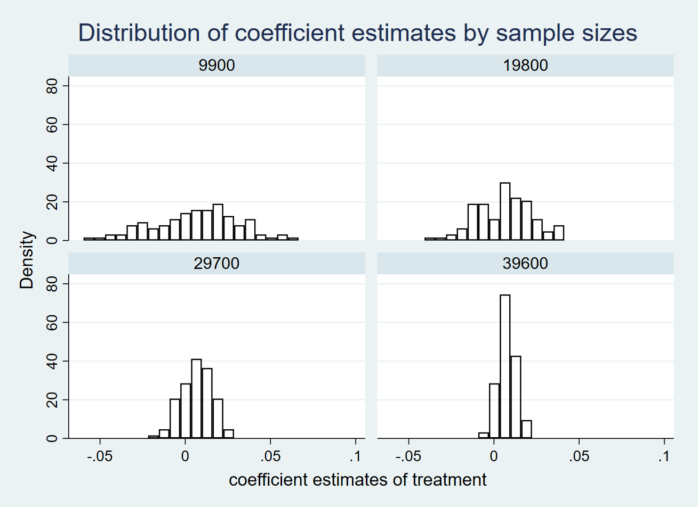
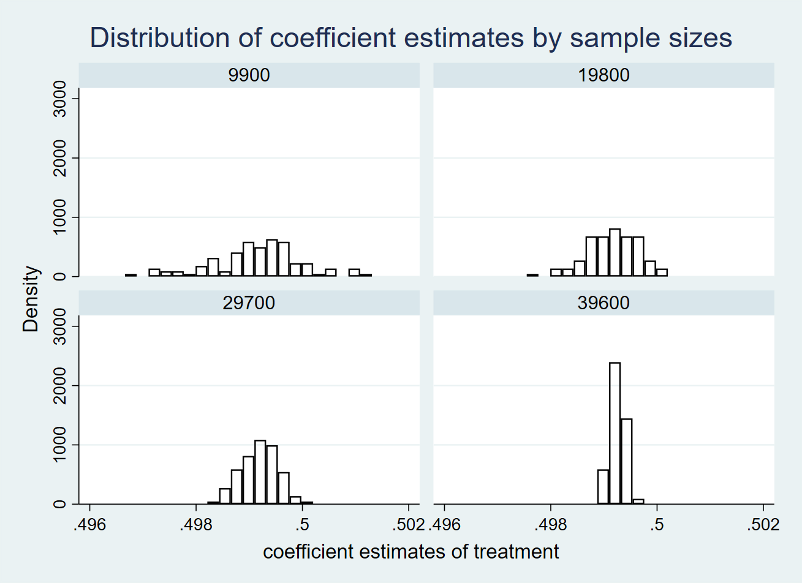
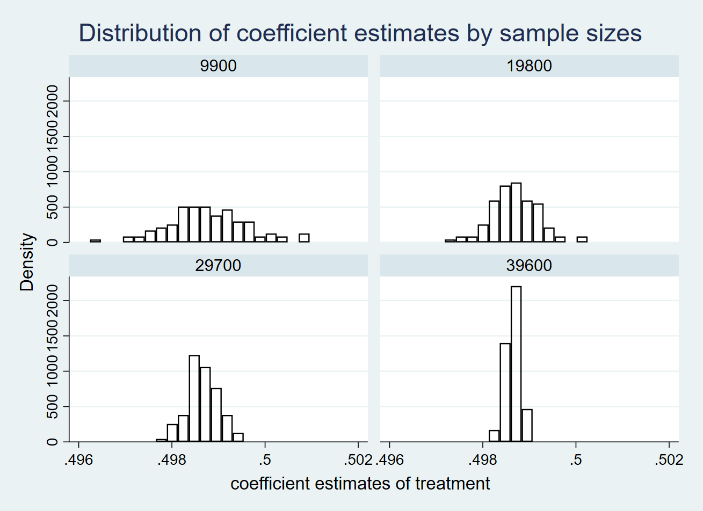

# Week 09 Assignment Xinyu Zheng

## Part 1

To study the effect of a multi-sector Cap-and-Trade program on the emission size by state and sector, I constructed facility-level data and incorporated the following variables in the regressions:

- state id
- sector id
- facility id
- treatment: implemented multi-sector CAT or not
- confounder: liberal or not
- covariate affecting x only: have a certain level of economic complexity or not
- covariate affecting y only: production size
- outcome: emission size

True relationship: 
$$emission = 50 - 30*mul_cat - 10*liberal + 40*production + error term$$

1. Regression: reg emission mul_cat liberal production 

2. Regression: reg emission mul_cat liberal production economy_complexity

3. Regression: reg emission mul_cat liberal

4. Regression: reg emission mul_cat production 

5. Regression: reg emission mul_cat

| Model | Sample Size | Estimates | Standard Error |
|:-----:|:-----------:|:---------:|:--------------:|
| 1 | 9900 | -30.01 | 0.0289 |
| 1 | 19800 | -30.01 | 0.0205 |
| 1 | 29700 | -30.01 | 0.0167 |
| 1 | 39600 | -30.02 | 0.00145 |
| 2 | 9900 | -30.00 | 0.0421 |
| 2 | 19800 | -29.99 | 0.0297 |
| 2 | 29700 | -29.99 | 0.0243 |
| 2 | 39600 | -29.99 | 0.0210 |
| 3 | 9900 | -53.10| 115.4 |
| 3 | 19800 | -61.30 | 81.64 |
| 3 | 29700 | -48.88 | 66.63 |
| 3 | 39600 | -59.15 | 57.68 |
| 4 | 9900 | -35.57 | 0.120 |
| 4 | 19800 | -35.57  | 0.0848 |
| 4 | 29700 | -35.57  | 0.0692 |
| 4 | 39600 | -35.57  | 0.0600 |
| 5 | 9900 | -64.40 | 104.1 |
| 5 | 19800 | -41.42 | 73.63 |
| 5 | 29700 | -45.34 | 60.14 |
| 5 | 39600 | -44.66 | 52.06 |

Based on the histograms and the summary table of beta estimates of treatment and standard errors, I found:
- Regression 2: Including covariate affecting treatment only (economic complexity) does not significantly affect coefficient estimates and standard errors.
- Regression 3: Omitting covariate affecting y only (production) makes the distribution of treatment coefficient estimates spread. Still, the distribution of coefficient estimates is centered around the true population parameter -30. This is to say omitting covariates affecting y only will enlarge the standard errors but will not bias the estimates a lot.
- Regression 4: Omitting confounder (liberal) results in a big bais of the treatment coefficient estimates. The distribution of coefficient estimates does not include the true population estimate of -30.
- Regression 5: Omitting both confounder and covariates affecting y not only biases the treatment coefficient estimates but also enlarges the standard errors.

## Part 2

Similar to part 1, I constructed facility-level data and incorporated the following variables in the regressions:

- state id
- sector id
- facility id
- treatment: implemented multi-sector CAT or not
- channel: production size
- collider: public grievance towards GHG emission
- outcome: emission size

True relationship: 
$$emission = 50 + 40*production + error term$$

1. Regression: reg emission production

2. Regression: reg emission mul_cat

3. Regression: reg emission mul_cat production

4. Regression: reg emission mul_cat public_grievance

5. Regression: reg emission mul_cat production public_grievance

| Model | Sample Size | Estimates | Standard Error |
|:------------:|:-----------:|:---------:|:--------------:|
| 1 production | 9900 | 40.00 | 0.0289 |
| 1 production | 19800 | 40.00 | 0.0205 |
| 1 production | 29700 | 40.00 | 0.0167 |
| 1 production | 39600 | 40.00 | 0.00145 |
| 2 mul_cap | 9900 | 8033 | 0.0421 |
| 2 mul_cap | 19800 | 8033 | 0.0297 |
| 2 mul_cap | 29700 | 8030 | 0.0243 |
| 2 mul_cap | 39600 | 8033 | 0.0210 |
| 3 mul_cap | 9900 | 0.00629| 115.4 |
| 3 mul_cap | 19800 | 0.00606 | 81.64 |
| 3 mul_cap | 29700 | 0.00658 | 66.63 |
| 3 mul_cap | 39600 | 0.00774 | 57.68 |
| 4 mul_cap | 9900 | 0.499 | 0.120 |
| 4 mul_cap | 19800 | 0.499  | 0.0848 |
| 4 mul_cap | 29700 | 0.499  | 0.0692 |
| 4 mul_cap | 39600 | 0.499  | 0.0600 |
| 5 mul_cap | 9900 | 1.219 | 104.1 |
| 5 mul_cap | 19800 | 1.221 | 73.63 |
| 5 mul_cap | 29700 | 1.223 | 60.14 |
| 5 mul_cap | 39600 | 1.223 | 52.06 |

Based on the histograms and the summary table of beta estimates of treatment and standard errors, I found:
- Regression 2: The treatment variable can affect the outcome through the channel variable (production) even though treatment itself is not a determinant of the outcome in the true relationship.
- Regression 3: The distribution of treatment coefficient estimates includes zero. Therefore, compared with Regression 2, where the channel is excluded from the regression, including both treatment and channel in the regression diminishes the treatment coefficient to zero.
- Regression 4 and 5: Including the collider in the regression, or including both channel and collider in the regression, will bias the treatment coefficient estimate. Both distributions of treatment coefficient estimates in two regressions surround  0.49..., far from the estimate in regression 2.

Overall, in modeling, we should always include confounders but leave channels and colliders out.
