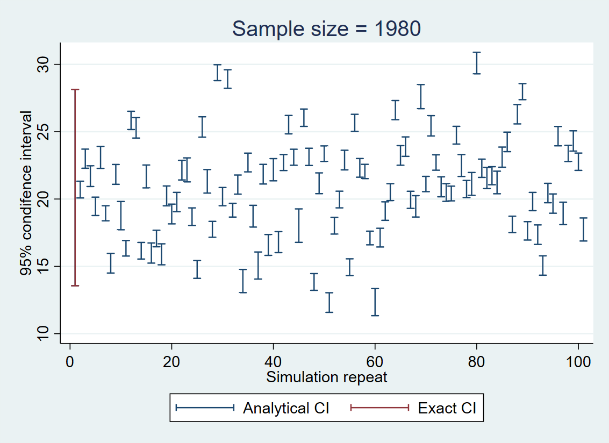
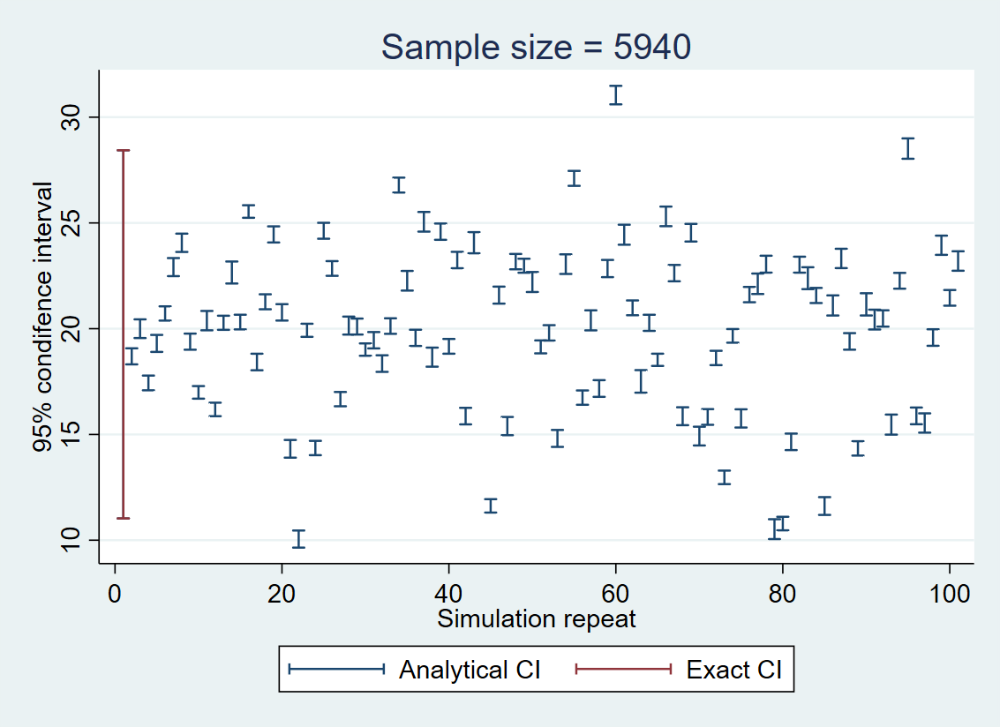
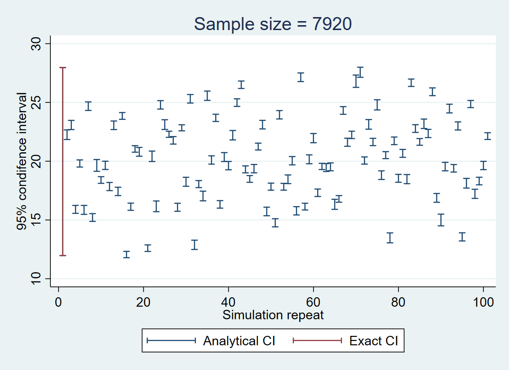
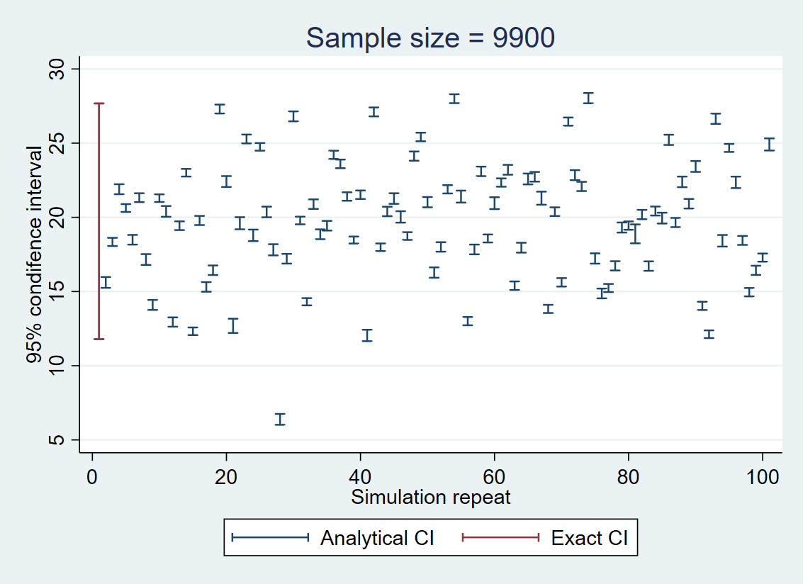
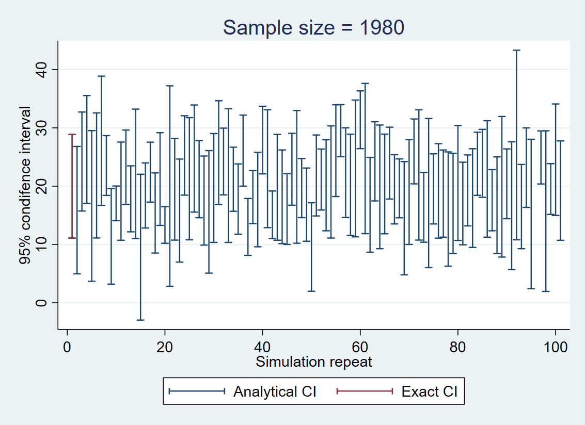
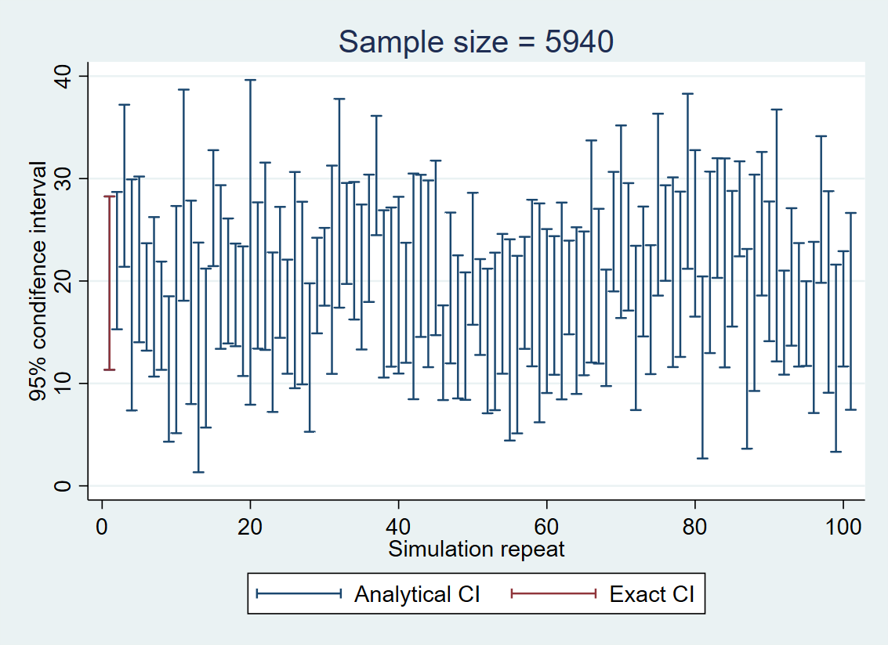
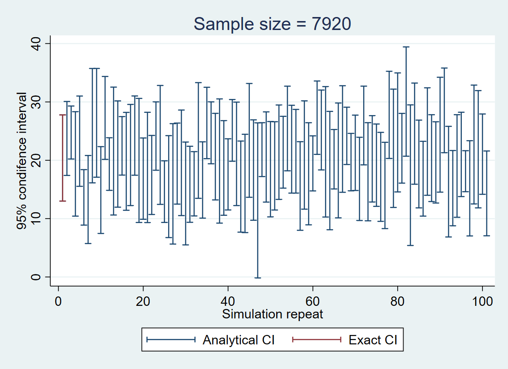
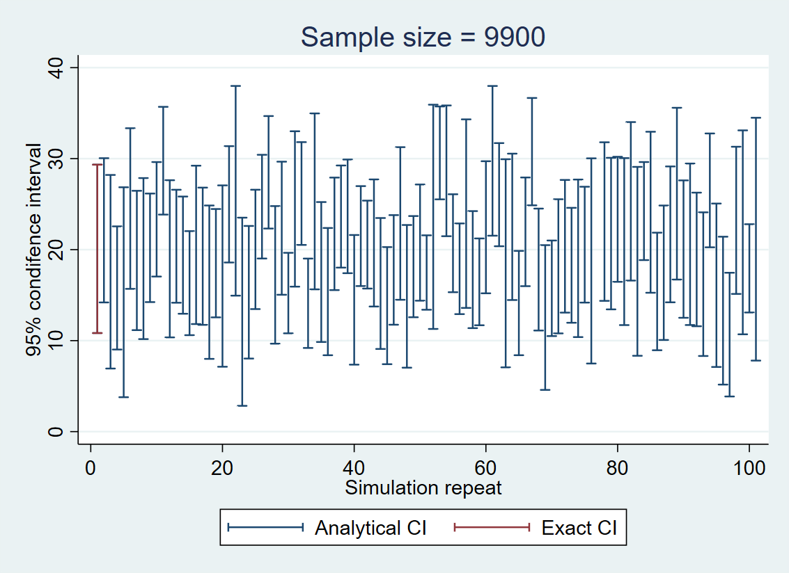

## Week 10 Assignment

For both part 1 and part 2, I created a facility-level dataset stratified by state and sector, in line with my group project studying the effect of cap-and-trade program on emissions. 

### Part 1

#### Variables

- state id
- sector id
- facility id
- treatment: implemented multi-sector CAT or not
- confounder: liberal or not
- covariate affecting x only: have a certain level of economic complexity or not
- covariate affecting y only: production size
- outcome: emission size

#### Models

1. reg emission mul_cap liberal production (TRUE relationship)
2. reg emission mul_cap liberal 
3. reg emission mul_cap liberal production economic_complexity

#### Find Minimum Sample Size

Note: The number of states and sectors is fixed, so the only way to adjust the sample size is to change the number of facilities

| Model | Overall Sample Size | Sample Size in Each Strata | Power | 
|:-----:|:-------------------:|:--------------------------:|:-----:|
| 1 | 198	| 2	| .396 |
| 1 | 297	| 3	| .564 |
| 1 | 396	| 4 | .662 |
| 1 | 495	| 5	| .772 |
| 1 | 594	| 6 |	.774 |
| 1 | 693	| 7 |	.806 |
| 1 | 792	| 8 |	.854 |
| 1 | 891	| 9 |	.896 |
| 1 | 990	| 10 |	.916 |
| 2 | 10197	| 103 |	.792 |
| 2 | 10296	| 104 |	.818 |
| 2 | 10395	| 105 |	.812 |
| 2 | 10494	| 106 |	.838 |
| 2 | 10593	| 107 |	.808 |
| 3 | 990	| 10 |	.744 |
| 3 | 1089 | 11 |	.766 |
| 3 | 1188 | 12 | .8 |
| 3 | 1287 | 13 | .822 |
| 3 | 1386 | 14 | .834 |
| 3 | 1485 | 15 | .848 |

Based on the table above, the minimum sample sizes in each stratum with a power of 0.8 for models 1 - 3 are 7, 104, and 12, respectively. Omitting covariates or including irrelevant covariates will not bias the coefficient estimates of mul_cap a lot but will enlarge the standard errors of coefficient estimates and make it harder to obtain a p-value < 0.05. Therefore, in models 2 and 3, where covariate is omitted or irrelevant covariable is included, the minimum sample size required to obtain a power of 0.8 is bigger than that in model 1. 

#### Find Minimum Detectable Effect Size

Applying the minimum sample sizes in each stratum to corresponding models and enabling the treatment effect to change, I yield:

| Treatment Effect | Model | Power |
|:----------------:|:-----:|:-----:|
| 1 | 25 | .718 |
| 1 | 26	| .782 |
| 1 | 27	| .784 |
| 1 | 28	| .828 |
| 1 | 29	| .812 |
| 1 | 30	| .846 |
| 2 | 28	| .716 |
| 2 | 29	| .794 |
| 2 | 30	| .81 |
| 2 | 31	| .852 |
| 2 | 32	| .848 |
| 3 | 28	| .738 |
| 3 | 29	| .75 |
| 3 | 30	| .774 |
| 3 | 31	| .796 |
| 3 | 32	| .848 |

The minimum detectable effect sizes with a power of 0.8 for models 1 - 3 are around 28, 30, and 32, respectively. The minimum detectable effect sizes required to obtain a power of 0.8 for models 2 and 3 are also bigger than in model 1. 

### Part 2

For this part, the regression is： reg mul_cap production

#### Include random errors in clustering (state and sector) and observation (facility) levels

As the sample size increases, the width of CI increases. However, no matter how the sample size changes, the exact confidence interval is significantly wider than the analytical CIs of regressions. The standard errors of coefficient estimates are underestimated because the regressions fail to recognize that the observations are clustered at the state and sector levels and that there should be fewer actual observations than the regressions thought. Notably, real observations are 11 states and 9 sectors instead of facilities because of clustering. 

#### Include random errors in clustering (state and sector) levels only 

In this case, the widths of analytical CIs are very similar to the width of the exact CI, regardless of how the sample size changes. This is because I only include random errors in the cluster levels, and by using vce(cluster state sector), I correct the calculation of standard errors of coefficient estimates making the analytical CIs in proximity to the exact CI. The widths of analytical CIs are consistent across sample sizes because no matter of how the sample size changes at the facility level, the number of states and sectors does not change.

