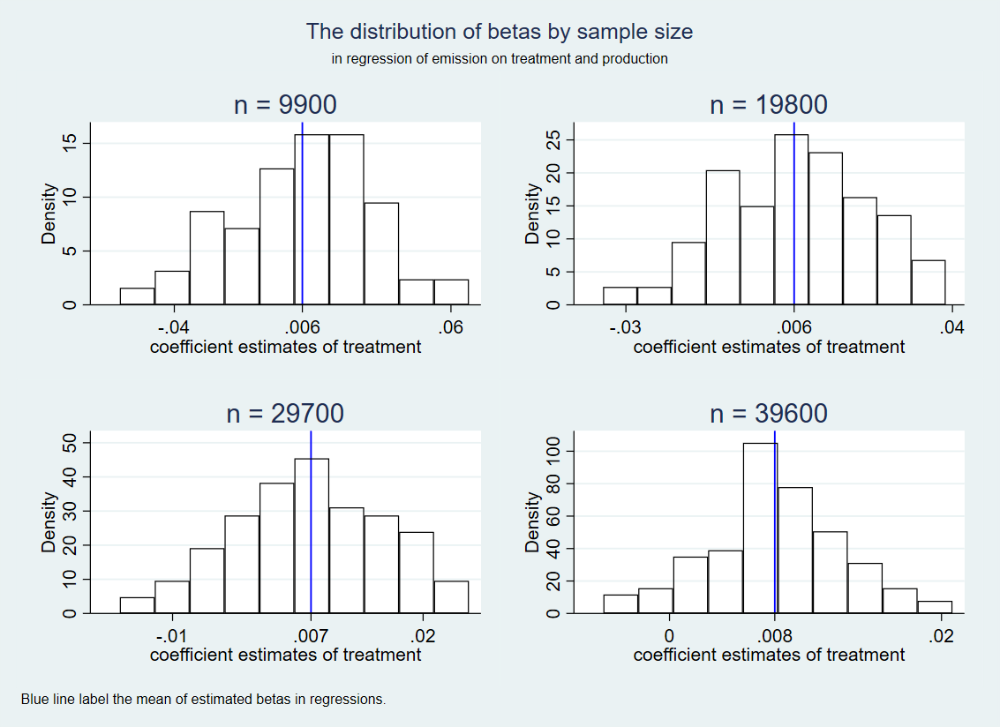

# Week 09 Assignment Xinyu Zheng

## Part 1

To study the effect of a multi-sector Cap-and-Trade program on the emission size by state and sector, I constructed facility-level data and incorporated the following variables in the regressions:

- state id
- sector id
- facility id
- treatment: implemented multi-sector CAT or not
- confounder: liberal or not
- covariate affecting x only: have a certain level of economic complexity or not
- covariate affecting y only: production size
- outcome: emission size

True relationship: 
$$emission = 50 - 30*mul_cat - 10*liberal + 40*production + error term$$

1. Regression: reg emission mul_cat liberal production 

2. Regression: reg emission mul_cat liberal production economy_complexity

3. Regression: reg emission mul_cat liberal

4. Regression: reg emission mul_cat production 

5. Regression: reg emission mul_cat

| Model | Sample Size | Estimates | Standard Error |
|:---------------------------------------------------:|:-----------:|:---------:|:--------------:|
| Unbiased regression model | 9900 | -32.86 | 5.787 |
| Unbiased regression model | 19800 | -32.80 | 4.093 |
| Unbiased regression model | 29700 | -32.79 | 3.341 |
| Unbiased regression model | 39600 | -33.09 | 2.893 |
| Including covariate affecting treatment only | 9900 | -29.07 | 8.410 |
| Including covariate affecting treatment only | 19800 | -28.75 | 5.944 |
| Including covariate affecting treatment only | 29700 | -28.86 | 4.855 |
| Including covariate affecting treatment only | 39600 | -29.00 | 4.205 |
| Omitting covariate affecting y only | 9900 | -55.43| 115.6 |
| Omitting covariate affecting y only | 19800 | -64.61 | 81.75 |
| Omitting covariate affecting y only | 29700 | -51.87 | 66.72 |
| Omitting covariate affecting y only | 39600 | -62.19 | 57.75 |
| Omitting confounder | 9900 | -37.61 | 5.226 |
| Omitting confounder | 19800 | -37.66  | 3.697 |
| Omitting confounder | 29700 | -37.52  | 3.016 |
| Omitting confounder | 39600 | -37.68  | 2.613 |
| Omitting both confounder and covariates affecting y | 9900 | -66.44 | 104.2 |
| Omitting both confounder and covariates affecting y | 19800 | -43.91 | 73.72 |
| Omitting both confounder and covariates affecting y | 29700 | -47.45 | 60.22 |
| Omitting both confounder and covariates affecting y | 39600 | -46.80 | 52.13 |

Based on the histograms and the summary table of beta estimates of treatment and standard errors, I found:
- Regression 1: The mean of beta estimates is very close to the true beta. As the sample size increases, the spread of the beta estimates shrinks.
- Regression 2: Including covariate affecting treatment only (economic complexity) does not significantly affect beta estimates and standard errors. As the sample size increases, the spread of the beta estimates shrinks.
- Regression 3: Omitting covariate affecting y only (production) makes the mean of beta estimates more biased than the previous two scenarios and makes the distribution of beta estimates spread. Still, the true population parameter -30 is within the two-standard-error range.
- Regression 4: When omitting the confounder (liberal), the two-standard-error range of beta estimates does not include the true population estimate of -30.
- Regression 5: Omitting both confounder and covariates affecting y not only biases the treatment coefficient estimates but also enlarges the standard errors.

## Part 2

Similar to part 1, I constructed facility-level data and incorporated the following variables in the regressions:

- state id
- sector id
- facility id
- treatment: implemented multi-sector CAT or not
- channel: production size
- collider: public grievance towards GHG emission
- outcome: emission size

True relationship: 
$$emission = 50 + 40*production + error term$$

1. Regression: reg emission production

2. Regression: reg emission mul_cat

3. Regression: reg emission mul_cat production

4. Regression: reg emission mul_cat public_grievance

5. Regression: reg emission mul_cat production public_grievance

| Model | Sample Size | Estimates | Standard Error |
|:------------:|:-----------:|:---------:|:--------------:|
| Unbiased regression model | 9900 | 40.00 | 0.0000714 |
| Unbiased regression model | 19800 | 40.00 | 0.0000504 |
| Unbiased regression model | 29700 | 40.00 | 0.000411 |
| Unbiased regression model | 39600 | 40.00 | 0.0000356 |
| Include treatment and channel | 9900 | 8033.37 | 80.665|
| Include treatment and channel | 19800 | 8033.163 | 57.083 |
| Include treatment and channel | 29700 | 8029.727 | 46.576 |
| Include Include treatment and channel | 39600 | 8032.751 | 40.336 |
| Include treatment but exclude channel | 9900 | 0.00629| 0.029 |
| Include treatment but exclude channel | 19800 | 0.00606 | 0.020 |
| Include treatment but exclude channel | 29700 | 0.00657 | 0.016 |
| Include treatment but exclude channel | 39600 | 0.00774 |0.014 |
| Include treatment and collider | 9900 | 0.499 | 0.00095 |
| Include treatment and collider | 19800 | 0.499  | 0.00055 |
| Include treatment and collider | 29700 | 0.499  | 0.00047 |
| Include treatment and collider | 39600 | 0.499  | 0.00096 |
| Include treatment, collider, and channel | 9900 | 0.499 | 0.00096 |
| Include treatment, collider, and channel | 19800 | 0.499 | 0.00068 |
| Include treatment, collider, and channel | 29700 | 0.499 | 0.00055 |
| Include treatment, collider, and channel | 39600 | 0.499 | 0.00048 |

Based on the histograms and the summary table of beta estimates of treatment and standard errors, I found:
-Regression 1: The mean of betas estimate for the channel, production, is equal to the true beta in the DGP.
- Regression 2: The treatment variable can affect the outcome through the channel (production) even though treatment itself is not a determinant of the outcome in the true relationship. The magnitude of beta estimates for treatment is above 8000.
- Regression 3: The two-standard-error distribution of treatment coefficient estimates includes zero. Therefore, compared with Regression 2, where the channel is excluded from the regression, including both treatment and channel in the regression diminishes the treatment coefficient to zero.
- Regression 4 and 5: Including the collider in the regression, or including both channel and collider in the regression, will bias the treatment coefficient estimate. Both distributions of treatment coefficient estimates in two regressions surround  0.49..., far from the estimate in regression 2.

Overall, in modeling, we should always include confounders but leave channels and colliders out.
