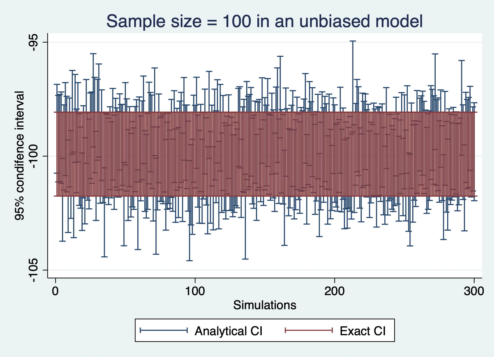
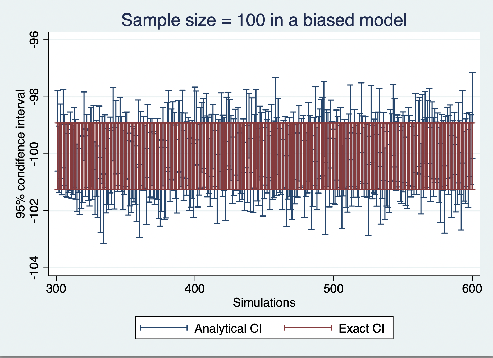
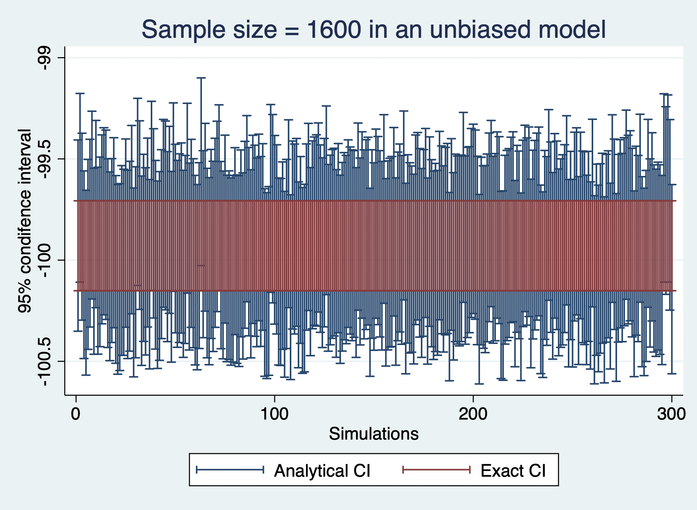
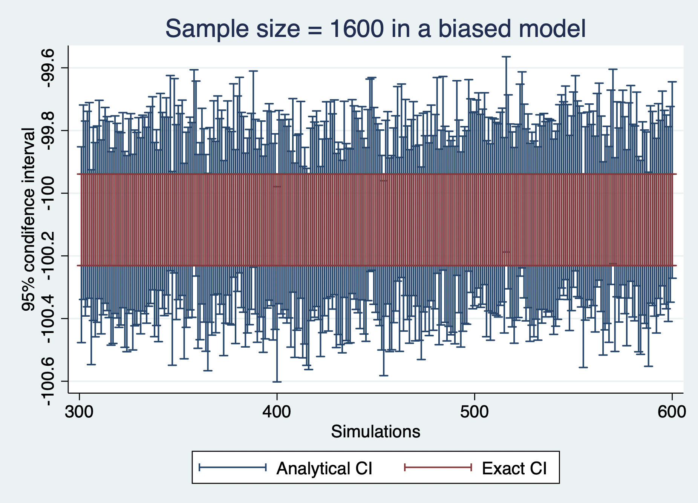

Week10 Ming Zhou

# Part one

## 1 The power of the regression models

In part one, there are two models.

***1.Unbiased Model:*** reg emission treatment i.party industrial activity

***2.Biased Model:*** reg emission treatment

Tables below show the power of both biased model and unbiased model, with the treatment effect of -50. As sample size increases, the power increases accordingly. But in order to get the power of 80%, the minimum sample size needed for a biased model is significantly larger than that needed for an unbiased model. The minimum sample size needed for a biased model is 1958, while the minimum sample size needed for an unbiased model is 235.

|     Model      | Sample size |   Power   |
|:--------------:|:-----------:|:---------:|
| unbiased model |     100     | .43666667 |
| unbiased model |     234     | .79333335 |
| unbiased model |     235     | .81333333 |
| unbiased model |    1957     |     1     |
| unbiased model |    1958     |     1     |
|  biased model  |     100     |    .08    |
|  biased model  |     234     |    .14    |
|  biased model  |     235     | .14333333 |
|  biased model  |    1957     | .79333335 |
|  biased model  |    1958     |    .81    |

With treatment effects vary, the table below show the power of each treatment effect at the sample size of 100. In the unbiased model, to get the power of 80%, the minimum treatment effect should be 43. While in the biased model, to get the power of 80%, the minimum treatment effect should be 247.

|     Model      | Treatment Effect | Power |
|:--------------:|:----------------:|:-----:|
| unbiased model |        5         |  .06  |
| unbiased model |        20        |  .26  |
| unbiased model |        43        | 0.084 |
| unbiased model |        50        | 0.898 |
|  biased model  |        5         | .064  |
|  biased model  |        50        | 0.114 |
|  biased model  |       100        |  .24  |
|  biased model  |       200        | .616  |
|  biased model  |       240        |  .78  |
|  biased model  |       245        |  .79  |
|  biased model  |       247        |  .8   |
|  biased model  |       248        |  .81  |
|  biased model  |       250        |  .82  |

# Part two

***Model without clustered errors:*** reg emission treatment activity

***Model with clustered errors:*** reg emission1 treatment activity

Table below show the empirical/exact CIs and the analytic ones in an unbiased regression model.The width of the empirical/exact CIs are smaller than analytic ones. And with sample size increasing, the CIs both converge to 0.

| Sample Size | Analytic CIs | Empirical/Exact CIs |
|:-----------:|:------------:|:-------------------:|
|     100     |   3.790624   |      3.6804047      |
|     600     |   1.525673   |      1.3863983      |
|    1100     |   1.122502   |      .74989319      |
|    1600     |   .9294646   |      .44424438      |

Table below show the empirical/exact CIs and the analytic ones in an unbiased regression model with random error terms are only determined at the cluster level. The width of the empirical/exact CIs are smaller than analytic ones. But the differences between analytic ones and empirical ones are smaller. And with sample size increasing, the CIs both converge to 0.

| Sample Size | Analytic CIs | Empirical/Exact CIs |
|:-----------:|:------------:|:-------------------:|
|     100     |   2.53826    |      2.3435059      |
|     600     |   1.018826   |       .85112        |
|    1100     |   .7499536   |      .48442078      |
|    1600     |   .6214737   |      .29187012      |

We can get the "analytic" confidence intervals to be correct using the vce() option in regress.

***reg emission1 treatment industrial activity, vce(cluster)***
